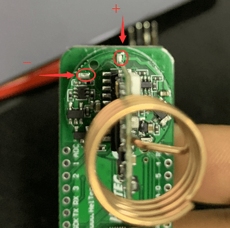
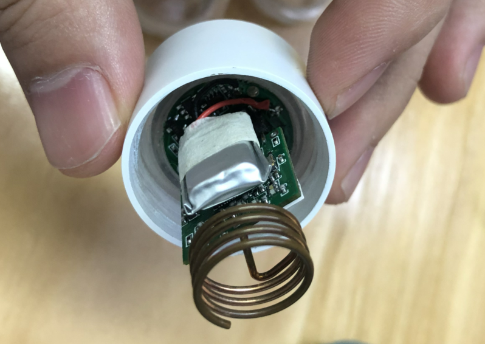

# 组装电池到胶囊传感器
[English](https://heltec-automation-docs.readthedocs.io/en/latest/cubecell/capsule-sensor/htcc-ac01/assemble_a_battery.html)

胶囊传感器是全球性产品，但由于国际运输、储存等问题，**默认胶囊传感器内部没有集成电池**。

&nbsp;

拆卸传感器外壳后，可以看到底部圆形电路板上有2个焊盘，并将电池正负极焊接到该焊盘上：

&nbsp;

&nbsp;

## 电池规格

在胶囊传感器中，它已经集成了一个充电管理电路，但没有过放电保护电路，因此**锂电池必须有一个保护电路**。电池必须包括以下功能：

- 电压：3.7V
- 充电电压：4.2V
- 放电截止电压：≤3.3V

