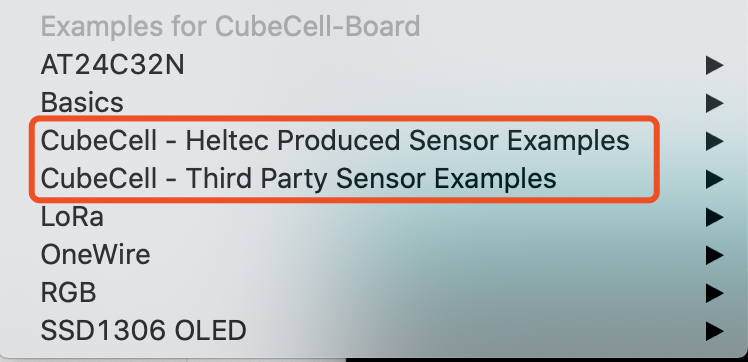
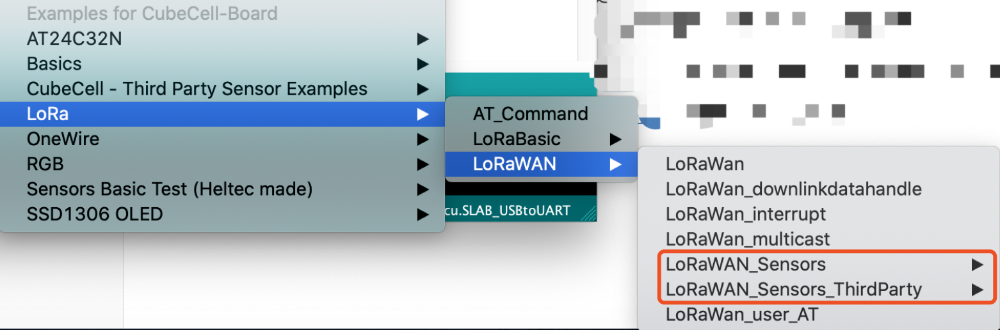

# 胶囊传感器快速入门
[English](https://heltec-automation-docs.readthedocs.io/en/latest/cubecell/capsule-sensor/htcc-ac01/capsule_quick_start.html)
## 摘要

**使用胶囊传感器时，请注意以下问题**

- 胶囊传感器本身被定位为一个小型、组装和部署的传感器。它没有编程、调试和其他接口。您需要使用[调试板](https://heltec.org/product/cubecell-capsule-Debug/)来编程和调试程序；
- 由于储存和运输问题，电池默认不集成在胶囊内。在中国大陆的用户可以在订购时通知我们的客服，我们将提供集成电池服务。
  - [如何在胶囊传感器内组装电池](https://heltec-automation.readthedocs.io/zh_CN/latest/cubecell/capsule-sensor/htcc-ac01/assemble_a_battery.html)

&nbsp;

## 准备
- [正确安装CubeCell-Arduino开发框架](https://heltec-automation.readthedocs.io/zh_CN/latest/cubecell/quick_start.html)
- 高品质的Micro-USB数据线；
- [将胶囊连接到调试板](https://heltec-automation.readthedocs.io/zh_CN/latest/cubecell/capsule-sensor/htcc-ac01/connect_capsule_to_debugger.html)；
- 安装CP2102 USB-UART bridge驱动程序。
  - 在大多数情况下，Windows、Mac OS和Linux将自动识别CP2102 USB-UART bridge。如果无法正确识别，请参考[建立串行连接](https://heltec-automation.readthedocs.io/zh_CN/latest/general/establish_serial_connection.html)

## 胶囊传感器测试

### 基础测试

在示例菜单中，“CubeCell-xxxx Sensor Examples”是胶囊传感器使用的基本测试程序，可用于快速验证传感器并从传感器读取值：



**Heltec 传感器例程:** 传感器模块由Heltec制造 传感器列表: `https://github.com/HelTecAutomation/ASR650x-Arduino/blob/master/libraries/SensorBasic/readme.md`

**第三方传感器示例：**用于用户开发的第三方传感器模块 传感器列表: `https://github.com/HelTecAutomation/ASR650x-Arduino/blob/master/libraries/Sensor_ThirdParty/readme.md`

&nbsp;

### 通过LoRaWAN协议传输传感器数据

``` Tip:: 此部分操作必须使用支持标准LoRaWAN协议的网关执行。

```

在例程菜单中选择 `LoRa → LoRaWAN → LoRaWAN_Sensors(_ThirdParty)`,我们提供了一些通过LoRaWAN 协议传输传感器数据的例程。



在所有传感器和LoRaWAN 示例中，传感器数据在发送前读取一次。例如，在HDC1080温度和湿度传感器示例中：

```c++
case DEVICE_STATE_SEND:
{
	PrepareTxFrame( AppPort ); //read data from HDC1080 sensor
	LoRaWAN.Send(); //LoRaWAN transmit
	DeviceState = DEVICE_STATE_CYCLE;
	break;
}
```
`PrepareTxFrame`读取了温度（float）、湿度（float）和电池电压（unsigned int）。并将数据转换为字符。内容：

```c++
static void PrepareTxFrame( uint8_t port )
{
    pinMode(Vext,OUTPUT);
    digitalWrite(Vext,LOW);
    hdc1080.begin(0x40);
    float Temperature = (float)(hdc1080.readTemperature());
    float Humidity = (float)(hdc1080.readHumidity());
    hdc1080.end();
    digitalWrite(Vext,HIGH);
    uint16_t BatteryVoltage = GetBatteryVoltage();
    unsigned char *puc;

    puc = (unsigned char *)(&Temperature);
    AppDataSize = 10;//AppDataSize max value is 64
    AppData[0] = puc[0];
    AppData[1] = puc[1];
    AppData[2] = puc[2];
    AppData[3] = puc[3];

    puc = (unsigned char *)(&Humidity);
    AppData[4] = puc[0];
    AppData[5] = puc[1];
    AppData[6] = puc[2];
    AppData[7] = puc[3];

    AppData[8] = (uint8_t)(BatteryVoltage>>8);
    AppData[9] = (uint8_t)BatteryVoltage;

    Serial.print("T=");
    Serial.print(Temperature);
    Serial.print("C, RH=");
    Serial.print(Humidity);
    Serial.print("%,");
    Serial.print("BatteryVoltage:");
    Serial.println(BatteryVoltage);
}
```
#### 为什么要将数据转换为byte?

众所周知，“float”数据占用4个字节内存，“unsigned int”数据占用2个字节内存。假设您有一个非常精确的传感器，例如，测量数据是12.34567890987654321，如果通过诸如“char data[]=”27.313232421875“这样的字符串发送此数据，它将花费15个字节。但如果以字节`80 81 DA 41`传输，则只需花费4个字节。

## 外部资源

- 准备好LoRa网关
  - [怎样连接HT-M01到LoRa服务器](https://heltec-automation.readthedocs.io/zh_CN/latest/gateway/ht-m01/connect_to_server.html)
  - [怎样连接HT-M02到LoRa服务器](https://heltec-automation.readthedocs.io/zh_CN/latest/gateway/ht-m02_4g/quick_start_4g.html#lora)

- [如何配置LoRaWAN 参数](https://heltec-automation.readthedocs.io/zh_CN/latest/cubecell/lorawan/config_parameter.html)

- [连接CubeCell到LoRaWAN服务器](https://heltec-automation.readthedocs.io/zh_CN/latest/cubecell/lorawan/connect_to_gateway.html)
