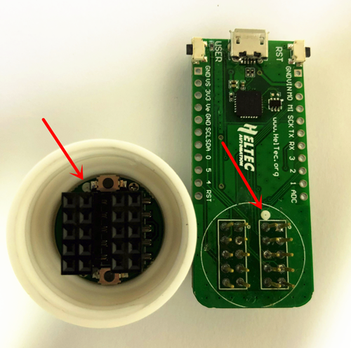
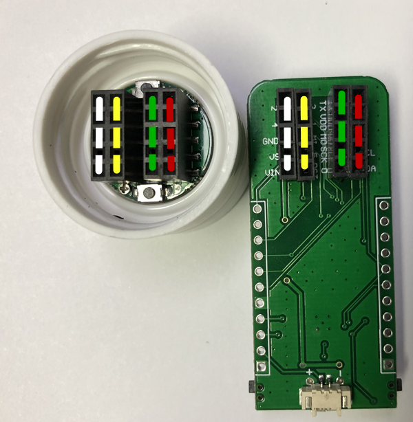
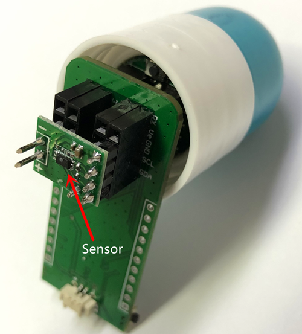

# 将胶囊连接到调试板
[English](https://heltec-automation-docs.readthedocs.io/en/latest/cubecell/capsule-sensor/htcc-ac01/connect_capsule_to_debugger.html)

胶囊传感器本身被定位为一个小型、组装和部署的传感器。它没有编程、调试和其他接口。您需要使用[调试板](https://heltec.org/product/cubecell-capsule-Debug)来编程和调试程序。

胶囊传感器本体和调试板都有一个圆形的白色标记点。连接时，白点的位置应匹配。

连接完成后，将传感器本体和调试板集成在一起，各插针之间相互对应，便于插入各种传感器。

&nbsp;

**“胶囊主体、调试板、传感器”**的正确组装：

