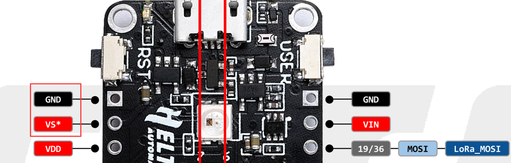
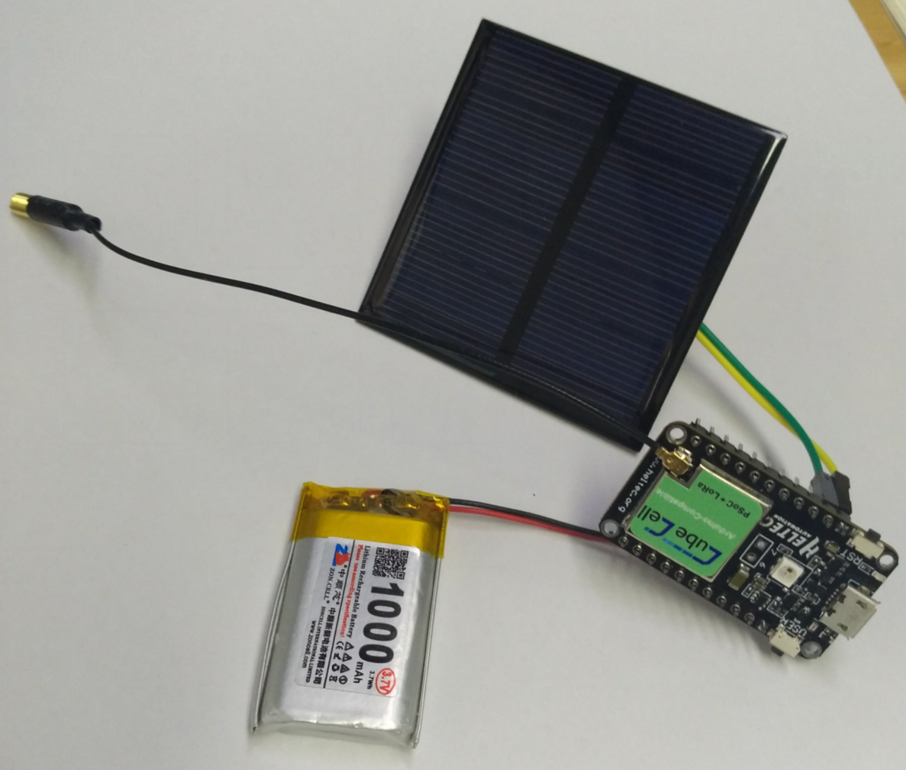
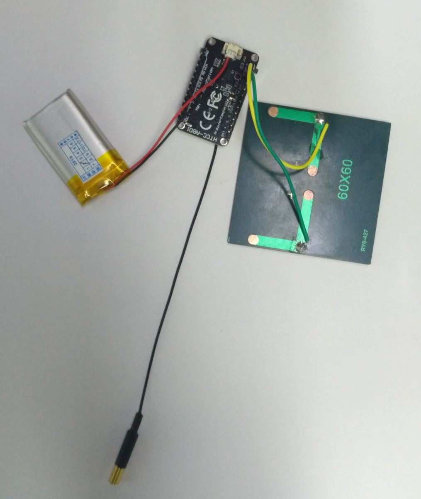

# 连接太阳能板到HTCC-AB01
[English](https://heltec-automation-docs.readthedocs.io/en/latest/cubecell/dev-board/htcc-ab01/solar_panel.html)

请参考 [HTCC-AB01的引脚图](https://resource.heltec.cn/download/CubeCell/HTCC-AB01/HTCC-AB01_PinoutDiagram.pdf).

“VS”脚是太阳能电池板的输入端，任何5.5~7V的太阳能板都可以连接到这个“VS”和“GND”。



``` Note:: 太阳能电池板不能作为整个系统的动力源，因此必须使用可充电的锂电池。CubeCell HTCC-AB01开发板上已经集成了电池和太阳能电池板管理系统。

```




