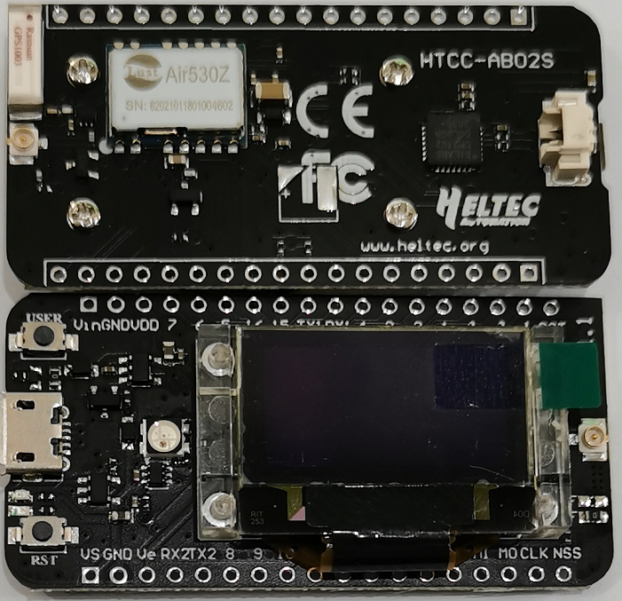

# CubeCell-GPS-6502硬件更新日志

[English](https://heltec-automation-docs.readthedocs.io/en/latest/cubecell/dev-board/htcc-ab02s/hardware_update_log.html)

## V1.0

- 首次发布
- 2020-04-30 公开销售
- [V1引脚图](https://resource.heltec.cn/download/CubeCell/HTCC-AB02S/HTCC-AB02S_PinoutDiagram.pdf)
- [V1原理图](https://resource.heltec.cn/download/CubeCell/HTCC-AB02S/HTCC-AB02S_SchematicDiagram.pdf)

## V1.0_1

- 2020-10-08公开销售
- 将GPS指示灯引脚从IO8改为IO12。
- [V1.0_1引脚图](https://resource.heltec.cn/download/CubeCell/HTCC-AB02S/HTCC-AB02S_PinoutDiagram.pdf)
- [V1.0_1原理图](https://resource.heltec.cn/download/CubeCell/HTCC-AB02S/HTCC-AB02S_SchematicDiagram_V1.1.pdf)

## V1.1

- 2021-03-28公开销售
- 将GPS模块从AIR530替换为AIR530Z，进一步提升性能，优化低功耗。

- 优化电路，优化PCB布局。

- [V1.1引脚图](https://resource.heltec.cn/download/CubeCell/HTCC-AB02S/HTCC-AB02S_PinoutDiagram.pdf)
- [V1.1原理图](https://resource.heltec.cn/download/CubeCell/HTCC-AB02S/HTCC-AB02S_SchematicDiagram_V1.1.pdf)

