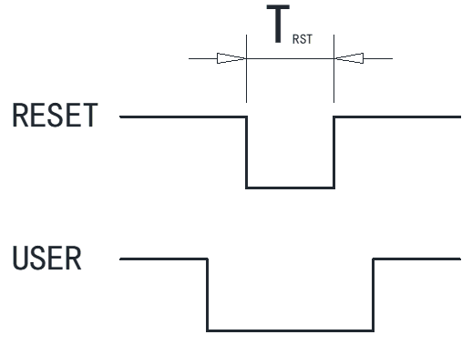
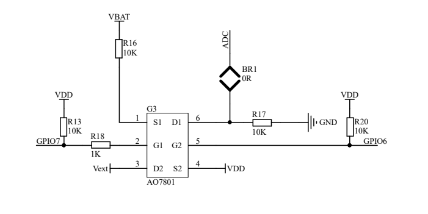
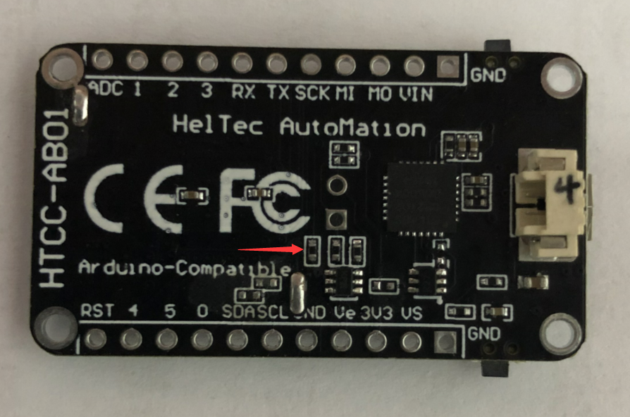

# Heltec<sup>TM</sup>CubeCell<sup>TM</sup>系列常见问题
[English](https://heltec-automation-docs.readthedocs.io/en/latest/cubecell/frequently_asked_questions.html)
此页面包含了用户最常提出的问题。如果此页面的详细信息无法解决您的问题，您也可以在我们的论坛上留言： [community.heltec.cn](http://community.heltec.cn/)

&nbsp;

## 怎样进入Bootloader模式

CubeCell<sup>TM</sup>的bootloader是用于烧录和验证固件的预编程软件。在FLASH0~33行中，重写此部分将破坏Bootloader，无法再下载固件。

进入bootloader模式需要满足以下时间（T<sub>RST</sub>>10mS）：



以下是手动进入bootloader 的两种方法：

- CubeCell没有连接到计算机 -- 将CubeCell插入计算机的任何USB端口前，请按住它的“USER”按钮，直到CubeCell连接到计算机再松开。
- CubeCell已经连接到计算机 -- 按住“USER”按钮→按下"RESET"按钮→松开"RESET"按钮→松开"USER"按钮。

**USER引脚**

**[Dev-Board](https://heltec.org/project/htcc-ab01/)** -- `GPIO 7`

**[Capsule Sensor + Debug board](https://heltec.org/project/htcc-ac01/)** -- `GPIO 0`

``` Tip:: 如果始终保持&quot;USER&quot;引脚低电平（软件设置低或下拉到GND），可能导致自动引导系统不工作，用户可以手动访问bootloader模式。

```

&nbsp;

## 如何使用ADC引脚进行模拟读取（ASR6501）

ASR6501嵌入了12位1Msps SAR ADC，但只有一个通道ADC输入引脚，该引脚已默认用于读取电池电压值。



为了读取其他模拟信号，用户需要移除电阻BR1，然后ADC引脚将空闲。



``` Tip:: CubeCell的ADC使用内部1.2V参考电压。

```

``` Note:: ADC输入电压不能高于VDD。

```
