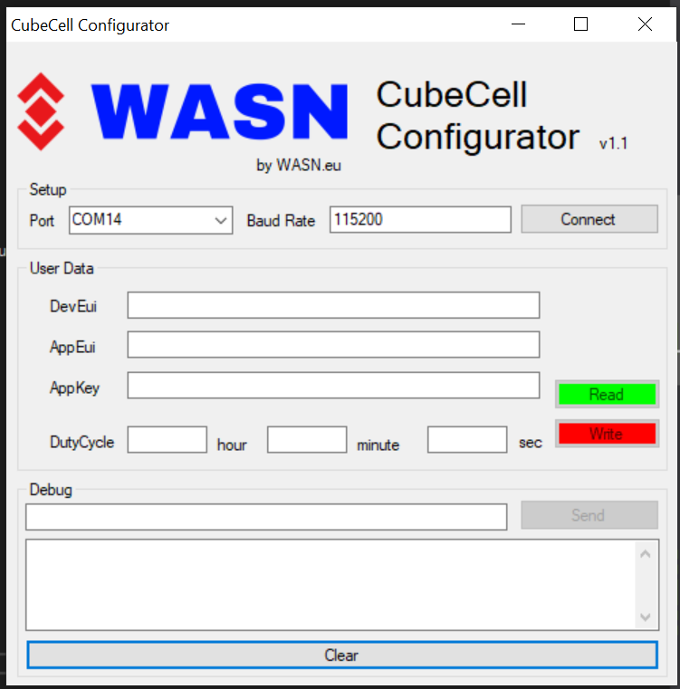

# CubeCell配置LoRaWAN网络参数（Dev EUI、App Key等）

&nbsp;

## 摘要

无论使用何种LoRa管理平台，都需要DevEui、AppKey等参数。并确保它与服务器上的相关设置一致。


- -**以下参数对于OTAA模式至关重要：**
  - [DevEui](#deveui) -- Mote device IEEE EUI (big endian), 8 bytes;
  - [AppEui](#appeui) -- Application IEEE EUI (big endian), 8 bytes;
  - [AppKey](appkey) -- AES encryption/decryption cipher application key, 16 bytes;
- **以下参数对于ABP模式至关重要：**
  - [NwkSKey](nwkskey) -- AES encryption/decryption cipher network session key, 16 bytes;
  - [AppSKey](appskey) -- AES encryption/decryption cipher application session key, 16 bytes;
  - [DevAddr](devaddr) -- Device address on the network (big endian), uint32_t;

``` Tip:: 这有配置LoRaWAN网络参数的三种方法，请选择其中一种。

```

- [通过修改源代码参数](#通过修改源代码参数)
- [通过AT命令](#通过AT命令)
- [通过CubeCell Configurator](#通过cubeCell configurator)

&nbsp;

## 通过修改源代码参数

LoRaWAN网络相关参数在以下头文件：

`ASR650X-ARDUINO/libraries/LoRa/src/Commissioning.h`

更改源代码并再次编译/上载。

&nbsp;

``` Note:: 下面的两种方法需要AT命令支持。

```

## 通过AT命令

为了使用AT命令，需要在上传前在“工具”菜单中启用AT命令。


### 串行端口设置

- Baud rate: 115200
- Stop bit: 1
- Data bits: 8
- DTR, RTS requirement: **None**
- Ending characters: **None**

``` Note:: 确保串行监视器配置中没有结束字符或新行!

```

在AT命令支持下，CubeCell在默认情况下处于休眠状态。任何通过串行端口的内容都会唤醒它。这意味着第一个通过串行端口的命令只唤醒系统。

例如，如果发送“hello”等内容，您将收到以下答复：

`ASR is Waked,LowPower Mode Stopped`

``` Tip:: 我们以全为0为例

```

### DevEui

通过串行端口发送以下命令：

`AT+DevEui=0000000000000000`

命令运行成功将打印反馈：

```
+OK
+DevEui=0000000000000000(For OTAA Mode)
```

### AppEui

配置 AppEui 为 "0000000000000000", 通过串行端口发送以下命令：

`AT+AppEui=0000000000000000`

命令运行成功将打印反馈：

```
+OK
+AppEui=0000000000000000(For OTAA Mode)
```

### AppKey

配置AppKey 为"00000000000000000000000000000000", 通过串行端口发送以下命令：

`AT+AppEui=00000000000000000000000000000000`

命令运行成功将打印反馈：

```
+OK
+AppEui=00000000000000000000000000000000(For OTAA Mode)
```

### NwkSKey

配置NwkSKey 为"00000000000000000000000000000000", 通过串行端口发送以下命令：

`AT+NwkSKey=00000000000000000000000000000000`

命令运行成功将打印反馈：

```
+OK
+NwkSKey=00000000000000000000000000000000(For ABP Mode)
```

### AppSKey

配置AppSKey 为"00000000000000000000000000000000", 通过串行端口发送以下命令：

`AT+AppSKey=00000000000000000000000000000000`

命令运行成功将打印反馈：

```
+OK
+AppSKey=00000000000000000000000000000000(For ABP Mode)
```

### DevAddr

配置DevAddr 为"00000000", 通过串行端口发送以下命令：

`AT+DevAddr=00000000`

命令运行成功将打印反馈：

```
+OK
+DevAddr=00000000(For ABP Mode)
```

### Duty Cycle

LoRa节点的默认发送数据周期为15秒，将此周期更改为60秒：

`AT+DutyCycle=6000`

### 重置CubeCell

LoRaWAN参数需要重置CubeCell才能生效，CubeCell可以通过三种方法重置：

- 按下"RST"按键
- 使用AT命令: `AT+RESET=1`
- 向"RST"引脚提供≥10ms的低电平信号。

查看更多的AT命令请参考**[CubeCell AT Command list](https://docs.heltec.cn/download/cubecell/CubeCell_Series_AT_Command_User_Manual_V0.2.pdf)**.


## 通过CubeCell Configurator

特别感谢[Raystream](https://github.com/raystream)为CubeCell制作了一个配置程序，现在它只支持Windows<sup>®</sup>。

[https://github.com/raystream/CubeCell_Getting_Started](https://github.com/raystream/CubeCell_Getting_Started)



