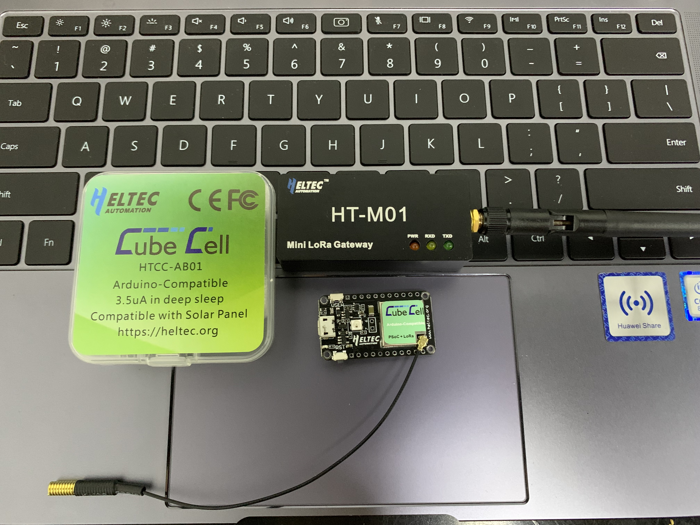
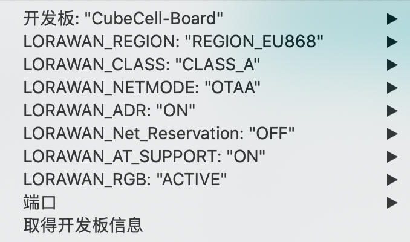

# 连接CubeCell到LoRaWAN服务器
[English](https://heltec-automation-docs.readthedocs.io/en/latest/cubecell/lorawan/connect_to_gateway.html)

在本文档中，所有操作和测试必须使用标准的[LoRaWAN网关](https://heltec.org/proudct_center/lora/lora-gateway/)进行，在CubeCell的LoRaWAN库，对于每个工作频段，我们都严格遵守[LoRaWAN™ 1.0.2 Regional Parameters rB](https://resource.heltec.cn/download/LoRaWANRegionalParametersv1.0.2_final_1944_1.pdf).

## 摘要

LoRaWAN协议是所有LoRa应用的核心。我们认为，LoRaWAN最显著的好处如下：

- 对低功耗应用非常友好。例如，您的应用程序需要每10分钟向服务器发送一次数据，然后在一个周期内，只有大约1秒处于发送状态，其他9分59秒处于低功耗睡眠状态；
- 星型网络可以通过[LoRa网关](https://heltec.org/proudct_center/lora/lora-gateway/)形成，不同厂商的节点和网关可以通过LoRaWAN协议相互通信；
- 该协议已经包含了阻塞、自动调频、加密等处理机制，能够更好地保证节点和网关的流畅运行；
- ADR（自适应数据速率）。

``` Tip:: CubeCell LoRaWAN库是从v4.3.2版本的LoRaMac-node迁移而来的。

```



&nbsp;

## 准备

- 正确安装`Arduino IDE`和 [CubeCell框架](https://heltec-automation.readthedocs.io/zh_CN/latest/cubecell/quick_start.html).
- 至少有8个通道的标准LoRaWAN网关（基于SX1301/8基带芯片即可），并确保您的网关已连接到LoRa服务器。
  - [怎样连接HT-M01到LoRa服务器](https://heltec-automation.readthedocs.io/zh_CN/latest/gateway/ht-m01/connect_to_server.html)
  - [怎样连接HT-M02到LoRa服务器]https://heltec-automation.readthedocs.io/zh_CN/latest/gateway/ht-m02_4g/quick_start_4g.html#lora)
- 一个 [CubeCell开发板](https://heltec.org/project/htcc-ab01/) 或 [CubeCell胶囊](https://heltec.org/project/htcc-ac01/) ，一根高质量的Micro-USB数据线.

在这个例程中，我们在Windows<sup>®</sup> 10环境下使用 [HT-M01网关](https://heltec.org/project/ht-m01/) ， 测试频段: EU868,，其他工作频段相似。

### 在Arduino中运行一个例程

在“LoRa”路径中，所有以“LoRaWAN_xxx”格式命名的示例都是使用LoRaWAN协议的示例，请选择其中一个。


[在“工具”菜单中配置参数](https://heltec-automation.readthedocs.io/zh_CN/latest/cubecell/quick_start.html#id4)，下面是我对EU868的配置：



``` Note:: “工具”菜单的配置必须与LoRa服务器中的配置匹配。例如，如果CubeCell使用OTAA，则LoRa服务器必须为相关设备启用OTAA。

```

&nbsp;

## 连接到TTN

在此之前，请确保您的TTN帐户中有一个激活的LoRa网关。

### 注册设备

在TTN的“Applications”页面注册新设备。可以自动生成`Device ID`, `Device EUI`, `App Key`。用户需要确保CubeCell中的相关参数与TTN相同。


正确配置CubeCell的LoRaWAN参数，请参考[这篇文档](https://heltec-automation.readthedocs.io/zh_CN/latest/cubecell/lorawan/config_parameter.html)。如果一切顺利，我们将能够看到设备的“DEVICE OVERVIEW”。


&nbsp;

## 连接到ChirpStack

即将上线。

&nbsp;

## 连接到HelTec服务器

在此之前，请确保您的HelTec帐户中有一个激活的LoRa网关。

### 注册设备

在"Apps"中选择"AppsCreate"新建应用，填入相应的信息后点击"CREATE APPLICATION"完成应用创建。


在"AppsList"中选择新建的应用，在应用中新建设备。


配置节点设备的"Device EUI", "App Key"相关参数，用户需确保CubeCell中的参数与服务器中配置的一致。


正确配置CubeCell的LoRaWAN参数，请参考[这篇文档](https://heltec-automation.readthedocs.io/zh_CN/latest/cubecell/lorawan/config_parameter.html)。如果一切顺利，我们将能够看到设备的状态。


&nbsp;

## 重要提示

请仔细检查以下两件事：

1. LoRaWAN参数与服务器相同！
2. 你的LoRa 网关的监听频率和CubeCell的发送频率相同。我们严格遵守[LoRaWAN™ 1.0.2 Regional Parameters rB](https://resource.heltec.cn/download/LoRaWANRegionalParametersv1.0.2_final_1944_1.pdf)。