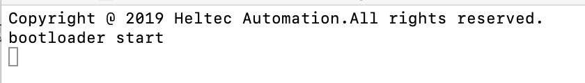

# 如何为CubeCell模块编程
[English](https://heltec-automation-docs.readthedocs.io/en/latest/cubecell/module/htcc-am01/programming_cubecell.html)

**CubeCell模块提供两种版本：**

- **只支持AT命令**
  - 由于FLASH大小的原因，“只支持AT命令”的HTCC-AM01只提供CN470-510MHz硬件版本，发送和开启频率固定（0~7通道），软件无法配置，没有专用硬件无法升级。
- **兼容Arduino&AT命令**
  - 默认支持AT命令，已经有一个激活的Arduino bootloader，可以通过Arduino开发。

本文档适用于“兼容Arduino&AT命令”版本。

CubeCell模块（HTCC-AM01）内部只有ASR6501和射频相关电路。要对其进行编程，需要连接外部UART-USB bridge。CH340G、CP2102等。

&nbsp;

### 1. 推荐电路

这有两个推荐的电路图：

- **[Arduino兼容推荐设计](http://resource.heltec.cn/download/CubeCell/HTCC-AM01_Module/HTCC-AM01_Reference_Design(Arduino).pdf)**
  - 该电路具有自动引导电路，可以自动进入bootloader模式。
- **[由主设备控制的从模块](http://resource.heltec.cn/download/CubeCell/HTCC-AM01_Module/HTCC-AM01_Reference_Design(AT).pdf)**
  - 此电路需要手动进入bootloader模式 ([怎样进入bootloader](https://heltec-automation.readthedocs.io/zh_CN/latest/cubecell/frequently_asked_questions.html#bootloader)).

### 2. 准备

- 正确安装CubeCell开发框架（[参考资料](https://heltec-automation.readthedocs.io/zh_CN/latest/cubecell/quick_start.html))
- 将重新设计的电路板连接到计算机，确保使用高质量的Micro-USB数据线；
- 成功进入bootloader 模式，以下日志将通过串行端口打印：

如果使用Arduino兼容电路，并且系统自动进入引导加载程序模式，将不会看到此日志。日志通常由CubeCell打印，但是IDE的com端口用于编程，所以没有显示的地方。

### 3. 通过Arduino IDE编程

