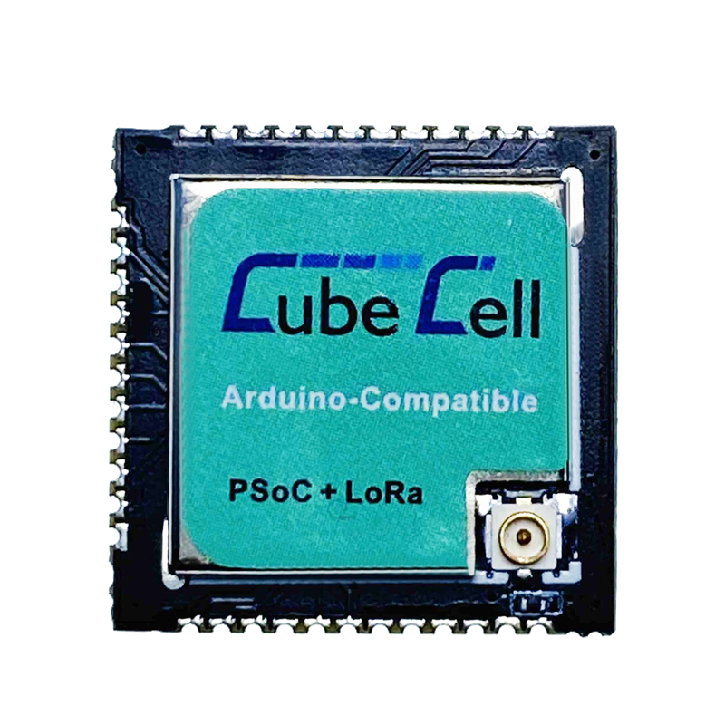

# HTTC - AM02硬件更新日志

[English](https://heltec-automation-docs.readthedocs.io/en/latest/cubecell/module/htcc-am02/hardware_update_log.html)

**HTCC-AM02内部只有ASR6502和射频相关电路。要对其进行编程，需要连接外部UART-USB bridge。如CH340G、CP2102等。**

## V1

- 首次发布
- 2020-04-30公开销售
- [V1引脚图](https://resource.heltec.cn/download/CubeCell/HTCC-AM02_Module/HTCC-AM02_PinoutDiagram.pdf)
