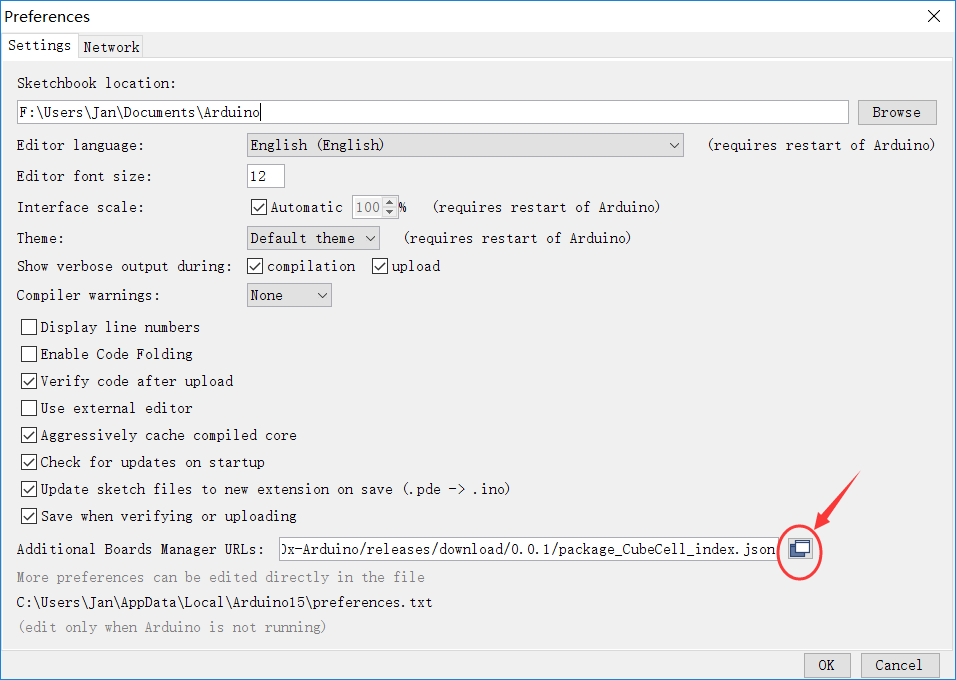
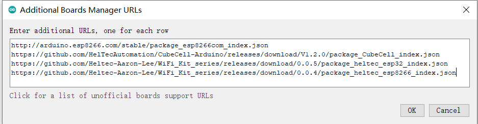
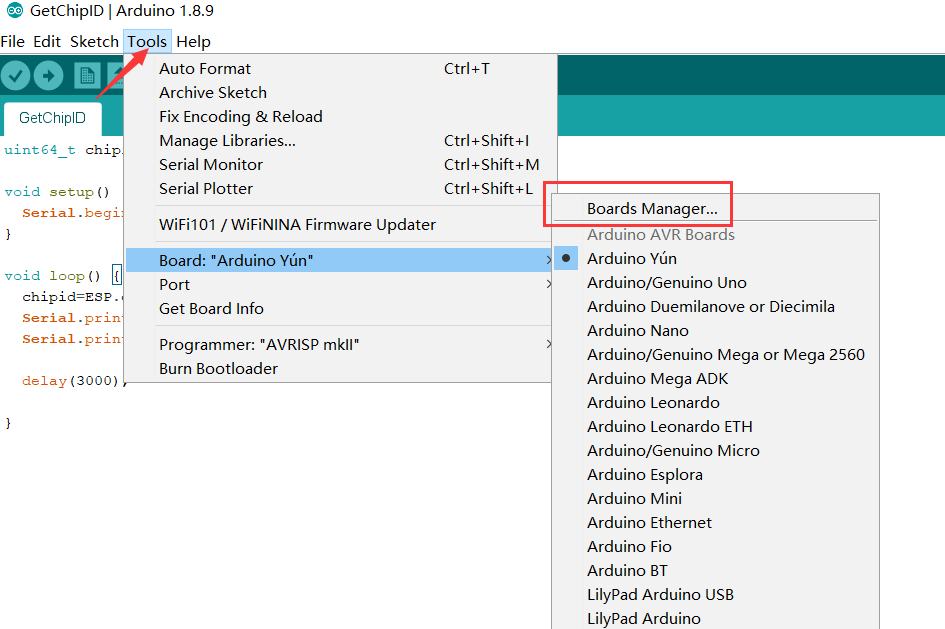
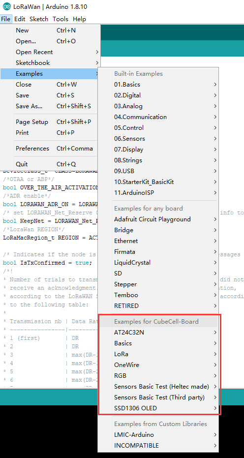

# CubeCell系列快速入门
[English](https://heltec-automation-docs.readthedocs.io/en/latest/cubecell/quick_start.html)
## 摘要

CubeCell基于ASR650x系列，本页面展示了如何安装和配置CubeCell Arduino框架，以及如何上传和运行代码（示例）。

## 安装CubeCell相关框架

``` Tip:: 请确认USB驱动程序、Git和Arduino IDE是否已正确安装。

```

如果没有，请看这两篇文章 [建立串行连接](https://heltec-automation.readthedocs.io/zh_CN/latest/general/establish_serial_connection.html) 和 [安装Git 和 Arduino IDE](https://heltec-automation.readthedocs.io/zh_CN/latest/general/how_to_install_git_and_arduino.html)。

**安装CubeCell框架有两种方法，请选择其中一种**

- [通过Arduino board manager](#arduino-board-manager)
- [通过Git](#git)

&nbsp;

### 	通过Arduino board manager

打开 `Arduino IDE`，然后依次点击 `File`->`Peferences`->`Settings`




输入以下json url到board manager URLs:：

 [https://github.com/HelTecAutomation/CubeCell-Arduino/releases/download/V1.3.0/package_CubeCell_index.json](https://github.com/HelTecAutomation/CubeCell-Arduino/releases/download/V1.3.0/package_CubeCell_index.json)



依次点击`Tools`->`Board:`->`Boards Manager...`，在新弹出对话框中搜索`Heltec cubecell`，选择最新的“版本”，然后点击“安装”。




Heltec ASR650x 系列 (ASR6501&ASR6502)的框架源码:

[https://github.com/HelTecAutomation/ASR650x-Arduino](https://github.com/HelTecAutomation/ASR650x-Arduino)

&nbsp;

### 通过Git

- For Windows: `https://github.com/HelTecAutomation/ASR650x-Arduino/blob/master/InstallGuide/windows.md`
- For MacOS: `https://github.com/HelTecAutomation/ASR650x-Arduino/blob/master/InstallGuide/mac.md`
- For Linux(Ubuntu/Debian): `https://github.com/HelTecAutomation/ASR650x-Arduino/blob/master/InstallGuide/debian_ubuntu.md`

&nbsp;

## 运行一个例程	

将CubeCell开发板通过一根高质量的Micro-USB数据线连接到电脑（这是我们遇到的最常见的无法编译程序的原因）。

### 正确配置工具菜单

在“工具”菜单中，有以下选项：

- **Board** -- 选择正确的硬件连接到电脑；
- **LORAWAN_REGION** -- 严格遵守LORAWAN协议区域规定 [LoRaWAN™ 1.0.2 Regional Parameters rB](https://resource.heltec.cn/download/LoRaWANRegionalParametersv1.0.2_final_1944_1.pdf);
- **LORAWAN_CLASS** -- 现在支持Class A 和 Class C；
- **LORAWAN_DEVEUI** -- LoRaWAN参数`DevEUI`的来源
  - `CUSTOM -- 使用.ino文件中devEui数组中定义的值，可以是任何值，但可能与其他序列号冲突。`
  - `Generate by ChipID -- 根据ASR650x的唯一芯片ID生成。`
- **LORAWAN_NETMODE** -- OTAA or ABP；
- **LORAWAN_ADR** -- ON or OFF     ADR (自适应数据速率);
- **LORAWAN_Net_Reservation** -- 这是LoRaWAN协议之外的功能，仅在OTAA模式下有效。如果启用此选项，则系统复位时不需要再次加入。智能路灯等项目可能有用；
- **LORAWAN_UPLINKMODE** -- LoRa上行确认/未确认信息。确认后的消息需要服务器发送下行链路到节点，但有些LoRa服务器下行链路受限（如TTN）。
- **LORAWAN_AT_SUPPORT** -- AT命令将提供许多有用的功能，例如，用户可以使用串行端口来配置LoRa节点的DevEui、AppKey或使节点休眠、复位等。
- **LORAWAN_RGB** -- LoRaWAN状态的RGB灯：
  - `紫色 -- 入网;`
  - `蓝色 -- 第一接收窗口;`
  - `黄色 -- 第二接收窗口;`
  - `绿色 -- 入网成功.`
- **LoRaWan Debug Level** -- 通过串行端口打印LoRaWAN相关信息
  - `None -- 默认；`
  - `Freq -- 发送/接收频率；`
  - `Freq && DIO -- 发送/接收频率和DIO引脚中断信息。`
- **COM Port** -- 设备在计算机中的串行端口。


``` Note:: LORAWAN_Net_Reservation:例如，城市发生大规模停电，恢复供电后，数千台设备同时接入网络，可能导致LoRa网关或服务器故障。启用此功能将避免这种情况。启用LORAWAN_Net_Reservation必须禁用LoRa服务器中的帧计数器（fCnt）。

```


### 选择一个例程



### 编译并上传


### 为CubeCell新建工程

在`Arduino IDE`中, 点击`File --> new` 然后复制下面这段代码：

```arduino
// the setup routine runs once when starts up
void setup(){

  // Initialize the Heltec ASR650x object


// the loop routine runs over and over again forever
void loop() {

}
```

&nbsp;

## 外部资源

### 串行端口无法连接到Linux系统？

在Linux系统中，如果遇到无法连接的串行端口。请参阅本文档：[https://playground.arduino.cc/Linux/All/#Permission](https://playground.arduino.cc/Linux/All/#Permission)

