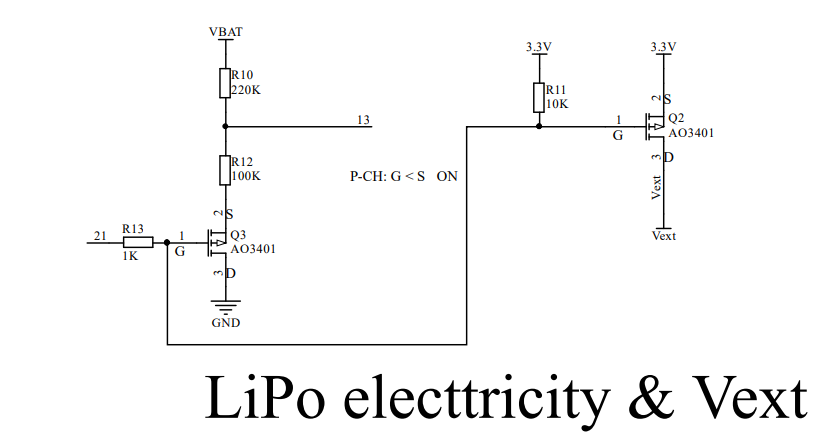

# HeltecTM "ESP32+Arduino"系列常见问题
[English](https://heltec-automation-docs.readthedocs.io/en/latest/esp32+arduino/frequently_asked_questions.html)

此页面包含用户最常提出的问题。如果这个页面的详细信息不能解决你的问题，你也可以在我们的论坛上留言: [community.heltec.cn](http://community.heltec.cn/)

&nbsp;

## 无法下载固件

- 使用更好的Micro-USB数据线，或更换USB底座;
- 检查并确保CP210x驱动器已正确安装，用户可以参考以下文档：[https://heltec-automation.readthedocs.io/zh_CN/latest/general/establish_serial_connection.html);
- 上传前按“PRG”按钮。

&nbsp;

## 橙色LED闪烁问题

橙色LED灯总是闪烁？因为电池管理芯片MCP73831。具有以下控制逻辑：

- 闪烁—打开电源
- 高亮—充电
- 关闭—电池已充满

将此电容器改为220nF，以暂时解决此问题。

我们用TP4054代替了MCP73831，橙色的LED有了新的控制逻辑：

- 暗淡—打开电源
- 高亮—充电
- 关闭—电池已充满

&nbsp;

## 其他通信总线用法示例

- **[SPI0 / SPI1 / SPI2 / SPI3](https://github.com/Heltec-Aaron-Lee/WiFi_Kit_series/tree/master/esp32/libraries/SPI/examples/SPI_Multiple_Buses)**
- **[I2C0 / I2C1](https://github.com/HelTecAutomation/Heltec_ESP32/blob/master/examples/ESP32/I2C_Scanner/I2C_Scanner.ino)**
- **[UART0 / UART1](https://github.com/HelTecAutomation/Heltec_ESP32/blob/master/examples/ESP32/Serial2/Serial2.ino)**

&nbsp;

## 系统一直复位

根据我们目前收集到的情况，最有可能导致恒定复位问题的可能有两个原因：

- 电源问题：请确认USB电压≥4.7V，300mA；
- 您下载程序时没有选择对应的开发板：因为每种类型的板可能有不同的FLASH大小，并且它们有不同的分区映射，这将导致内部逻辑错误。

## 外部设备电源控制

`Vext`是外部设备的电源。从原理图上看，由GPIO21控制：

`GPIO 21 --> 低电平 --> Vext(3.3V/250mA) 开启`

`GPIO 21 --> 高电平 --> Vext(3.3V/250mA) 关闭`

