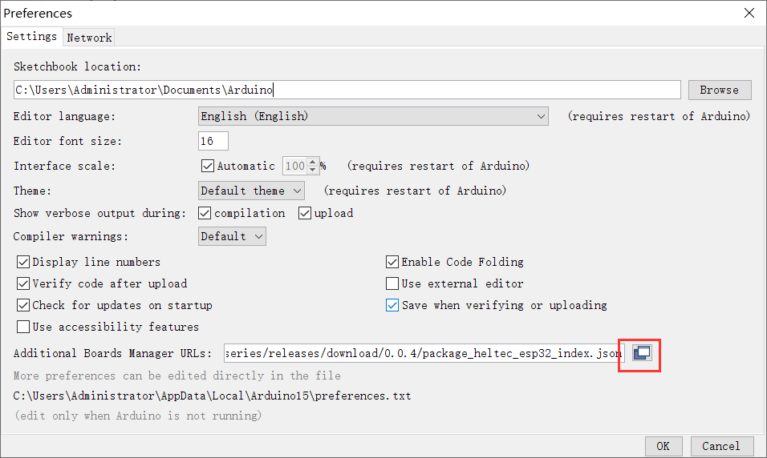
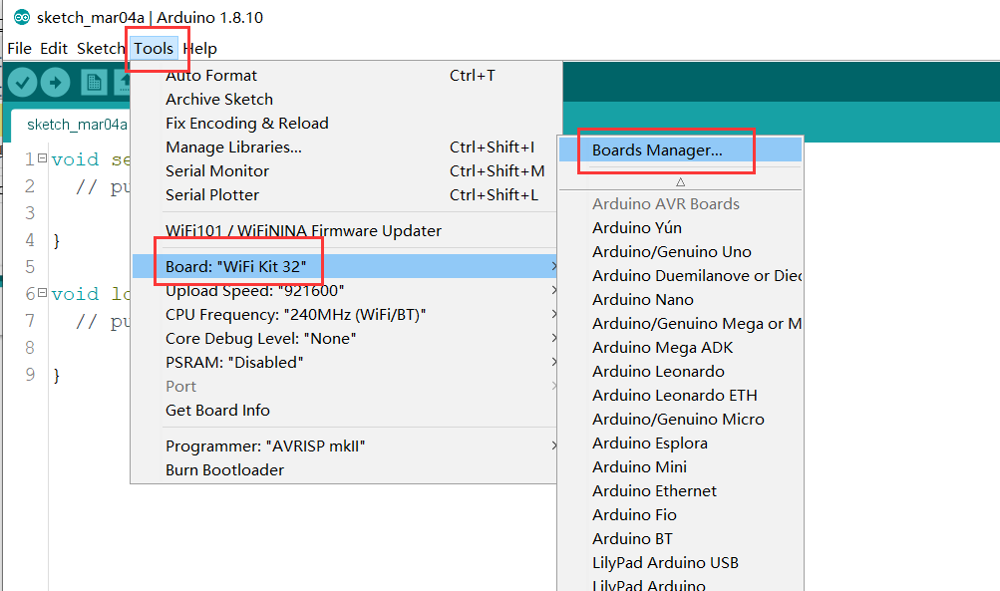
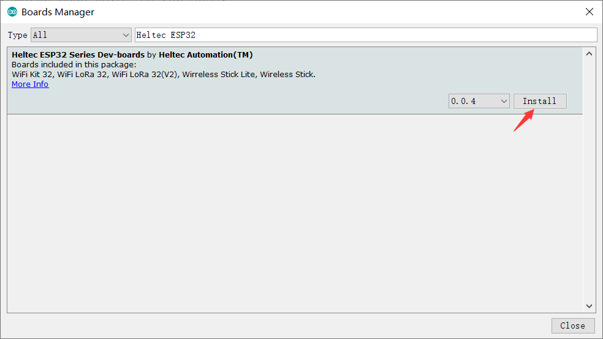
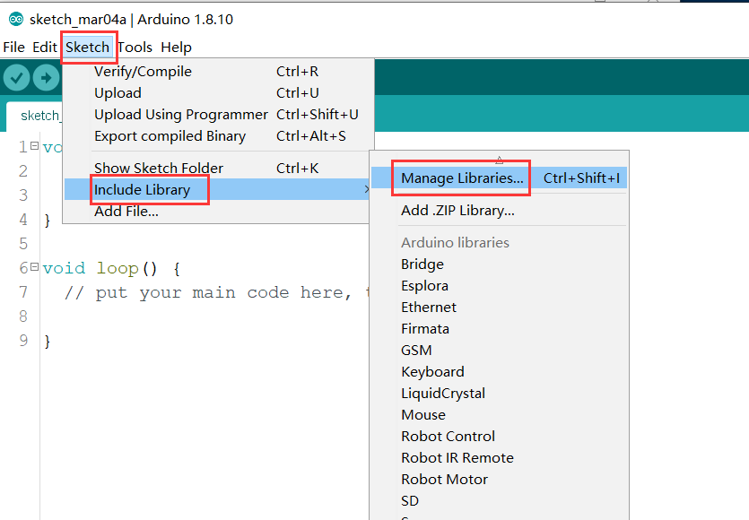
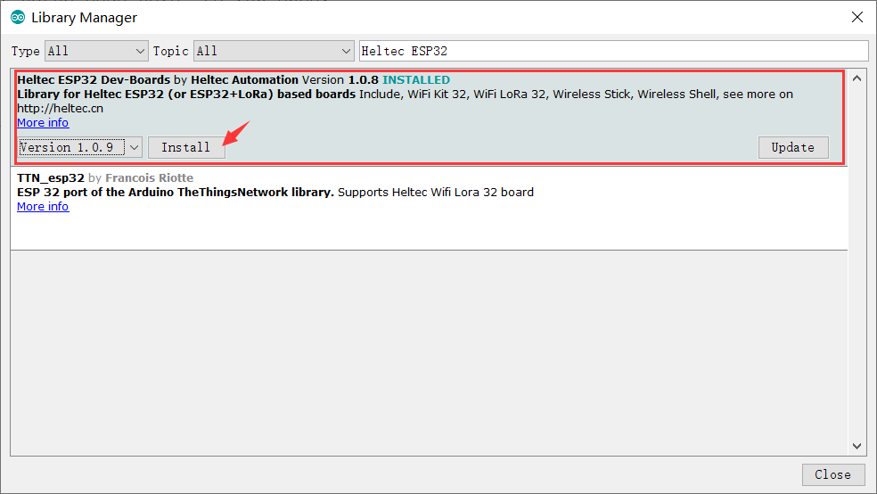
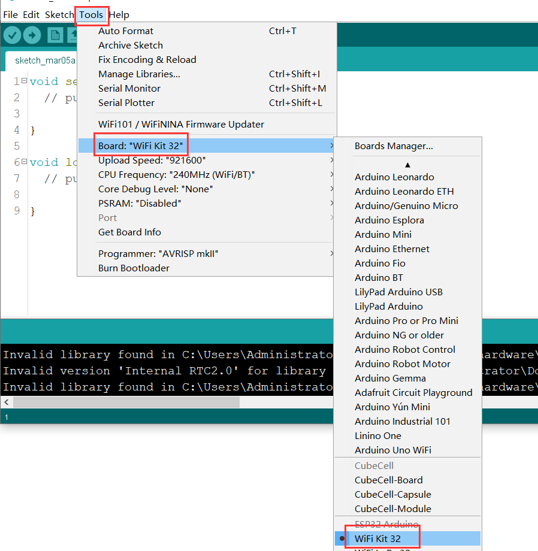
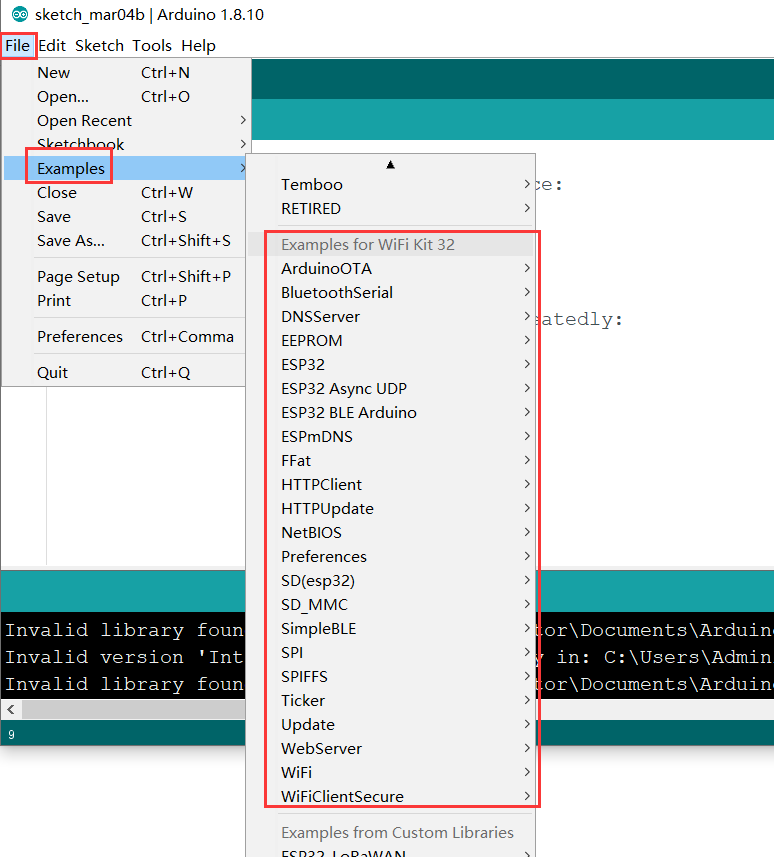

# Heltec "ESP32+Arduino"系列快速入门
[English](https://heltec-automation-docs.readthedocs.io/en/latest/esp32+arduino/quick_start.html)

我们建议您确认是否已先安装了“USB驱动程序”、“Git”和“Arduino IDE”。如果没有，请查看这两篇文章[建立串行连接](https://heltec-automation.readthedocs.io/zh_CN/latest/general/establish_serial_connection.html)和[安装Git和Arduino IDE](https://heltec-automation.readthedocs.io/zh_CN/latest/general/how_to_install_git_and_arduino.html)。

- **安装开发框架有两种方法，请从中选择：**

  - [通过Arduino Board Manager](#arduino-board-manager)
  - [通过Git](#git)

&nbsp;

## 通过Arduino Board Manager

### 第一步. 下载Arduino-ESP32开发环境支持

打开"Arduino IDE", 依次点击`File`->`Peferences` ，在`settings`中修改"Board Manager URLs"。

**输入最新的 ESP32 package URL:** [https://github.com/Heltec-Aaron-Lee/WiFi_Kit_series/releases/download/0.0.5/package_heltec_esp32_index.json](https://github.com/Heltec-Aaron-Lee/WiFi_Kit_series/releases/download/0.0.5/package_heltec_esp32_index.json)

依次点击 `Tools`->`Board:`->`Boards Manager...`，在新弹出的对话框中搜索“Heltec ESP32”，然后选择最新版本下载。

Heltec ESP系列（ESP32和ESP8266）框架的源代码：[https://github.com/Heltec-Aaron-Lee/WiFi_Kit_series](https://github.com/Heltec-Aaron-Lee/WiFi_Kit_series)

### 第二部. 下载Heltec ESP32库

打开"Arduino IDE"，依次点击 `Sketch`->`Include Library`->`Manage Libraries...`，在新弹出的对话框中搜索“Heltec ESP32”，选择最新版本下载。

Heltec ESP32库的源代码：[https://github.com/HelTecAutomation/Heltec_ESP32](https://github.com/HelTecAutomation/Heltec_ESP32)

&nbsp;

## 通过Git

- For Windows: `https://github.com/Heltec-Aaron-Lee/WiFi_Kit_series/blob/master/InstallGuide/windows.md`
- For MacOS: `https://github.com/Heltec-Aaron-Lee/WiFi_Kit_series/blob/master/InstallGuide/mac.md`
- For Linux
  - Debian/Ubuntu: `https://github.com/Heltec-Aaron-Lee/WiFi_Kit_series/blob/master/InstallGuide/debian_ubuntu.md`
  - Fedora: `https://github.com/Heltec-Aaron-Lee/WiFi_Kit_series/blob/master/InstallGuide/fedora.md`
  - OpenSUSE: `https://github.com/Heltec-Aaron-Lee/WiFi_Kit_series/blob/master/InstallGuide/opensuse.md`

&nbsp;

## 示例

本节用于验证Arduino编程是否可用，以及环境是否配置成功。

- 选择  `Wifi Kit 32`  开发板

- 选择相应的例程并上传。

如果屏幕或串行端口有输出，说明开发板运行成功！