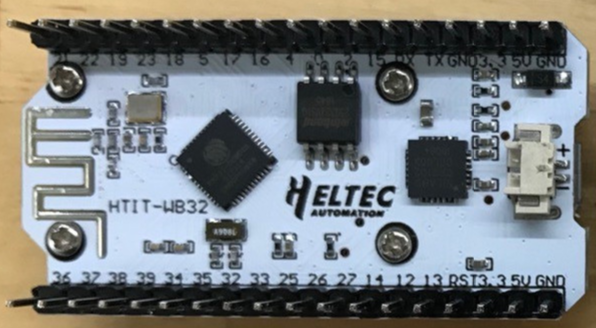
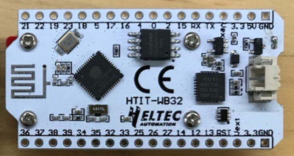
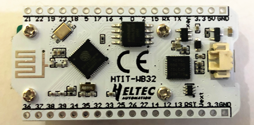

# Wifi Kit 32硬件更新日志
[English](https://heltec-automation-docs.readthedocs.io/en/latest/esp32+arduino/wifi_kit_32/hardware_update_log.html)
## V1

- 首次发布
- 2017-06-01 公开销售

- [V1引脚图](http://resource.heltec.cn/download/WiFi_Kit_32/WIFI%20Kit%2032_pinoutDiagram_V1.pdf)
- [V1原理图](http://resource.heltec.cn/download/WiFi_Kit_32/WIFI_Kit_32_Schematic_diagram_V1.PDF)

&nbsp;

## V2

- 2019-05 公开销售
- 修复充电状态（橙色LED）闪烁问题；;
- 4MB（32M位）FLASH 升级到8MB（64M位）FLASH ；
- 更好的2.4GHz天线设计和阻抗匹配；;
- 基本低功耗设计（深度睡眠800uA）；
- 增加电池电量检测电路。使用ADC2_4（GPIO 13）读取电池电压；
- 添加Vext电源输出引脚，用户可以使用该引脚驱动一些外部设备（传感器、电机等），当系统需要进入深度睡眠模式时，Vext可以关闭。**此引脚由GPIO21控制，例如：**
- Turn ON: `digitalWrite(21, LOW);`
  
- Turn OFF: `digitalWrite(21, HIGH);`
- 电路优化，系统更稳定；
- 更好的电源管理系统设计。
- [V2引脚图](http://resource.heltec.cn/download/WiFi_Kit_32/WIFI_Kit_32_pinoutDiagram_V2.pdf);
- [V2原理图](http://resource.heltec.cn/download/WiFi_Kit_32/WIFI_Kit_32_Schematic_diagram_V2.pdf);

&nbsp;

## V2.1

- 2019-10 公开销售
- 修复电池电压读数无法与Wi-Fi一起工作，将电池电压读数引脚更改为GPI37（使用ADC1_1），请参阅以下示例：[ADC_Read_Voltage/Battery_power](https://github.com/HelTecAutomation/Heltec_ESP32/blob/master/examples/ESP32/ADC_Read_Voltage/Battery_power/Battery_power.ino)。
- [V2.1引脚图](https://resource.heltec.cn/download/WiFi_Kit_32/WIFI_Kit_32_pinoutDiagram_V2.1.pdf);
- [V2.1原理图](https://resource.heltec.cn/download/WiFi_Kit_32/WIFI_Kit_32_Schematic_diagram_V2.1.PDF);

