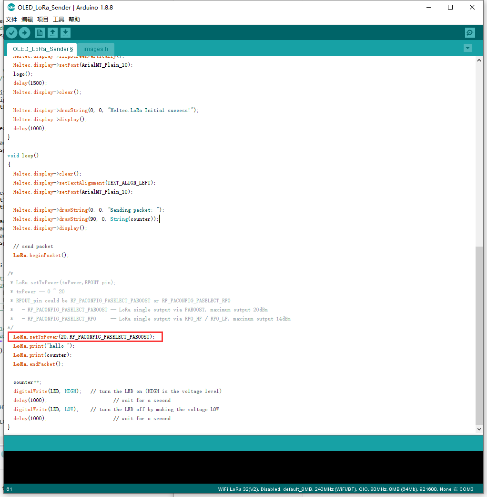

# LoRa最大通信距离测试
[English](https://heltec-automation-docs.readthedocs.io/en/latest/esp32/distance_test.html)
## 准备工作

首先，确认[Heltec ESP开发框架](https://github.com/Heltec-Aaron-Lee/WiFi_Kit_series)和[Heltec ESP32 库](https://github.com/HelTecAutomation/Heltec_ESP32)已正确安装。如果没有，请查看本文[Heltec ESP32快速入门](https://heltec-automation.readthedocs.io/zh_CN/latest/esp32/quick_start.html)。

- 准备两块ESP32+LoRa板；

- 建议使用“OLED_LoRa_Sender”和“OLED_LoRa_Receiver”示例代码（您可以在示例中找到）；

- 更换频段以适合您的硬件和位置。例如：`433E6，470E6，868E6，915E6`**（非常重要！错误的工作频段将损坏硬件，可能违反您的位置法）**

  `Heltec.begin(true /*DisplayEnable Enable*/, true /*Heltec.Heltec.Heltec.LoRa Disable*/, true /*Serial Enable*/, true /*PABOOST Enable*/, BAND /*long BAND*/);`

  **发送方和接收方应配置为同一频带**

- 在发送器中设置20dBm最大LoRa输出功率（某些国家或地区不允许20dBm，请参考当地法律）：

  `LoRa.setTxPower(20,RF_PACONFIG_PASELECT_PABOOST); //20dB output must via PABOOST`

  例如像这样：

  

## 重要提示

- 天线对射频通信非常重要，所以必须有一个工作频率正确的好天线。

  例如：如果在868频段工作，则必须有一个868MHz天线。

- 两个天线保持平行。

  例如：如果发送者的天线垂直于地面，接收器的天线也应垂直于地面。

- 足够的电源；

- 发送节点在更高的地方。

