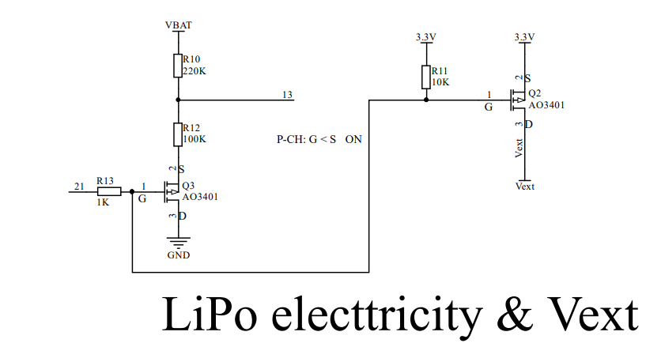

# HeltecTM "ESP32+LoRa"系列常见问题
[English](https://heltec-automation-docs.readthedocs.io/en/latest/esp32/frequently_asked_questions.html)

此页包含用户最常提出的问题。如果此页面的详细信息无法解决您的问题，您也可以在我们的论坛上留言: [community.heltec.cn](http://community.heltec.cn/)

&nbsp;

## 无法下载固件

- 使用更好的Micro-USB数据线，或更换USB底座;
- 检查并确保CP210x驱动器已正确安装，用户可以参考以下文档：[建立串行连接](https://heltec-automation.readthedocs.io/zh_CN/latest/general/establish_serial_connection.html);
- 上传前按“PRG”按钮。

&nbsp;

## 橙色LED闪烁问题

橙色LED灯总是闪烁？因为电池管理芯片MCP73831。具有以下控制逻辑：

- 闪烁—打开电源
- 高亮—充电
- 关闭—电池已充满

将此电容器改为220nF，以暂时解决此问题。

我们用TP4054代替了MCP73831，橙色的LED有了新的控制逻辑：

- 暗淡—打开电源
- 高亮—充电
- 关闭—电池已充满

## 系统一直复位

根据我们目前收集到的情况，最有可能导致恒定复位问题的可能有两个原因：

- 电源问题：请确认USB电压≥4.7V，300mA；
- 您下载程序时没有选择对应的开发板：因为每种类型的板可能有不同的FLASH大小，并且它们有不同的分区映射，这将导致内部逻辑错误。

## 关于WiFi LoRa 32（V2）睡眠电流测试

使用电池为开发板供电，并将电流表串联接入电路，下载以下示例代码：[示例代码](https://github.com/HelTecAutomation/Heltec_ESP32/blob/master/examples/Low_Power/Low_Power.ino)

这段视频是测试效果：[测试视频](https://v.youku.com/v_show/id_XNDI2NTE1NTQ3Ng==.html?spm=a2h3j.8428770.3416059.1)

## 点对点通信

在不存在硬件问题的前提下，LoRa节点可以进行点对点通信。点对点通信成功的关键在于确保以下7点相同：

1.  相同的发送和接收频率: `LoRa.setFrequency(frequency);`
2.  相同的带宽: `LoRa.setSignalBandwidth(signalBandwidth);`
3.  相同的编码率: `LoRa.setCodingRate4(codingRateDenominator);`
4.  相同的前导码长度: `LoRa.setPreambleLength(preambleLength);`
5.  相同的同步字: `LoRa.setSyncWord(syncWord);`
6.  相同的`LORA_IQ_INVERSION`状态：
7.  相同的`SPREADING FACTOR`;

了解更多关于LoRa节点间通信的信息，请参考LoRa基本库APIs: `https://github.com/HelTecAutomation/Heltec_ESP32/blob/master/src/lora/API.md`

## 外部设备电源控制

`Vext`是外部设备的电源。从原理图上看，由GPIO21控制：

`GPIO 21 --> 低电平 --> Vext(3.3V/250mA) 开启`

`GPIO 21 --> 高电平 --> Vext(3.3V/250mA) 关闭`

