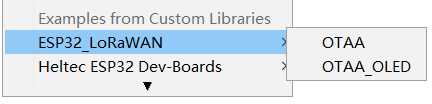
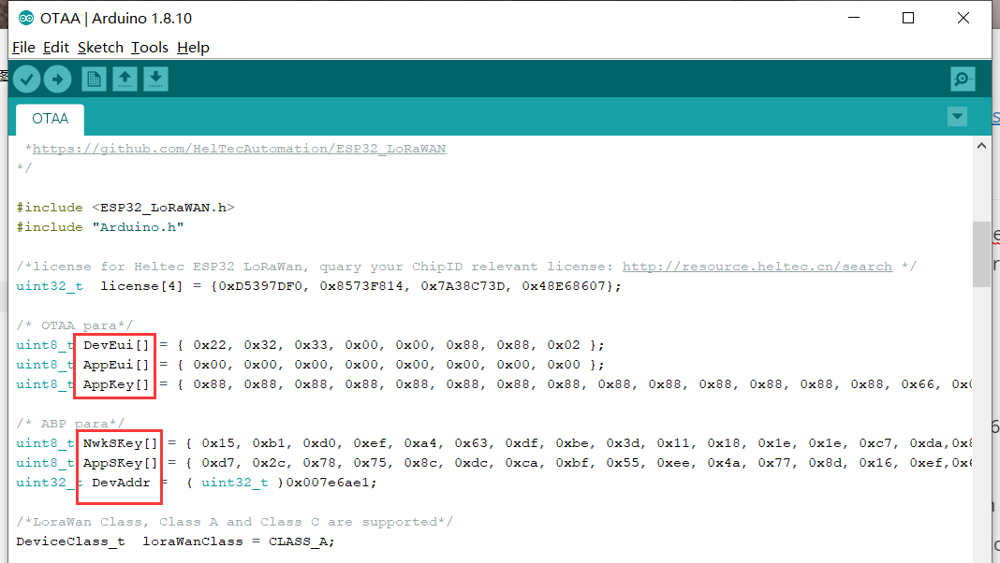
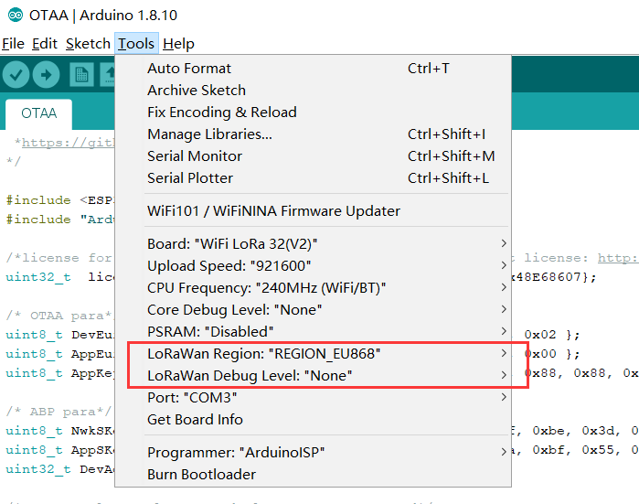

# "ESP32 + LoRa" 节点准备和配置参数
[English](https://heltec-automation-docs.readthedocs.io/en/latest/esp32/lorawan/config_parameter.html)
## 准备
----------
- [安装Arduino IDE](https://heltec-automation.readthedocs.io/zh_CN/latest/general/how_to_install_git_and_arduino.html)；
- 这个库必须与[Heltec WiFi_Kit_series Arduino开发框架](https://github.com/Heltec-Aaron-Lee/WiFi_Kit_series)一起运行，安装手册请参考[此文档](https://heltec-automation.readthedocs.io/zh_CN/latest/esp32/quick_start.html)；
- 一个网关已经连接了一个LoRa服务器；
  - [连接HT-M01到LoRa服务器](https://heltec-automation.readthedocs.io/zh_CN/latest/gateway/ht-m01/connect_to_server.html);
  - [连接HT-M02到LoRa服务器](https://heltec-automation.readthedocs.io/zh_CN/latest/gateway/ht-m02_4g/quick_start_4g.html#lora).
- 一个ESP32 + LoRa ([WiFi LoRa 32](https://heltec.org/project/wifi-lora-32/), [Wireless Stick](https://heltec.org/project/wireless-stick/), 等) 节点和一根高质量的Micro-USB数据线；
- 在本例中，我们使用[HT-M01网关](https://heltec.org/project/HT-M01/)并通过Micro-USB数据线将它连接到Windows<sup>®</sup>，然后使用[WiFi LoRa 32(V2)](https://heltec.org/project/WiFi-LoRa-32/)开发板快速连接到TTN。

### 安装库
我们提供了一个ESP32 LoRaWAN库，它从 [LoRaMac-node](https://github.com/Lora-net/LoRaMac-node) 库迁移：

[https://github.com/HelTecAutomation/ESP32_LoRaWAN](https://github.com/HelTecAutomation/ESP32_LoRaWAN)

选择以下方法之一安装此库：

1. 使用“Download ZIP”按钮从GitHub下载一个zip文件，并使用IDE（“Sketch”->“Include Library”->“Add.zip Library…”安装它；
2. 将此git存储库克隆到Arduino/libraries文件夹中。

了解更多信息, 请参考：[https://www.arduino.cc/en/Guide/Libraries](https://www.arduino.cc/en/Guide/Libraries).

&nbsp;

## 配置参数

无论使用何种LoRa管理平台，都需要DevEui、AppKey等参数。并确保它与服务器上的相关设置一致。

- **以下参数对于OTAA模式至关重要：**
  - DevEui -- Mote device IEEE EUI (big endian), 8 bytes;
  - AppEui -- Application IEEE EUI (big endian), 8 bytes;
  - AppKey -- AES encryption/decryption cipher application key, 16 bytes;
- **以下参数对于ABP模式至关重要：**
  - NwkSKey -- AES encryption/decryption cipher network session key, 16 bytes;
  - AppSKey -- AES encryption/decryption cipher application session key, 16 bytes;
  - DevAddr -- Device address on the network (big endian), uint32_t;

依次点击 `File -- Examples -- ESP32_LoRaWAN -- OTAA`，选择一个例程。



LoRaWAN相关参数在`.ino`文件中，直接在代码中修改。



&nbsp;

## 选择频段

Arduino“工具“菜单中有一些选项：



`Board, Upload Speed, CPU Frequency, Core Debug Level, PSRAM`是ESP32芯片的常规选项，仅保留默认值。特别注意“`LoRaWan Region`”和“ `LoRaWan Debug Level`”：

- **LoRaWan Region** -- 严格遵守LoRaWAN 协议区域定义[LoRaWAN™ 1.0.2 Regional Parameters rB](https://resource.heltec.cn/download/LoRaWANRegionalParametersv1.0.2_final_1944_1.pdf);
- **LoRaWan Debug Level** -- 通过串行端口打印的消息。
  - None -- 默认;
  - Freq -- 上下行频率；
  - Freq && DIO -- 上下行链路频率和DIO中断信息；
  - Freq && DIO && PW -- 上下行链路频率、DIO中断信息和低功耗状态。

``` Note:: 打印过多的消息可能会导致系统不稳定。

```
