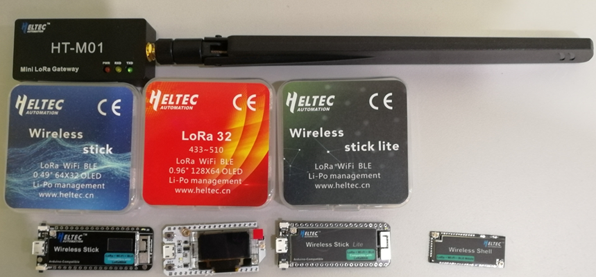
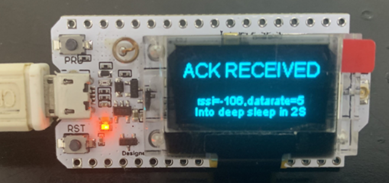
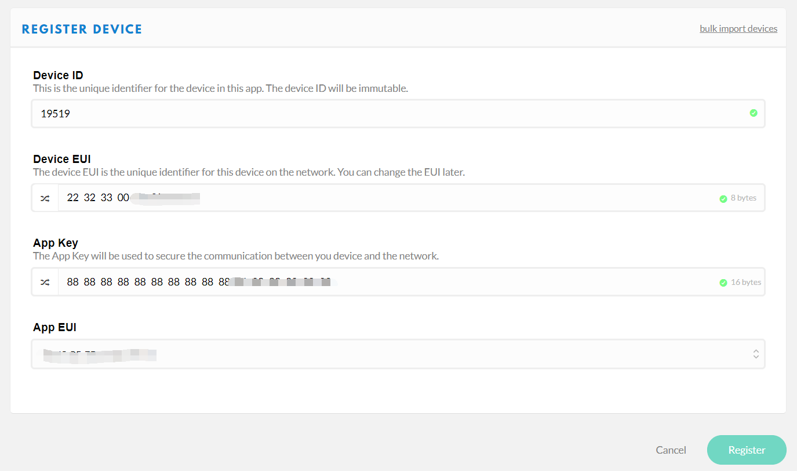
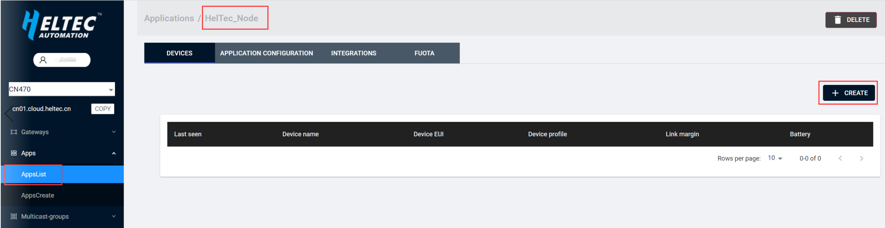
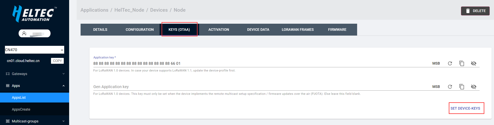

# 连接 "ESP32 + LoRa" 节点到LoRaWAN服务器
[English](https://heltec-automation-docs.readthedocs.io/en/latest/esp32/lorawan/connect_to_gateway.html)

配置前请仔细阅读本文档: **["ESP32 + LoRa" 节点准备和配置参数](https://heltec-automation.readthedocs.io/zh_CN/latest/esp32/lorawan/config_parameter.html)**

&nbsp;

## 连接到TTN

在此之前，请确保您的TTN帐户中有一个激活的LoRa网关。

### 注册设备

在TTN的“Applications”页面注册新设备。可以自动生成`Device ID`, `Device EUI`, `App Key`。用户需要确认ESP32 LoRa节点的相关参数与TTN相同。

正确配置ESP32LoRa节点的LoRaWAN参数，请参考[这篇文档](https://heltec-automation.readthedocs.io/zh_CN/latest/esp32/lorawan/config_parameter.html)。如果一切顺利，我们将能够看到设备的“DEVICE OVERVIEW”。

## 连接到ChirpStack

即将上线。

&nbsp;

## 连接到HelTec服务器

在此之前，请确保您的HelTec帐户中有一个激活的LoRa网关。

### 注册设备

在"Apps"中选择"AppsCreate"新建应用，填入相应的信息后点击"CREATE APPLICATION"完成应用创建。

在"AppsList"中选择新建的应用，在应用中新建设备。

配置节点设备的"Device EUI", "App Key"相关参数，用户需确保ESP32LoRa节点中的参数与服务器中配置的一致。

正确配置ESP32LoRa节点的LoRaWAN参数，请参考[这篇文档](https://heltec-automation.readthedocs.io/zh_CN/latest/esp32/lorawan/config_parameter.html)。如果一切顺利，我们将能够看到设备的状态。

## 重要提示

请仔细检查以下两件事：

1. LoRaWAN参数与服务器相同！
2. 你的LoRa网关的监听频率和ESP32节点的发送频率相同。我们严格遵守[LoRaWAN™ 1.0.2 Regional Parameters rB](https://resource.heltec.cn/download/LoRaWANRegionalParametersv1.0.2_final_1944_1.pdf)。