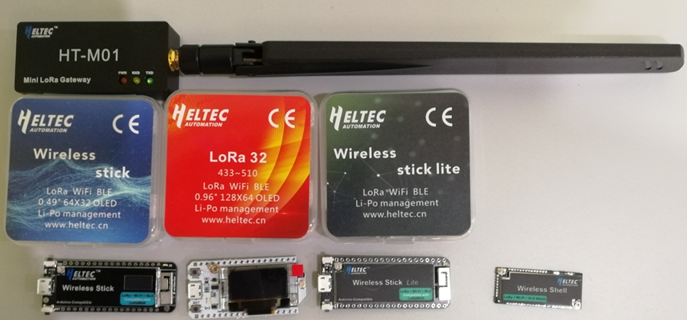

LoRaWAN
=======
`English <https://heltec-automation-docs.readthedocs.io/en/latest/esp32/lorawan/index.html>`_

本文旨在描述如何使用 `Heltec ESP32 LoRaWAN库 <https://github.com/HelTecAutomation/ESP32_LoRaWAN>`_。

.. tip:: 这个库是从https://github.com/Lora-net/LoRaMac-node移植的。

该库使LoRaWAN 1.0.2协议与ESP32 Arduino一起运行。 只支持由 `HelTec Automation(TM) <https://heltec.org>`_ 生产的ESP32 + LoRa系列产品, 并且 `LoRa网关 <https://heltec.org/proudct_center/lora/lora-gateway/>`_ 是必需的。

.. note:: Heltec ESP32 LoRaWAN库需要license才能激活，license对应ESP32的芯片ID。查询开发板的license请点击: `http://resource.heltec.cn/search <http://resource.heltec.cn/search>`_。

`Heltec LoRa节点列表 <https://docs.heltec.cn/#/en/products/lora/lora_node/heltec_lora_node_list_eu>`_.

.. toctree::
    :maxdepth: 2
    
    配置参数 <config_parameter>
    连接到LoRaWAN服务器 <connect_to_gateway>