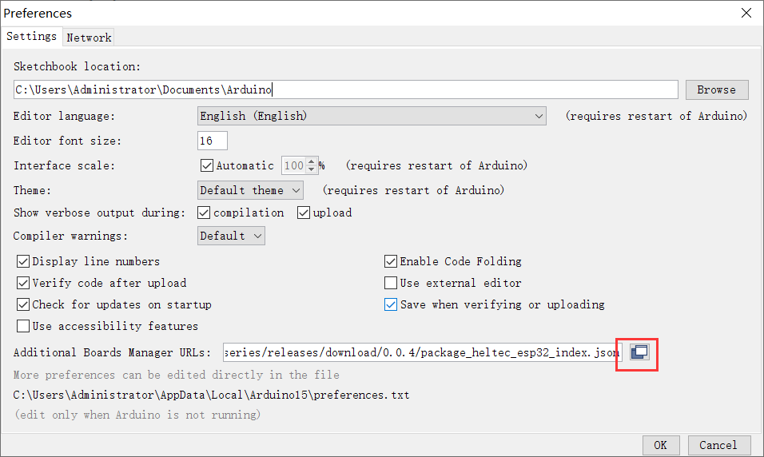
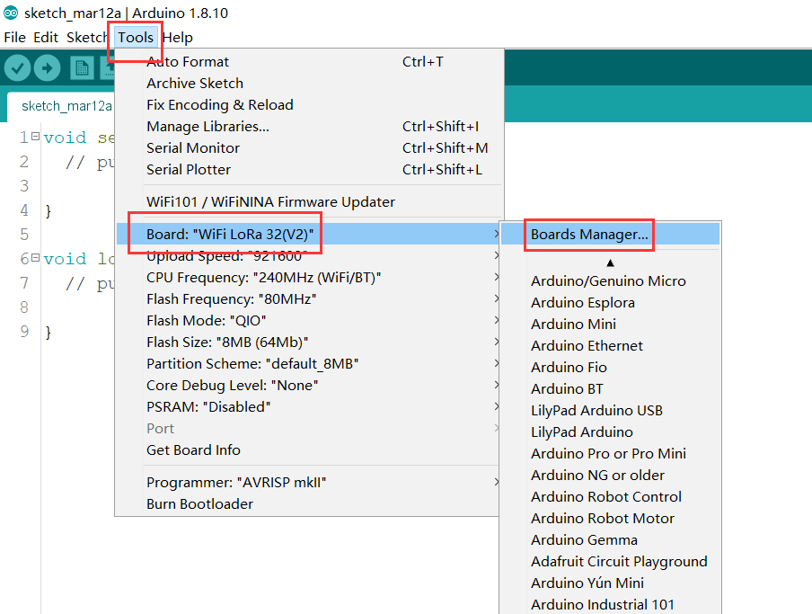
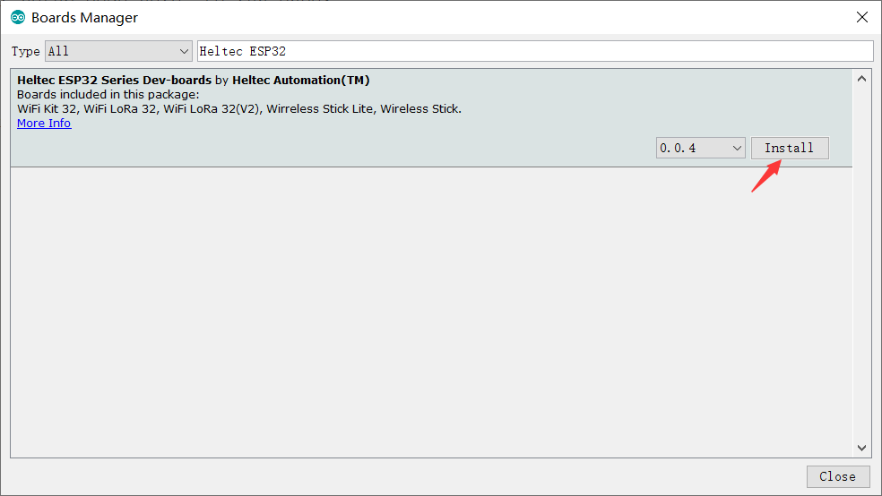
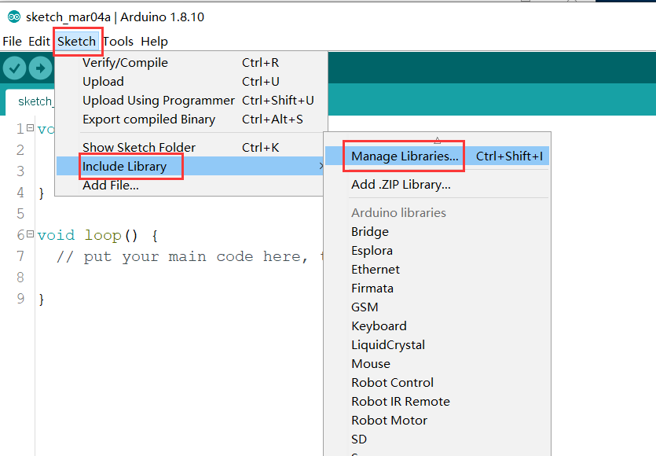
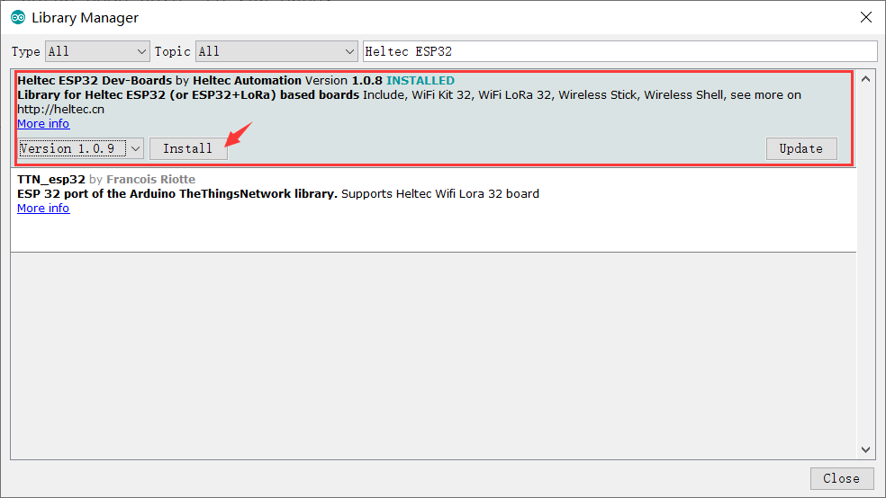
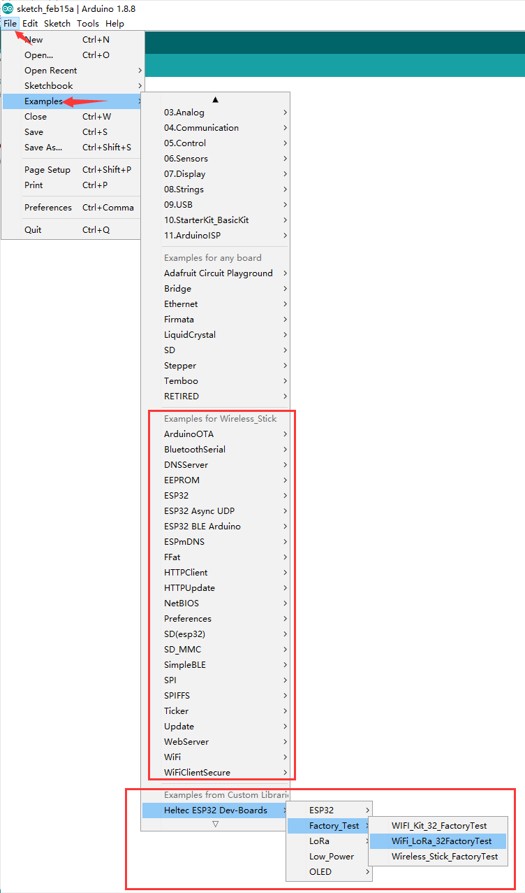
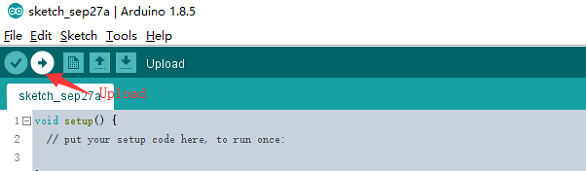

# Heltec "ESP32+LoRa"系列快速入门
[English](https://heltec-automation-docs.readthedocs.io/en/latest/esp32/quick_start.html)

我们建议您确认是否已先安装了“USB驱动程序”、“Git”和“Arduino IDE”。如果没有，请查看这两篇文章[建立串行连接](https://heltec-automation.readthedocs.io/zh_CN/latest/general/establish_serial_connection.html)和[安装Git和Arduino IDE](https://heltec-automation.readthedocs.io/zh_CN/latest/general/how_to_install_git_and_arduino.html)。

**安装开发框架有两种方法，请从中选择：**

- [通过Arduino Board Manager](#arduino-board-manager)
- [通过Git](#git)

&nbsp;

## 通过Arduino Board Manager

### 第一步. 下载Arduino-ESP32开发环境支持

打开"Arduino IDE", 依次点击`File`->`Peferences` ，在`settings`中修改"Board Manager URLs"。


&nbsp;



**输入最新的ESP32 package URL:** [https://github.com/Heltec-Aaron-Lee/WiFi_Kit_series/releases/download/0.0.5/package_heltec_esp32_index.json](https://github.com/Heltec-Aaron-Lee/WiFi_Kit_series/releases/download/0.0.5/package_heltec_esp32_index.json)


依次点击`Tools --> Board --> Boards Manager...`，在新弹出的对话框中搜索“Heltec ESP32”，然后选择最新版本下载。





Heltec ESP系列（ESP32和ESP8266）框架的源代码：[https://github.com/Heltec-Aaron-Lee/WiFi_Kit_series](https://github.com/Heltec-Aaron-Lee/WiFi_Kit_series)

### 第二步. 下载Heltec ESP32库

打开"Arduino IDE"，依次点击 `Sketch`->`Include Library`->`Manage Libraries...`，在新弹出的对话框中搜索“Heltec ESP32”，选择最新版本下载。





Heltec ESP32库的源代码：[https://github.com/HelTecAutomation/Heltec_ESP32](https://github.com/HelTecAutomation/Heltec_ESP32)

&nbsp;

## 通过Git

- For Windows: `https://github.com/Heltec-Aaron-Lee/WiFi_Kit_series/blob/master/InstallGuide/windows.md`
- For MacOS: `https://github.com/Heltec-Aaron-Lee/WiFi_Kit_series/blob/master/InstallGuide/mac.md`
- For Linux
  - Debian/Ubuntu: `https://github.com/Heltec-Aaron-Lee/WiFi_Kit_series/blob/master/InstallGuide/debian_ubuntu.md`
  - Fedora: `https://github.com/Heltec-Aaron-Lee/WiFi_Kit_series/blob/master/InstallGuide/fedora.md`
  - OpenSUSE: `https://github.com/Heltec-Aaron-Lee/WiFi_Kit_series/blob/master/InstallGuide/opensuse.md`

&nbsp;

## 示例

此部分用于验证是否可以使用Arduino编程。现在，用Micro-USB数据线将Heltec ESP32开发板连接到电脑，然后选择连接到Heltec ESP32开发板的串行端口。

### 选择一个例程

在“工具”菜单中正确选择开发板和相关选项：


然后选择一个例程，例如`XXXXXX_FactoryTest.ino`



编译并上传



### 新建一个Heltec ESP32 程序

打开“Arduino IDE”，创建一个新的“.ino”文件，然后复制下面的代码。

```arduino
#include <heltec.h>

// the setup routine runs once when starts up
void setup(){

  // Initialize the Heltec ESP32 object
  Heltec.begin(true /*DisplayEnable Enable*/, true /*LoRa Disable*/, true /*Serial Enable*/, true /*PABOOST Enable*/, 470E6 /**/);
}

// the loop routine runs over and over again forever
void loop() {

}
```

编译并上传，将在屏幕上（如果该板有屏幕）显示一些信息，并在串行端口打印一些东西，这意味着Heltec ESP32板运行成功！