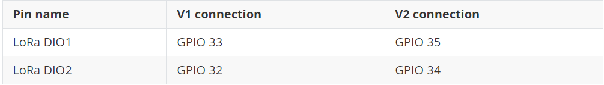

# WiFi LoRa 32硬件更新日志
[English](https://heltec-automation-docs.readthedocs.io/en/latest/esp32/wifi_lora_32/hardware_update_log.html)
## V1

- 首次发布
- 2017-6-1 公开销售

- [V1引脚图](http://resource.heltec.cn/download/WiFi_LoRa_32/WIFI_LoRa_32_V1.pdf)

- V1原理图
  - [433, 470~510 版本](http://resource.heltec.cn/download/WiFi_LoRa_32/V1/WIFI_LoRa_32(433_470-510%20version)Schematic_diagram.PDF)
  - [868~915 版本](http://resource.heltec.cn/download/WiFi_LoRa_32/V1/WIFI_LoRa_32(868-915version)Schematic_diagram.PDF)

&nbsp;

## V2

- 2018-9-15 公开销售

- 4MB（32M-bits）FLASH 升级到8MB（64M-bits）FLASH ；

- 使用40MHz HSE (V1 使用26MHz);

- 基本低功耗设计（深度睡眠800uA)；

- 添加Vext电源输出引脚，用户可以使用该引脚驱动一些外部设备（传感器、电机等），当系统需要进入深度睡眠模式时，Vext可以关闭。

  **此引脚由GPIO21控制，例如：**

  ​		Turn ON:  `digitalWrite(21, LOW);`

  ​		Turn OFF: `digitalWrite(21, HIGH);`

- 更改了一些引脚连接：

  

- 电路优化，系统更稳定；

- 更好的电源管理系统设计；

- 更好的射频阻抗匹配。

- [V2引脚图](http://resource.heltec.cn/download/WiFi_LoRa_32/WIFI_LoRa_32_V2.pdf)

- V2原理图
  - [433, 470~510 版本](http://resource.heltec.cn/download/WiFi_LoRa_32/V2/WiFi_LoRa_32_V2(433%2C470-510).PDF)
  - [868~915 版本](http://resource.heltec.cn/download/WiFi_LoRa_32/V2/WIFI_LoRa_32_V2(868-915).PDF)

&nbsp;

## V2.1

- 2019-6-15 公开销售
- 将射频开关从PE4259换成UPG2179，并将射频部分换成官方推荐值;
- 将电源检测引脚从13(ADC2:4)换到37(ADC1:1)。
- [V2.1引脚图](https://resource.heltec.cn/download/WiFi_LoRa_32/WIFI_LoRa_32_V2.1.pdf)
- V2.1原理图
  - [433, 470~510 版本](https://resource.heltec.cn/download/WiFi_LoRa_32/V2.1/WiFi_LoRa_32_V2.1(433%2C470-510).PDF)
  - [868~915 版本](https://resource.heltec.cn/download/WiFi_LoRa_32/V2.1/WIFI_LoRa_32_V2.1(868-915).PDF)