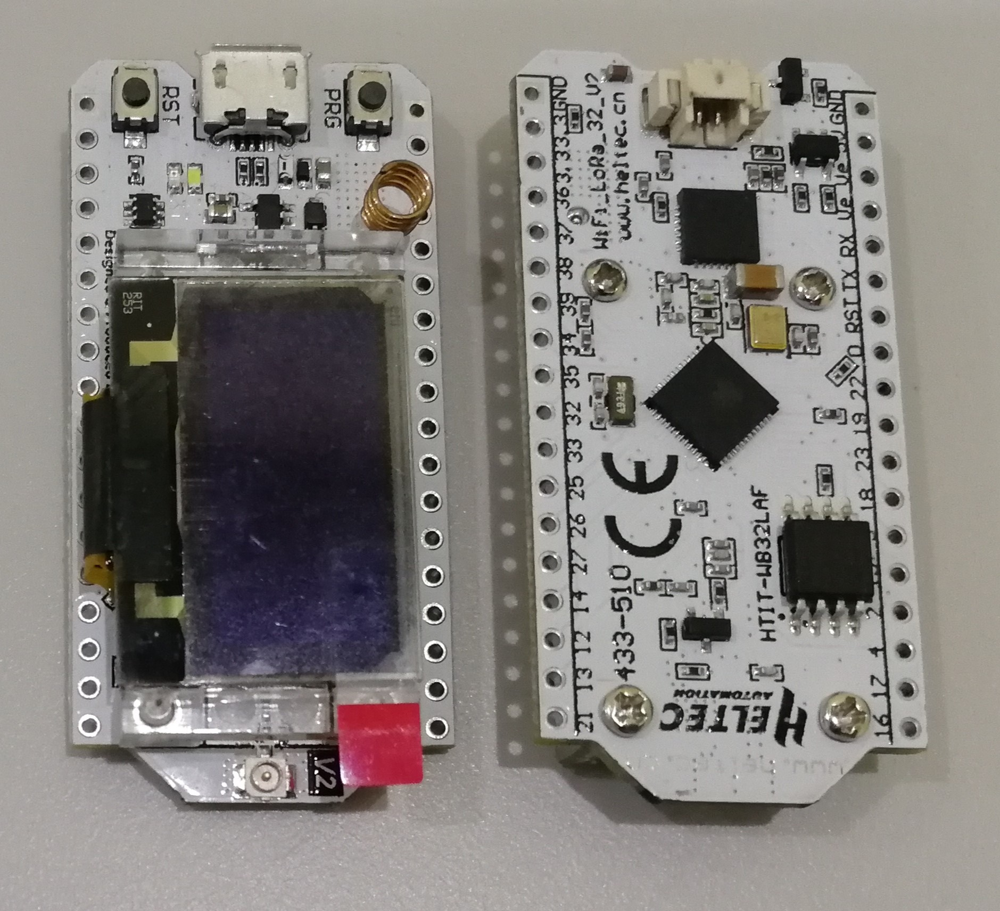

# WiFi LoRa 32 Hardware Update Logs

## V1

- First release
- 2017-6-1 public sale

- [V1 Pinout diagram](http://resource.heltec.cn/download/WiFi_LoRa_32/WIFI_LoRa_32_V1.pdf)

- V1 Schematic diagram
  - [433, 470~510 Version](http://resource.heltec.cn/download/WiFi_LoRa_32/V1/WIFI_LoRa_32(433_470-510%20version)Schematic_diagram.PDF)
  - [868~915 Version](http://resource.heltec.cn/download/WiFi_LoRa_32/V1/WIFI_LoRa_32(868-915version)Schematic_diagram.PDF)

&nbsp;

## V2

- 2018-9-15 public sale

- 4MB (32M-bits) FLASH upgrade to 8MB (64M-bits) FLASH;

- 4MB（32M位）FLASH 升级到8MB（64M位）FLASH ；

- Use 40MHz HSE (V1 use 26MHz);

- 使用40MHz HSE (V1 使用26MHz);

- Basic low power design (800uA in deep sleep);

- 基本低功耗设计（深度睡眠800uA）；

- Add Vext power output pin, users can use this pin to drive some external device (sensor, motor etc.), when system need into deep sleep mode, Vext can be turn off.

- 添加Vext电源输出引脚，用户可以使用该引脚驱动一些外部设备（传感器、电机等），当系统需要进入深度睡眠模式时，Vext可以关闭。

  **This pin was controlled by GPIO21, for example:**

  *此引脚由GPIO21控制，例如：**

  ​		Turn ON:  `digitalWrite(21, LOW);`

  ​		Turn OFF: `digitalWrite(21, HIGH);`

- Changed some pin connection:

- 更改了一些引脚连接：

  

- Circuit optimization, system more stable;

- 电路优化，系统更稳定；

- Better power manage system design;

- 更好的电源管理系统设计；

- Better RF impendence matching.

- 更好的射频阻抗匹配。

- [V2 Pinout diagram](http://resource.heltec.cn/download/WiFi_LoRa_32/WIFI_LoRa_32_V2.pdf)

- V2 Schematic diagram
  - [433, 470~510 Version](http://resource.heltec.cn/download/WiFi_LoRa_32/V2/WiFi_LoRa_32_V2(433%2C470-510).PDF)
  - [868~915 Version](http://resource.heltec.cn/download/WiFi_LoRa_32/V2/WIFI_LoRa_32_V2(868-915).PDF)

&nbsp;

## V2.1

