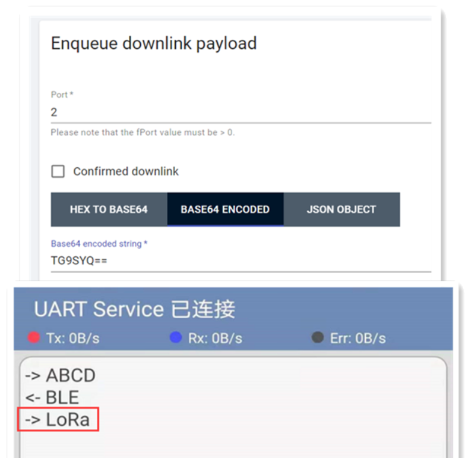

# Wireless Bridge BLE_LoRa 例程用户手册

[English](https://heltec-automation-docs.readthedocs.io/en/latest/esp32/wireless_bridge/ble_lora_user_manual.html)

## 摘要

本文档将简要介绍Wireless_Bridge BLE_LoRa例程的用法。

```Tip:: loraWanClass应该选择CLASS_C

```


## 用法

在开始测试之前，请确保Wireless_Bridge可以与网关正常通信。 要查看蓝牙消息，您需要相应的蓝牙调试工具。

- 将程序上传到开发板后，打开相应的蓝牙调试工具并连接到名为“ UART Service”的蓝牙。 连接时，请注意蓝牙传输参数与程序中的参数一致。


- 蓝牙连接成功后，通过蓝牙调试工具发送的信息将被转发到LoRa。转发到LoRa的信息需要相应地进行解码。


- 通过LoRa发送的信息将被转发到蓝牙，并且可以在蓝牙调试工具中查看。



- 该示例的相应解码如下：

```shell
function Decode(fPort, bytes) {
  var charValue1= String.fromCharCode(bytes[0]);
  var charValue2= String.fromCharCode(bytes[1]);
  var charValue3= String.fromCharCode(bytes[2]);
  var charValue4= String.fromCharCode(bytes[3]);
  var charValue= charValue1 + charValue2 + charValue3 + charValue4;
  var result={
    
                                                "char":{
                                                "charValue":charValue,
                                                       }
  }
  return result;
}
```
