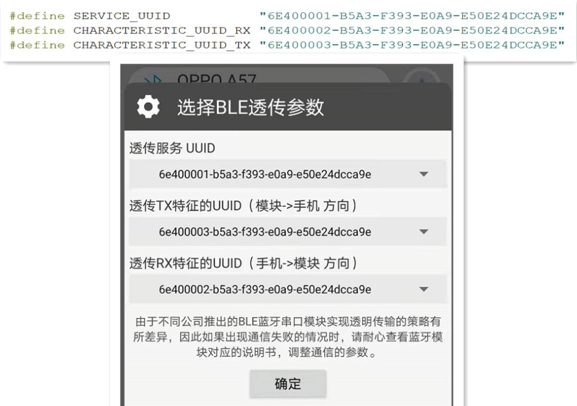
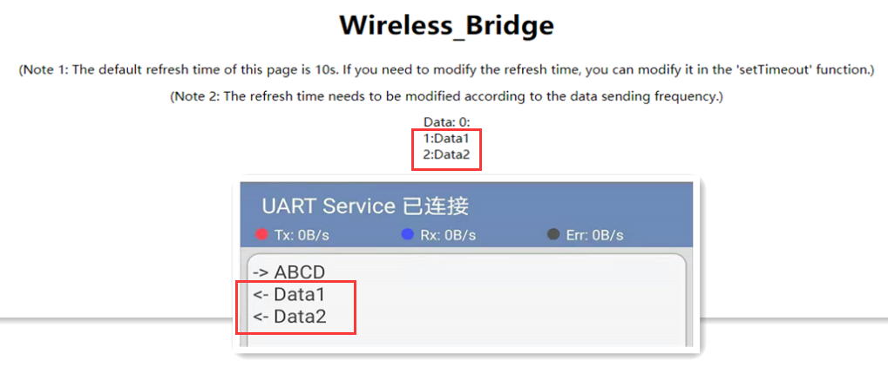
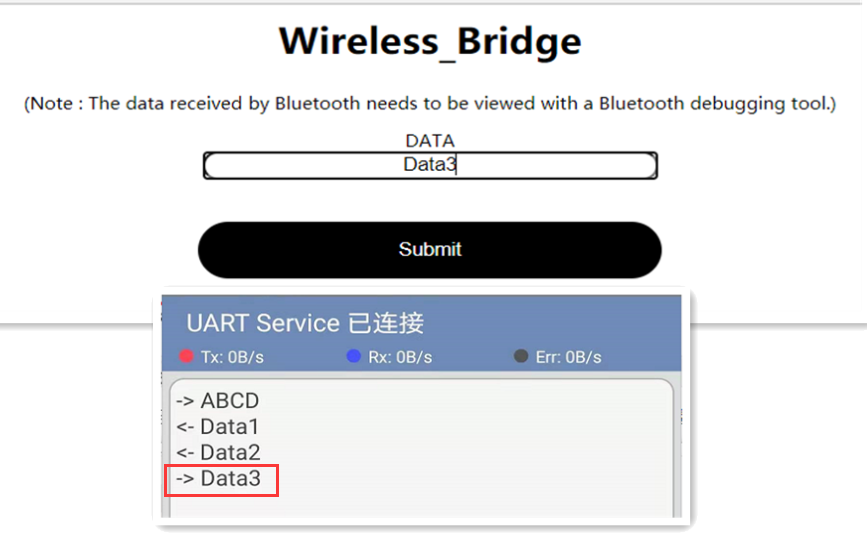

# Wireless Bridge WiFi_BLE 例程用户手册

[English](https://heltec-automation-docs.readthedocs.io/en/latest/esp32/wireless_bridge/wifi_ble_user_manual.html)

## 摘要

本文档将简要介绍Wireless_Bridge WiFi_BLE例程的用法。

## 用法

要查看蓝牙消息，您需要相应的蓝牙调试工具。

- 在程序中配置WiFi信息。

- 将程序上传到开发板后，打开串行端口以查看网页的IP地址。 其中，“View page IP address”是用于将蓝牙信息转发至WiFi的查看网页，而“Write page IP address”是用于将WiFi信息转发至蓝牙的发送网页。 打开网页的设备必须与Wireless_Bridge位于同一局域网中。

- 打开相应的蓝牙调试工具，然后连接到名为“ UART Service”的蓝牙。 连接时，请注意蓝牙传输参数与程序中的参数一致。

- 蓝牙连接成功后，通过蓝牙调试工具发送信息，接收到的数据将通过WiFi显示在网页上。 默认的网页刷新时间为10S，可以根据特定需要在“ setTimeout”函数中修改网页刷新时间。

- 通过网页发布的信息将被转发到蓝牙，并且可以在蓝牙调试工具中查看。

