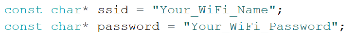
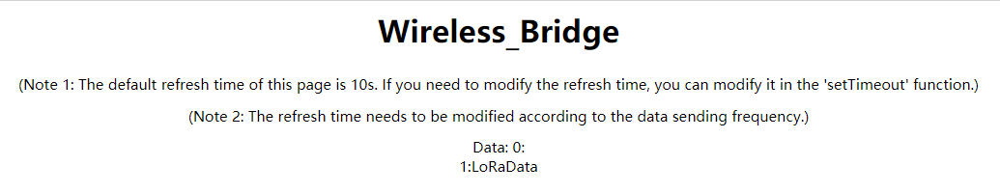
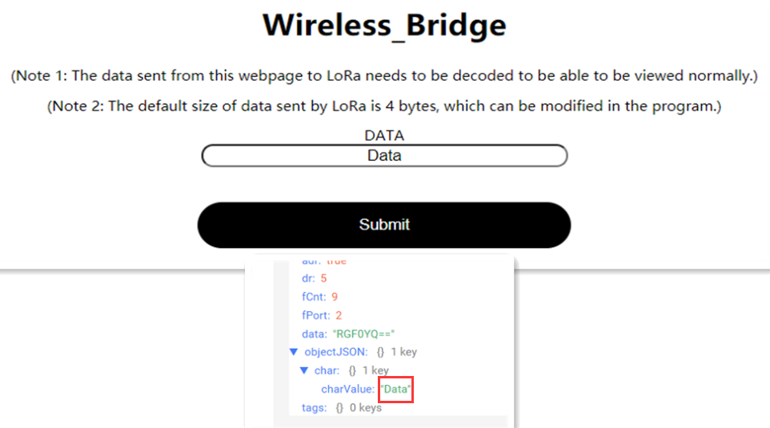

# Wireless Bridge WiFi_LoRa 例程用户手册

[English](https://heltec-automation-docs.readthedocs.io/en/latest/esp32/wireless_bridge/wifi_lora_user_manual.html)

## 摘要

本文档将简要介绍Wireless_Bridge WiFi_LoRa例程的用法。

```Tip:: loraWanClass应该选择CLASS_C

```


## 用法

在开始测试之前，请确保Wireless_Bridge可以与网关正常通信。

- 在程序中配置WiFi信息。



- 将程序上传到开发板后，打开串行端口以查看网页的IP地址。 其中，“View page IP address”是用于将LoRa信息转发到WiFi的查看网页，而“Write page IP address”是用于将WiFi信息转发到LoRa的发送网页。 打开网页的设备必须与Wireless_Bridge位于同一局域网中。


- 通过LoRa发送信息，接收到的数据将通过WiFi显示在网页上。 默认的网页刷新时间为10S，可以根据特定需要在“ setTimeout”函数中修改网页刷新时间。




- 网页发布的信息将转发到LoRa，并且可以在节点数据中查看。 转发到LoRa的信息需要相应地进行解码。



- 该示例的相应解码如下：

```shell
function Decode(fPort, bytes) {
  var charValue1= String.fromCharCode(bytes[0]);
  var charValue2= String.fromCharCode(bytes[1]);
  var charValue3= String.fromCharCode(bytes[2]);
  var charValue4= String.fromCharCode(bytes[3]);
  var charValue= charValue1 + charValue2 + charValue3 + charValue4;
  var result={
    
                                                "char":{
                                                "charValue":charValue,
                                                       }
  }
  return result;
}
```

