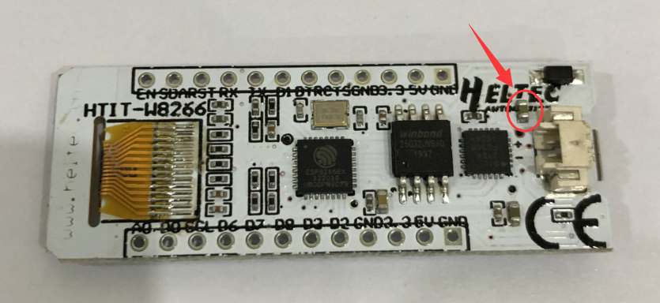

# HeltecTM "ESP8266+Arduino"系列常见问题
[English](https://heltec-automation-docs.readthedocs.io/en/latest/esp8266+arduino/frequently_asked_questions.html)

此页面包含用户最常提出的问题。如果这个页面的详细信息不能解决你的问题，你也可以在我们的论坛上留言： [community.heltec.cn](http://community.heltec.cn/)

## 橙色LED闪烁问题

烦人的橙色LED灯总是闪烁吗？ 这是因为电池管理芯片MCP73831。 具有以下控制逻辑：

* 闪烁-开机
* 亮-充电
* 关闭-电池充满

将此电容器更改为220nF可暂时解决此问题。

## **关于设备无法连接到WiFi的说明**

我们收到一些客户的反馈：在正常情况下，该设备可以正常连接WiFi（未插入任何外围设备）。 但是，一旦将设备插入面包板，设备就**无法正常**连接WiFi。 我们对此进行了调查。

面包板内置大量**金属条**，这些金属条会对WiFi天线造成一定程度的**干扰**，并最终导致设备无法正常连接WiFi（请参阅图片）。

如果要使用WiFi功能，请尽量避免使用面包板。

