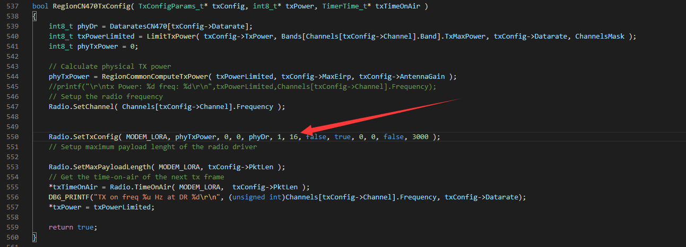
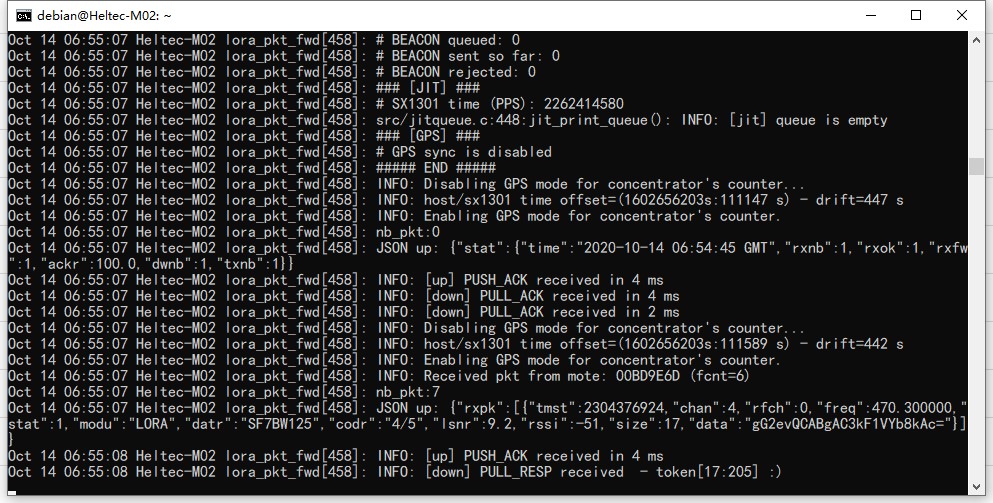

# Heltec<sup>TM</sup>网关系列常见问题
[English](https://heltec-automation-docs.readthedocs.io/en/latest/gateway/frequently_asked_questions.html)

此页面包含了用户最常提出的问题。如果此页面的详细信息无法解决您的问题，您也可以在我们的论坛上留言： [community.heltec.cn](http://community.heltec.cn/)

&nbsp;

## `PicoGW_UI`软件无法选择"China"

### 原因

`PicoGW_UI`的默认安装包里面，并未包含中国使用的470~510MHz频段的配置文件。

### 解决办法

- 将此GitHub仓库克隆或者下载下来：[https://github.com/HelTecAutomation/lorasdk](https://github.com/HelTecAutomation/lorasdk)；
- 将其中的`global_conf_CN470.json`文件更名为`default_global_conf_CN.json`；
- 将`default_global_conf_CN.json`文件复制到`C:\Users\username\AppData\Roaming\Semtech\PicoGW_UI\Config`路径，若已存在同名文件，将其覆盖。

若一切正常，就在`PicoGW_UI`正常选择"China"了。

&nbsp;

## HT-M02更改频段

要更改HT-M02网关频段，只需执行以下命令。

```shell
sudo cp -f /home/debian/lora/lorasdk/lora_conf_CN470.json /home/debian/lora/packet_forwarder/lora_pkt_fwd/lora_conf.json
```

其中"lora_conf_CN470.json"可替换为"lora_conf_EU433.json"，"lora_conf_EU868.json"，"lora_conf_US915.json"，分别对应相应频段。

&nbsp;

## 固定前导码长度以适合HT-M00双通道网关

由于HT-M00使用两个SX1276 LoRa芯片和一个在ESP32中运行的数字基带程序，因此节点必须固定前导码长度才能与HT-M00一起使用。

```Tip:: 修改了前导码长度的节点仍然可以与使用SX1301/2/8的网关正常通信。

```

我们的[节点产品](https://docs.heltec.cn/#/en/products/lora/lora_node/heltec_lora_node_list?id=heltec-lora-node-products-difference-table)使用的LoRaWAN节点代码，移植了[Semtech的LoRaMac节点代码](https://github.com/Lora-net/LoRaMac-node)，通常在RegionXXX.c中进行了修改。

For example, I need fix the preamble length of CN470, so I need first open the RegionCN470.c, in the RegionCN470TxConfig function, and modify that. *The 16 is already modified by us.*

例如，我需要固定CN470的前导码长度，因此需要首先打开`RegionCN470.c`，然后在`RegionCN470TxConfig`函数中进行修改。 **16是我们已经修改了的。**



&nbsp;

## 如何查看网关日志

在许多调试情况下，网关日志非常重要。 主要用于验证网关是否已正确从LoRa节点接收到LoRaWAN消息。

如果由[Heltec Automation](https://heltec.org)制造的网关用Linux驱动，网关将有一个名为`lrgateway`的服务，请通过以下命令查看网关日志：

`journalctl -f -n 100 -u lrgateway`



**以下网关可以使用此命令：**

- 由树莓派驱动的[HT-M01评估网关](https://heltec.org/project/ht-m01)；
- [HT-M02 边缘LoRa网关](https://heltec.org/project/ht-m02)