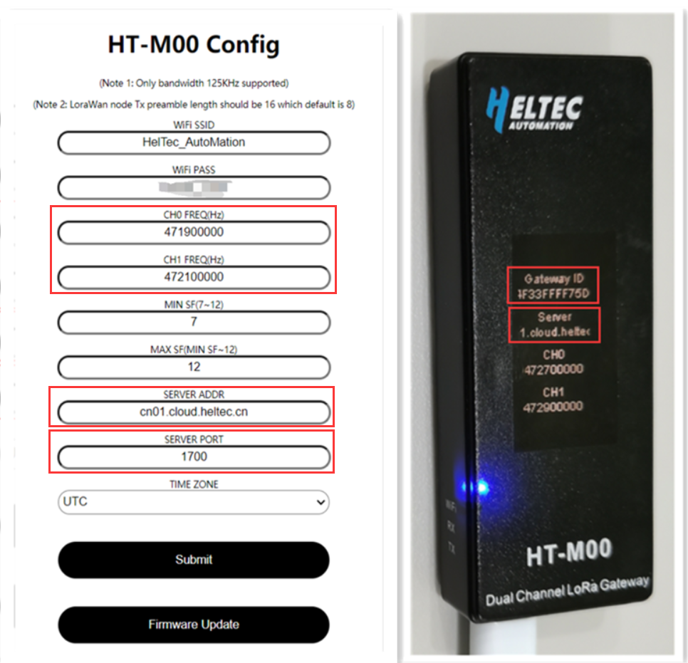
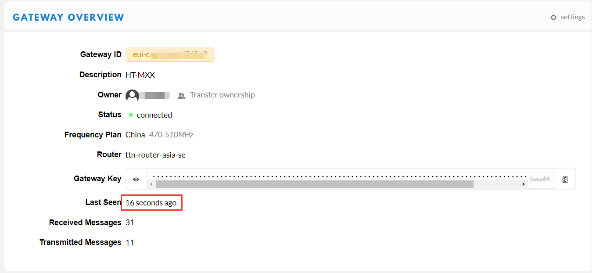

# 将HT-M00连接到LoRa服务器

[English]()

## 摘要

本文旨在描述如何将[HT-M00 网关](https://heltec.org/project/ht-m00/)连接到LoRa服务器，如[TTN](https://www.thethingsnetwork.org/), [ChirpStack](https://www.chirpstack.io/)，从而促进LoRa设备的二次开发和快速部署。

在所有操作之前，请确保HT-M00运行良好。如果没有，请参考[HT-M00快速入门]()文档。

&nbsp;

将HT-M00网关连接到LoRa服务器，只需在将HT-M00配置完成后，在服务器上添加相应网关。

- 在配置HT-M00时。应注意"SERVER ADDR"与服务器地址一致。在服务器中新建网关时，应注意”Gateway ID“与HT-M00的网关ID一致。



```Tip:: 每个HT-M00网关的网关ID是不同的，且不可更改。

```


&nbsp;

## 连接到TTN

### 在TTN中注册LoRa网关

在TTN中创建并激活帐户，在 [console](https://console.thethingsnetwork.org/) 页面中选择“Gateway”。


如下图所示填写HT-M00信息并完成添加。


- **Gateway EUI** -- HT-M00网关的唯一ID;
- **I'm using the legacy packet forwarder** -- 必须选择;
- **Frequency Plan** -- 必须匹配HT-M00中的LoRa频段；
- **Router** -- 必须使用TTN系统分配的默认Router.

``` Tip:: 这四点是成功连接TTN的关键。

```


### 连接TTN

在HT-M00网关中，只需要配置服务器地址和端口，服务器地址和端口在"HT-M00 Config"界面配置，请参考[HT-M00快速入门]()文档。

不同区域的路由器地址：

[https://www.thethingsnetwork.org/docs/gateways/packet-forwarder/semtech-udp.html#router-addresses](https://www.thethingsnetwork.org/docs/gateways/packet-forwarder/semtech-udp.html#router-addresses)


查看网关状态，它正在运行：



&nbsp;

## 连接到ChirpStack服务器

[ChirpStack](https://www.chirpstack.io/) 是目前最流行的LoRa服务器开源项目，广泛应用于许多领域，也是私有LoRa服务器的最佳选择。

- ChirpStack 安装指南: [https://www.chirpstack.io/overview/](https://www.chirpstack.io/overview/)
- ChirpStack 支持论坛: [https://forum.chirpstack.io/](https://forum.chirpstack.io/)

### ChirpStack网桥

**有件事需要注意！** ChirpStack需要一个名为`Gateway Bridge`的特殊服务，它将LoRa® Packet Forwarder协议转换为ChirpStack网络服务器通用数据格式(JSON和Protobuf)。

`Gateway Bridge`服务可以在树莓派或ChirpStack服务器上运行。

安装 ChirpStack Gateway Bridge: [https://www.chirpstack.io/gateway-bridge/install/debian/](https://www.chirpstack.io/gateway-bridge/install/debian/)

### 在ChirpStack中注册LoRa网关

如下图所示填写HT-M00信息并完成添加。


- **Gateway ID** -- HT-M00网关的唯一ID，从HT-M00的显示屏上查看。

查看网关状态，它正在运行：


&nbsp;

## 连接到HelTec服务器

即将上线。