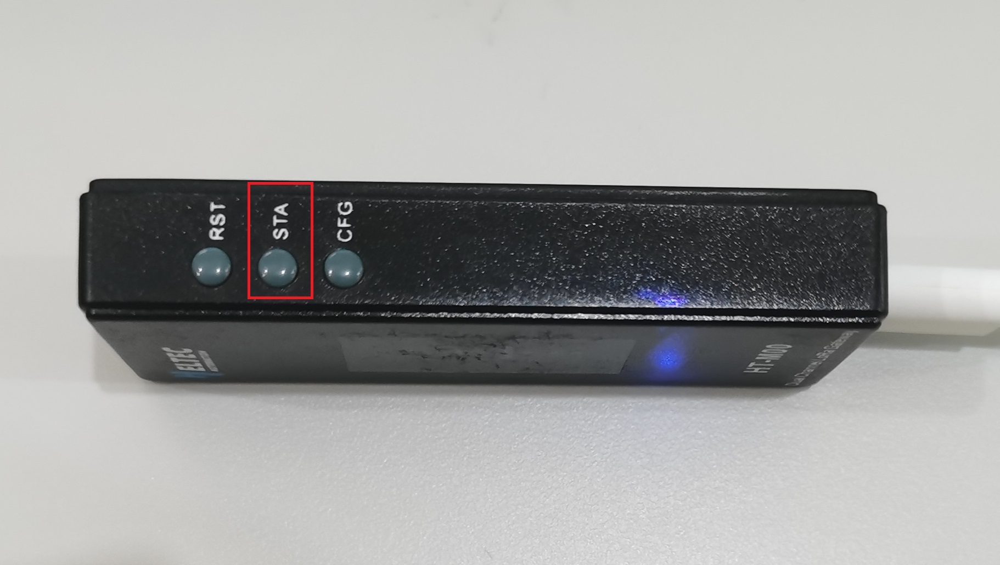
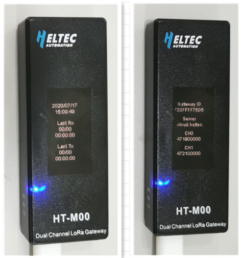

# HT-M00双通道LoRa网关快速入门
[English]()

## 摘要

HT-M00是一个小体积、低成本的双通道LoRa网关，使用Type-C接口。HT-M00网关基于ESP32驱动两个SX1276芯片。我们编写了软件混频器（基带仿真程序），以实现对125KHz SF7~SF12扩频因子的监听 。HT-M00的主要功能是为1500~2000平方米的大型房屋提供LoRaWAN网络，或弥补SX1301网关信号无法覆盖的区域中信号的盲点。

&nbsp;

## 配置网关

HT-M00网关在出厂时已经烧录好了相关程序，只需进行一些简单的操作就能使用。

- 通过Type-C数据线给网关通电后，一直按住"CFG"按键，按下"RST"按键，然后松开"RST"按键，待网关进入下图所示界面后松开"CFG"按键。

- 此时找到名字为"HT_M00"的WiFi，并通过密码"12345678"连接上WiFi，然后进入"192.168.4.1"。

- 在上图所示页面配置HT-M00需要连接的WiFi信息，网关通道频率，服务器地址及端口，时区，配置完成后点击"Submit"。同时我们会将HT-M00的相关固件放到该网页，点击"Firmware Update"可进行相应更新。

- 配置完成并提交后网关将重启。网关开机时将会自动连接配置好的WiFi，如果连接失败，将再次重启，直至连接成功。

- WiFi连接成功后，网关将进入下图所示界面。

- 按下“STA"按键，可切换显示屏显示内容。

  

- 通过按下“STA"按键，可切换显示内容。可查看时间，最近收发时间，网关ID，服务器地址，通道频率等信息。

