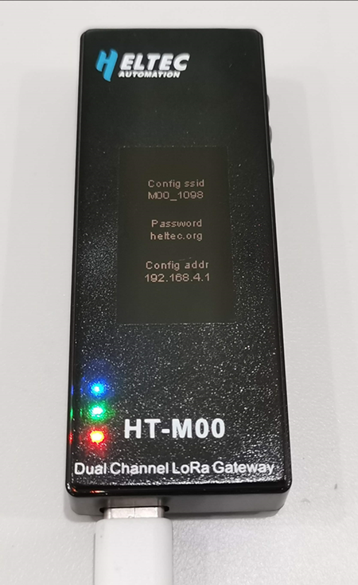

# HT-M00双通道LoRa网关快速入门
[English](https://heltec-automation-docs.readthedocs.io/en/latest/gateway/ht-m00/quick_start.html)

## 摘要

HT-M00是一个小体积、低成本的双通道LoRa网关，使用Type-C接口。HT-M00网关基于ESP32驱动两个SX1276芯片。我们编写了软件混频器（基带仿真程序），以实现对125KHz SF7~SF12扩频因子的监听 。HT-M00的主要功能是为1500~2000平方米的大型房屋提供LoRaWAN网络，或弥补SX1301网关信号无法覆盖的区域中信号的盲点。

```Tip:: 当使用HT-M00网关时，使用本公司CubeCell系列以外的节点，需要将节点的前导码长度更改为16（默认是8）。如果前导码长度为8，则需将最小SF与最大SF设为相等，否则将只能收到最小SF。例如节点前导码长度为8，网关设置最小SF为7，最大SF为12，那么将只能收到SF7。

```


如上图所示修改该函数中的前导码长度为16。 

&nbsp;

## 配置网关

```Tip:: 如果你的网关ID被占用，在修改网关ID时，为避免占用其他网关ID，请修改中间"FFFF“部分，谢谢！

```

HT-M00网关在出厂时已经烧录好了相关程序，只需进行一些简单的操作就能使用。

### 固件版本V1.9及以下


- 通过Type-C数据线给网关通电后，一直按住"CFG"按键，按下"RST"按键，然后松开"RST"按键，待网关进入下图所示界面后松开"CFG"按键。



- 找到名字为"M00_XXXX"的WiFi，并通过密码"heltec.org"连接上WiFi，然后通过浏览器进入”192.168.4.1”，进入网关配置页面。


- 在上图所示页面配置HT-M00需要连接的WiFi信息，网关通道频率，扩频因子，服务器地址及端口，时区，配置完成后点击"Submit"。同时我们会将HT-M00的相关固件放到该网页，点击"Firmware Update"可进行相应更新。

- 配置完成并提交后网关将重启。网关开机时将会自动连接配置好的WiFi，如果连接失败，将再次重启，直至连接成功。


### 固件版本V2.0及以上


- 通过Type-C数据线给网关通电后，一直按住"CFG"按键，按下"RST"按键，然后松开"RST"按键，待网关进入下图所示界面后松开"CFG"按键。


-  找到名字为"M00_XXXX"的WiFi并连接上WiFi，通过浏览器进入”192.168.4.1”，通过用户名"HT-M00"及密码"heltec.org"登入网关配置页面。


- 在上图所示页面配置HT-M00需要连接的WiFi信息，网关ID，网关通道频率，扩频因子，服务器地址及端口，心跳周期，时区，配置完成后点击"Submit"。同时我们会将HT-M00的相关固件放到该网页，点击"Firmware Update"可进行相应更新。
- 配置完成并提交后网关将重启。网关开机时将会自动连接配置好的WiFi，如果连接失败，将再次重启，直至连接成功。


```Tip:: 网关通过WiFi接入网络正常工作后，可通过显示屏上的"Local IP“直接进入配置界面(登入设备需与网关在同一局域网内)。

```


## 查看网关信息

- WiFi连接成功后，网关将进入下图所示界面。


- 按下“STA"按键，可切换显示屏显示内容。

  

- 通过按下“STA"按键，可切换显示内容。可查看时间，最近收发时间，网关ID，服务器地址，通道频率等信息。对于固件版本V2.0及以上，可在显示屏上看到"Local IP"，可通过显示屏上的"Local IP“直接进入配置界面(登入设备需与网关在同一局域网内)。


