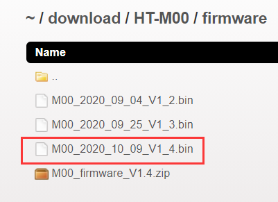
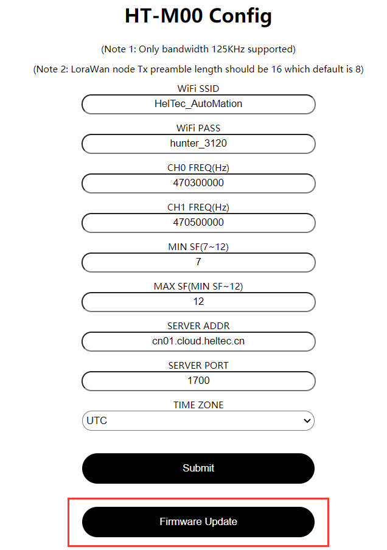

# HT-M00固件升级
[English](https://heltec-automation-docs.readthedocs.io/en/latest/gateway/ht-m00/update_firmware.html)

## 摘要

本文档旨在描述如何对HT-M00进行固件升级以及将HT-M00固件覆盖的处理方法。

```Tip:: 由于HT-M00固件版本V1.8更新了网关激活码算法。 因此，从V1.7及以下版本升级到V1.8及以上版本需要重新激活HT-M00网关。 请将网关ESP32芯片ID发送至“ support@heltec.cn”，我们将为您重新计算激活码并将其上传至服务器。

```

```Tip:: 如果你的网关ID被占用，在修改网关ID时，为避免占用其他网关ID，请修改中间"FFFF“部分，谢谢！

```

&nbsp;

## 固件升级日志

- V1.7
  - 增加底噪自动校准功能；
  - 修复已知错误。
- V1.8
  - 定时检查SX1276工作状态。如果SX1276芯片工作不正常，系统自动复位。
- V1.9
  - 增加前导长度解析功能。 如果服务端发送的json包有pream字段，HT-M00会解析转发。
- V2.0
  - 在Wi-Fi 连接中添加 DHCP 支持；
  - 上下行端口可分别设置；
  - 可自行修改心跳周期。
  - 可自行修改网关ID。

&nbsp;

## 固件升级

下载[HT-M00相应升级固件](https://resource.heltec.cn/download/HT-M00/firmware)。



通过连接HT-M00的WiFi进入HT-M00网关配置界面(可参考[HT-M00快速入门](https://heltec-automation.readthedocs.io/zh_CN/latest/gateway/ht-m00/quick_start.html))，再点击"Firmwaer Update"。



点击"Select firmware"选择下载好的相应升级固件，点击"Update"进行升级。


升级完成后，将弹出相应提示并重启网关。


&nbsp;

## HT-M00固件覆盖处理方法

### 下载及烧录固件

下载[HT-M00完整固件](https://resource.heltec.cn/download/HT-M00/firmware/complete_firmware)。

打开下载好的文件，编辑"M00_Vx_x.bat"文件。


将COM口改为HT-M00对应的COM口。


修改完成后双击运行"M00_Vx_x.bat"，完成网关固件烧录。

### 激活网关

固件烧录完成后，打开HT-M00对应的串口，读取网关相应ESP32芯片ID。


进入[https://resource.heltec.cn/search](https://resource.heltec.cn/search)，输入ESP32芯片ID查询网关对应序列号。


打开HT-M00对应的串口，通过串口发送命令"AT+CDKEY=xxxxxxxxxxxxxxxxxxxxxxxxxxxxxxxx"激活网关。其中"xxxxxxxxxxxxxxxxxxxxxxxxxxxxxxxx"为查询到的32位license。例如，如果license为0x12345678, 0x12345678, 0x12345678, 0x12345678，则激活命令为AT+CDKEY=12345678123456781234567812345678。


待显示屏正常显示后，表示网关激活成功。

```Tip:: 对于较低版本的固件，可根据"固件升级"方法对固件进行升级。

```

