# Heltec HT-M00L单通道网关接入指南

本文档将实现以下操作：

- 配置HT-M00L单通道网关，使其连接到腾讯云平台；
- 配置LoRa节点，与HT-M00L网关通过LoRaWAN协议进行通信；
- 在腾讯云平台上完成数据调试，并最终将节点发送的数据显示到“腾讯连连”小程序中；
- LoRaWAN用户自定义频点。

&nbsp;

## HT-M00L单通道网关简介

HT-M00L是[Heltec Automation](https://heltec.org/)与腾讯连连联名推出的一款低成本的单通道网关。能实现SF7～SF12的全速率监听，支持LoRaWAN协议，大幅的降低LoRa网关的成本。主要面向智能家居、通信方案评估等应用场景。

&nbsp;

## 准备工作

为了通过下面的步骤快速理解该业务场景，需要做好以下准备工作：

- 申请腾讯物联网开发平台服务；
- HT-M00L单通道网关一台；
- 任意支持LoRaWAN协议并可以修改前导码长度的节点，本例采用[CubeCell HTCC-AB01](https://heltec.org/project/htcc-ab01/)节点。

``` Tip:: 节点的前导码长度需修改为16。如果前导码长度为8，则需将最小SF与最大SF设为相等，否则将只能收到最小SF。例如节点前导码长度为8，网关设置最小SF为7，最大SF为12，那么将只能收到SF7。

```

&nbsp;

## 在腾讯云上注册设备（云平台操作）

### 注册HT-M00L网关

1. 登录 [物联网开发平台控制台](https://console.cloud.tencent.com/iotexplorer)，新建一个项目。

   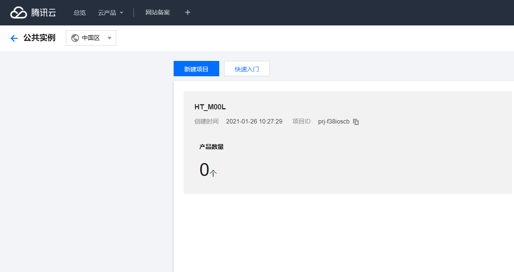

2. 在左侧工具列表中，选择【网络管理】>【LoRa 网关管理】,进入 LoRa 网关管理页面，在【用户网关】标签下选择【添加网关】。

   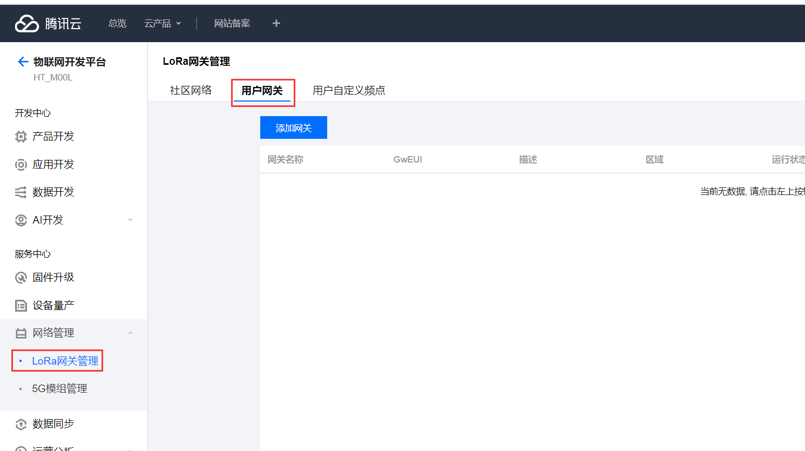

3. 在新建网关页面，填写网关基本信息。

- 网关名称：根据项目需要填写，本示例中填写HT_M00L。
- GwEUI：网关唯一 ID，可以在网关配置页上查看。
- 是否公开：选择“是”，表示社区开发者可在社区网络查看该网关，并可通过这个网关进行 LoRa 节点接入；选择“否”，则仅用户自己能查看该网关。
- 频点信息：根据具体需求选择。
- 位置信息：在地图上选择网关位置。

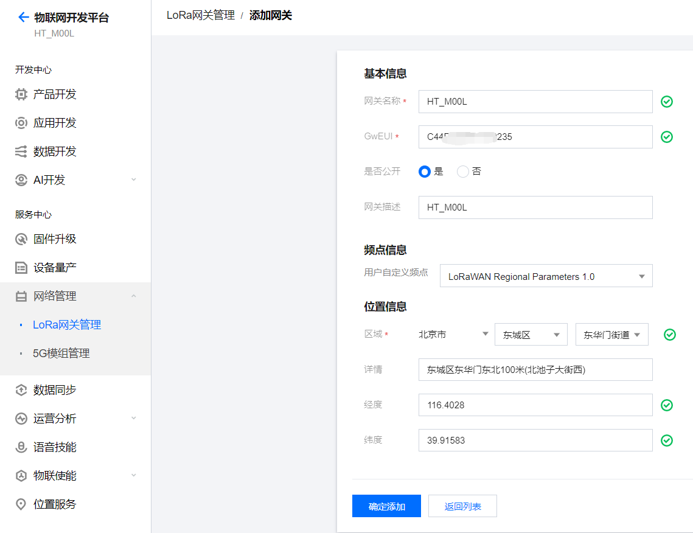

### 注册节点

1. 在左侧工具栏列表中，选择【产品开发】>【新建产品】。

   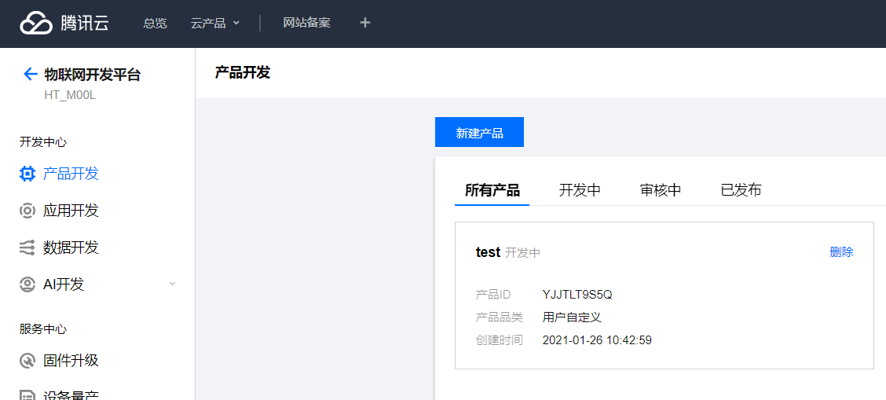

2. 根据实际情况填写“产品名称”。通信方式选择“LoRaWAN”，其他保持默认即可。

   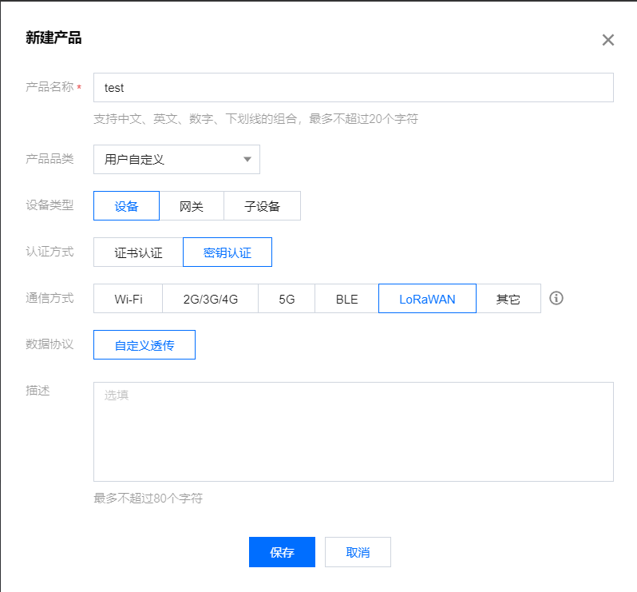

3. 在新建的产品中新建功能，根据实际情况添加需要使用到的数据，本文中需要监测"温度"，"湿度"，"电池电压"，所以新建三个功能。功能中的"数据类型"应与解析出的数据类型相匹配。。

   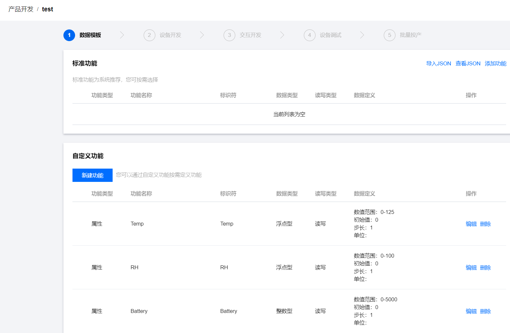

4. "新建功能"完成后，可在"设备开发"配置相应数据解析脚本。

   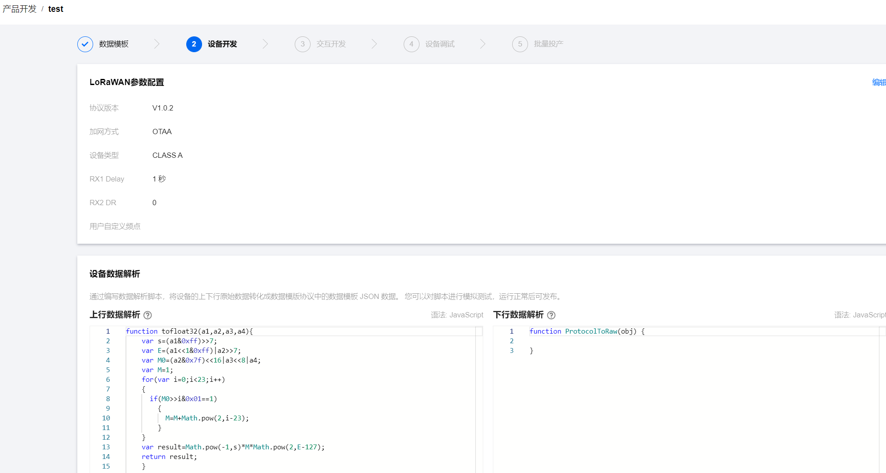

5. 在"设备调试"中点击"新建设备"新建节点。

   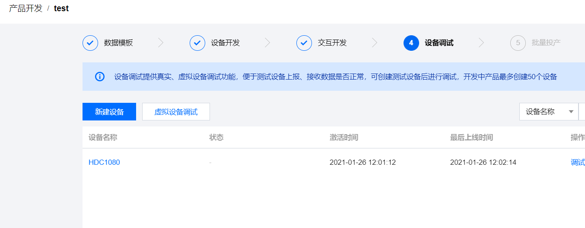

6. 新建节点的"DevEUI"，"AppKey"必须与LoRaWAN节点相对应。

   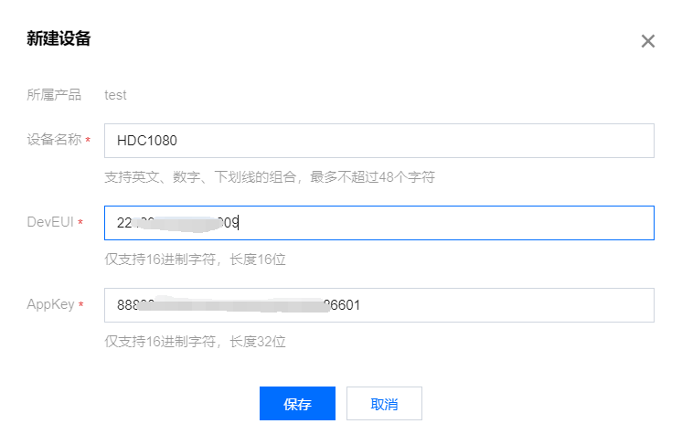


&nbsp;

&nbsp;

## 配置设备（硬件操作）

### 配置网关

- **保持"USR"键处于按下状态，单次按下"RST"并松开**，待RGB灯变成黄绿色后，松开"USR"键。此时网关将创建一个名为"M00L_XXXX"的WiFi。


- 将电脑或手机接入此WiFi，密码`heltec.org`，在浏览器中输入"192.168.4.1"，进入网关配置界面。
  - WiFi名称 -- HT-M00L网关将接入的WiFi名称，配置提交后，将通过此WiFi连接腾讯云；
  - WiFi密码 -- HT-M00L网关将接入的WiFi密码；
  - 信道频率Hz -- 该网关LoRa将要监听的频率，该频率必须与服务器、节点发射频率相对应；
  - 最小扩频因子(MIN SF:7~12) -- LoRa通信的最小扩频因子；
  - 最大扩频因子(MAX SF:MIN SF ~12) -- LoRa通信的最大扩频因子，该值必须大于等于“最小扩频因子”；
  - 网关ID -- 网关的唯一序列号，根据硬件Mac地址自动产生，已绑定；
  - 服务器地址 -- 已绑定腾讯云；
  - 端口号 -- HT-M00L网关与LoRa服务器通信的端口，已绑定为1700；
  - 时区 -- 网关所在位置的时区。

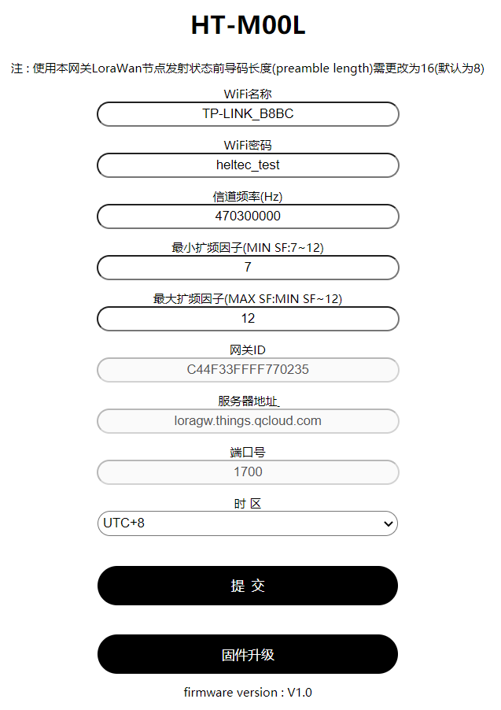

```Tip:: HT-M00L已绑定腾讯云，服务器地址不可修改。

```

### 配置节点

节点部分的通信实验在基于[CubeCell HTCC-AB01](https://heltec.org/project/htcc-ab01/)，外接HDC1080温湿度传感器，同时通过开发板上的ADC读取电池电压，并将读到的数据通过LoRaWAN协议发送到HT-M00L网关上。

CubeCell支持Arduino开发环境，首先安装[CubeCell Arduino开发环境](https://heltec-automation.readthedocs.io/zh_CN/latest/cubecell/quick_start.html)。

#### 修改节点代码

将传感器与主板连接好后，使用[HDC1080传感器 + LoRaWAN](https://github.com/HelTecAutomation/ASR650x-Arduino/blob/master/libraries/LoRa/examples/LoRaWAN/LoRaWAN_Sensors/LoRaWan_HDC1080/LoRaWan_HDC1080.ino)这一例程。在Arduino IDE的菜单中，按下图进行配置：

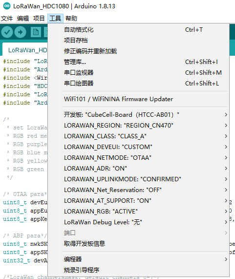

以下三个地方需要根据实际情况进行修改：

- **Arduino菜单中，工作频段设置为CN470；**

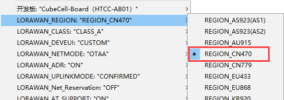

- **DevEUI和AppKey，必须与腾讯云上节点的信息一致；**

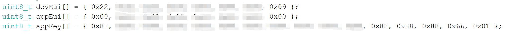

- **因为HT-M00是单通道网关，信道掩码必须配置为网关对应的通道。**

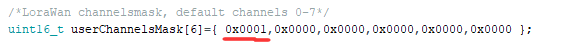

&nbsp;

## 验证通信

- 网关正确配置完成后，蓝灯为状态指示灯，正常工作时蓝灯常亮；红灯为发送指示灯，网关发送数据时红灯亮起；绿灯为接收指示灯，网关接收数据时绿灯亮起。红绿蓝三颗灯同时亮起5秒表示网关检测到信号不佳，自动校准。

- 网关正确配置完成后，可在【网络管理】>【LoRa网关管理】>【用户网关】中看到网关处于"在线"状态。

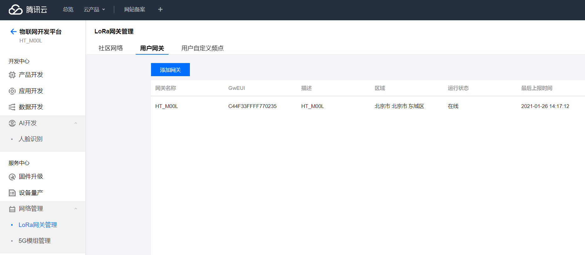

- 节点正确配置完成后，可在"在线调试"中看到节点的上行数据，可在"属性调试"中看到解析完成的数据。

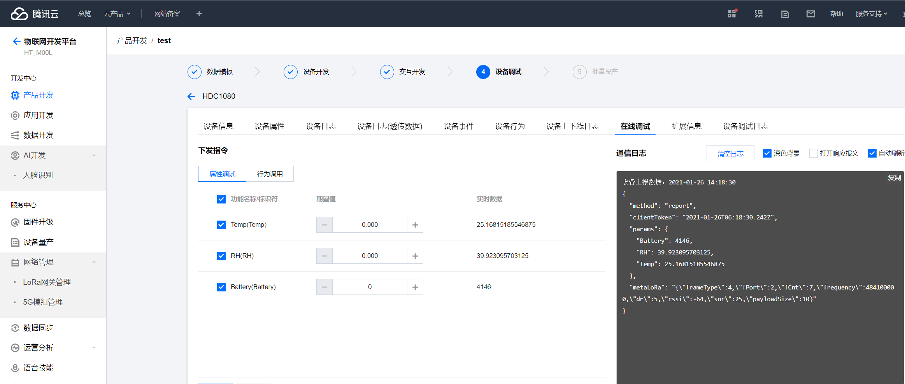

&nbsp;

## 展示数据

### 配置面板

- 在"交互开发"中配置"腾讯连连"小程序中设备信息显示面板。

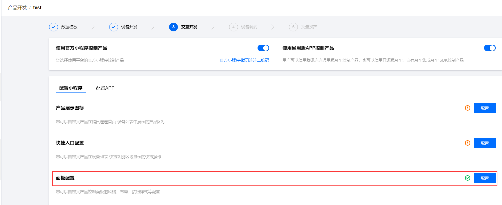

### 关联设备

- 节点和网关正确配置完成后，打开对应设备的"二维码"，打开"腾讯连连"小程序，通过小程序扫描设备二维码可快速添加设备。

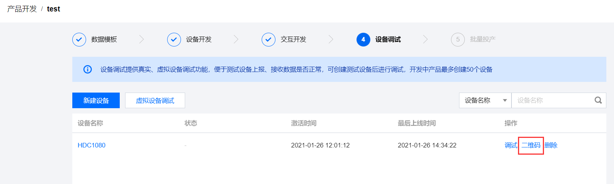

- 设备添加完成后，可在"腾讯连连"小程序点击对应设备查看设备数据。

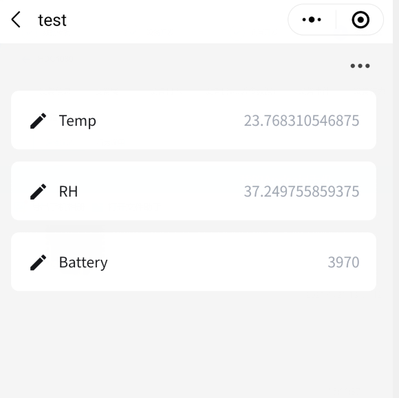

&nbsp;

## LoRaWAN 用户自定义频点

本例程以单信道频点计划为例。

### 新建频点计划

1. 登录 [物联网开发平台控制台](https://console.cloud.tencent.com/iotexplorer)，进入某一个已新建产品的项目。

2. 进入项目列表页，选择左侧菜单【网络管理】>【LoRa 网关管理】，在页面上方选择【用户自定义频点】后，单击【添加频点】，进入“添加用户自定义频点”页面。

   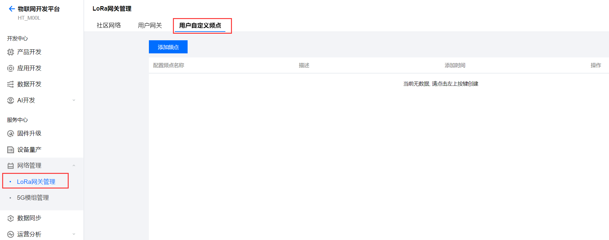

3. 根据具体需求填写图中信道配置。

   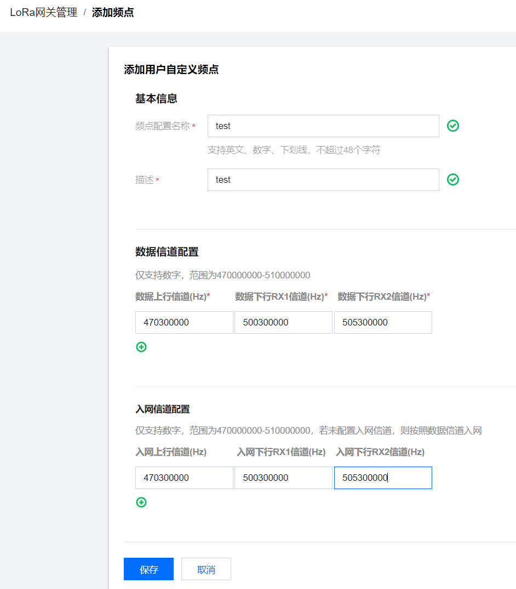

### 网关关联频点计划

1. 选择左侧菜单【网络管理】>【LoRa 网关管理】，在页面上方选择【用户网关】后，单击【添加网关】，进入新建网关界面。如果已有网关，可直接编辑修改频点计划。

   

2. 在新建网关页面，填写网关基本信息。

- 网关名称：根据项目需要填写，本例程中填写HT_M00L。
- GwEUI：网关唯一 ID，可以在网关配置页上查看。
- 是否公开：选择“是”，表示社区开发者可在社区网络查看该网关，并可通过这个网关进行 LoRa 节点接入；选择“否”，则仅用户自己能查看该网关。
- 频点信息：根据具体需求选择，本例程选择前文新增的"test"频点计划。
- 位置信息：在地图上选择网关位置。

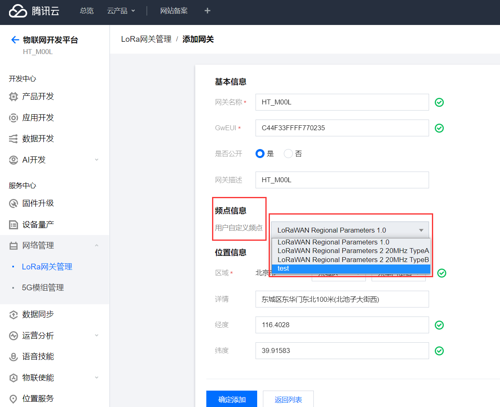

### 设备关联频点计划

1. 选择左侧菜单【产品开发】，选择需要打开的产品，进入”设备开发“页面。在 "LoRaWAN 参数配置“界面中，选择用户自定义频点，关联与设备对应的频点计划。本例程选择前文新增的"test"频点计划。

   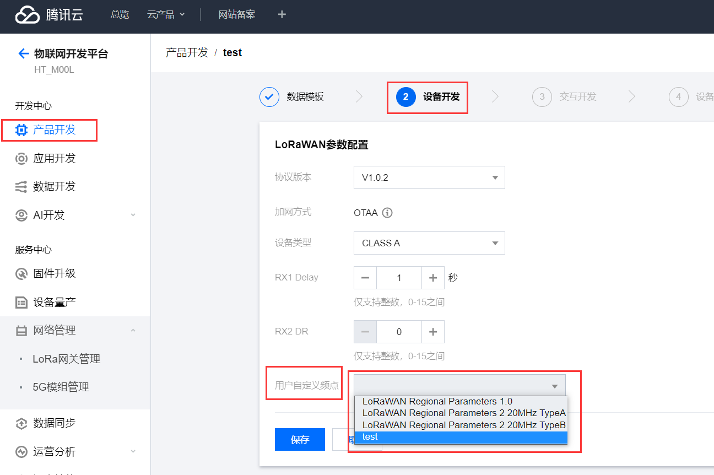

2. 节点信道掩码必须与网关的频点相对应。


