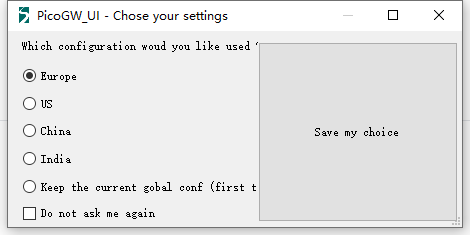
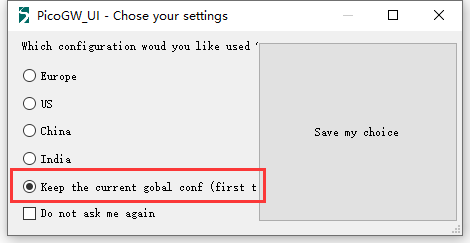

# 在PicoGW UI上添加更多区域支持
[English](https://heltec-automation-docs.readthedocs.io/en/latest/gateway/ht-m01/add_region_on_picogw_ui.html)
## 摘要

[PicoGW UI](http://resource.heltec.cn/download/HT-M01/PicoGW_UI_Release_V1.0.3.4.zip)由Semtech®提供，允许用户直接使用用户界面在Windows®上运行Pico Cell LoRa网关（[HT-M01](https://heltec.org/project/ht-m01)）。

但默认情况下，PicoGW_UI仅提供四个区域支持。

## 添加更多区域支持

假设您需要添加对AU915_SB2([AU915 Sub-band 2 for TTN](https://heltec-automation-docs.readthedocs.io/en/latest/general/sub_band_usage.html))的支持

- 克隆或下载此存储库: [https://github.com/HelTecAutomation/lorasdk](https://github.com/HelTecAutomation/lorasdk);
-  将 `global_conf_AU915_SB2.json` 重命名为`global_conf.json`;
- 复制 `global_conf.json` 到`C:\Users\user name\AppData\Roaming\Semtech\PicoGW_UI` 路径并且替换当前的文件;
- 重新打开 PicoGW_UI然后选择 `Keep the current gobal conf`.

现在, PicoGW_UI 将处理`global_conf.json`的定义.

&nbsp;

## 外部资源

- [LoRaWAN区域参数](https://lora-alliance.org/sites/default/files/2018-04/lorawantm_regional_parameters_v1.1rb_-_final.pdf)