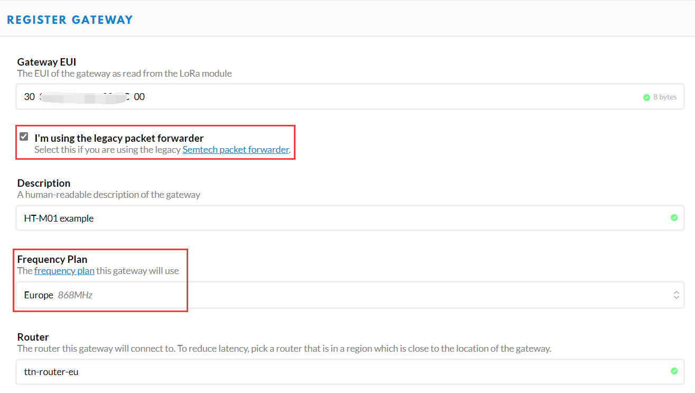
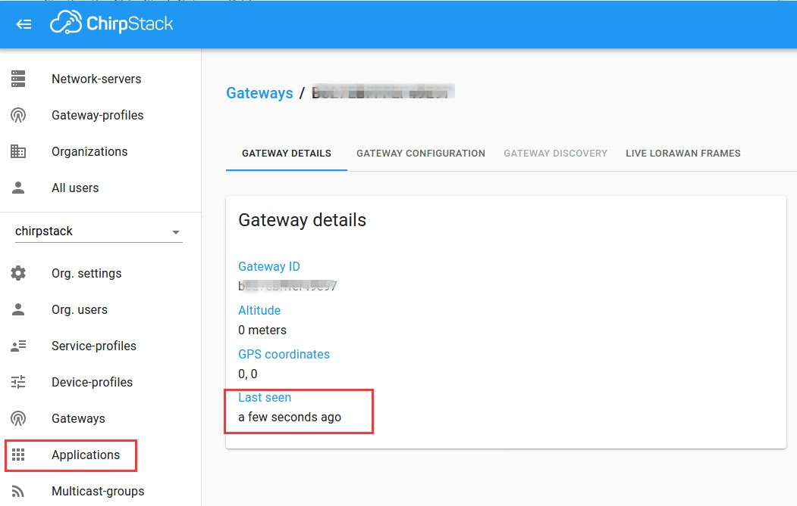
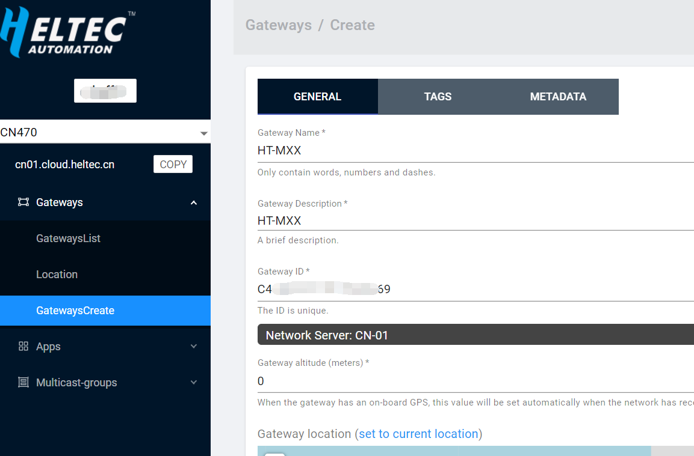

# 将HT-M01连接到LoRa服务器
[English](https://heltec-automation-docs.readthedocs.io/en/latest/gateway/ht-m01/connect_to_server.html)

## 摘要

本文旨在描述如何将[HT-M01 网关](https://heltec.org/project/ht-m01)连接到LoRa服务器，如[TTN](https://www.thethingsnetwork.org/), [ChirpStack](https://www.chirpstack.io/)，从而促进LoRa设备的二次开发和快速部署。

在所有操作之前，请确保HT-M01在树莓派(Linux)或Windows计算机上运行良好。如果没有，请参阅[HT-M01快速入门](https://heltec-automation.readthedocs.io/zh_CN/latest/gateway/ht-m01/quick_start.html)文档。

&nbsp;

## 连接到TTN

### 在TTN中注册LoRa网关

在TTN中创建并激活帐户，在 [console](https://console.thethingsnetwork.org/) 页面中选择“Gateway”。


如下图所示填写HT-M01信息并完成添加。



- **Gateway EUI** -- HT-M01网关的唯一ID;
- **I'm using the legacy packet forwarder** -- 必须选择;
- **Frequency Plan** -- 必须匹配HT-M01中的LoRa频段配置（`global_conf.json`）；
- **Router** -- 必须使用TTN系统分配的默认Router.

``` Tip:: 这四点是成功连接TTN的关键。

```

### 连接TTN

在HT-M01网关中，需要配置网关ID、服务器地址和端口。

不同区域的路由器地址：

[https://www.thethingsnetwork.org/docs/gateways/packet-forwarder/semtech-udp.html#router-addresses](https://www.thethingsnetwork.org/docs/gateways/packet-forwarder/semtech-udp.html#router-addresses)


#### Linux(树莓派)中的HT-M01

在`global_conf.json`中确定参数:

```shell
  nano /home/pi/lora/packet_forwarder/lora_pkt_fwd/global_conf.json
```

配置网关ID、服务器地址、端口。在`global_conf.json`的末尾，进行以下更改：


  ```json
  “gateway_ID”: “XXXXXXXXXXXXXXXX”, /*Your gateway ID, 16 characters*/
  “server_address”: “router.cn.thethings.network”, /*The router addresses need matach your region*/
  “serv_port_up”: 1700,
  “serv_port_down”: 1700,
  ```

`ctrl + O` 保存， `ctrl + X` 退出，在树莓派中重启服务:

```shell
sudo systemctl restart lrgateway
```

#### Windows中的HT-M01

勾选`Use a cloud network`,填写正确的 `server address`, 保持 `Port` 默认值1700


点击`OK`， 然后点击 `Start Packet Forwarder`。


查看网关状态，它正在运行：


&nbsp;

## 连接到ChirpStack服务器

[ChirpStack](https://www.chirpstack.io/) 是目前最流行的LoRa服务器开源项目，广泛应用于许多领域，也是私有LoRa服务器的最佳选择。

- ChirpStack 安装指南: [https://www.chirpstack.io/overview/](https://www.chirpstack.io/overview/)
- ChirpStack 支持论坛: [https://forum.chirpstack.io/](https://forum.chirpstack.io/)

### ChirpStack网桥

**有件事需要注意！** ChirpStack需要一个名为`Gateway Bridge`的特殊服务，它将LoRa® Packet Forwarder协议转换为ChirpStack网络服务器通用数据格式(JSON和Protobuf)。

`Gateway Bridge`服务可以在树莓派或ChirpStack服务器上运行。我们建议安装在树莓派。

安装LoRa-gateway-bridge:

```shell
wget https://artifacts.loraserver.io/downloads/lora-gateway-bridge/lora-gateway-bridge_2.5.1_armhf.deb
#下载支持Raspberry Pi Zero_W版本的LoRa-gateway-bridge软件包
sudo dpkg -i lora-gateway-bridge_2.5.1_armhf.deb
#安装LoRa-gateway-bridge
sudo systemctl start lora-gateway-bridge
#启动LoRa-gateway-bridge
sudo systemctl enable lora-gateway-bridge
#将LoRa-gateway-bridge设置为开机启动
```

安装 ChirpStack Gateway Bridge可以参考 [https://www.chirpstack.io/gateway-bridge/install/debian](https://www.chirpstack.io/gateway-bridge/install/debian)

启动 ChirpStack Gateway Bridge:

```shell
sudo systemctl start chirpstack-gateway-bridge
```

### 在ChirpStack中注册LoRa网关

如下图所示填写HT-M01信息并完成添加。


- **Gateway ID** -- HT-M01网关的唯一ID。

### 连接ChirpStack服务器

在HT-M01网关中，需要配置网关ID、服务器地址和端口。

#### Linux(树莓派)中的HT-M01

在`global_conf.json`中确定参数:

```shell
  nano /home/pi/lora/packet_forwarder/lora_pkt_fwd/global_conf.json
```

配置网关ID、服务器地址、端口。在`global_conf.json`的末尾，进行以下更改：


  ```json
  “gateway_ID”: “XXXXXXXXXXXXXXXX”, /*Your gateway ID, 16 characters*/
  “server_address”: “router.eu.thethings.network”, /*The router addresses need matach your region*/
  “serv_port_up”: 1700,
  “serv_port_down”: 1700,
  ```

`ctrl + O` 保存， `ctrl + X` 退出，在树莓派中重启服务:

```shell
sudo systemctl restart lrgateway
```

#### Windows中的HT-M01

填写正确的`ID`、 `server address`,保持 `Port` 默认值1700


点击`OK`， 然后点击 `Start Packet Forwarder`。


查看网关状态，它正在运行。



&nbsp;

## 连接到HelTec服务器

### 在HelTec Cloud Server中注册LoRa网关

如下图所示填写HT-M01信息并完成添加。



- **Gateway ID** -- HT-M01网关的唯一ID。

### 连接HelTec服务器

在HT-M01网关中，需要配置网关ID、服务器地址和端口。

不同区域的服务器地址：

`CN470` --  `cn01.cloud.heltec.cn`

`EU868` --  `eu01.cloud.heltec.org`

`US915` --  `us01.cloud.heltec.org`

`AU915` --  `au01.cloud.heltec.org`

`AS923` --  `as01.cloud.heltec.org`

#### Linux(树莓派)中的HT-M01

在`global_conf.json`中确定参数:  

```shell
  nano /home/pi/lora/packet_forwarder/lora_pkt_fwd/global_conf.json
```

设置网关ID，服务器地址，端口。在`global_conf.json`的末尾，进行以下更改：


  ```json
  “gateway_ID”: “XXXXXXXXXXXXXXXX”, /*Your gateway ID, 16 characters*/
  “server_address”: “cn01.cloud.heltec.cn”, /*The router addresses need matach your region*/
  “serv_port_up”: 1700,
  “serv_port_down”: 1700,
  ```

`ctrl + O` 保存， `ctrl + X` 退出，在树莓派中重启服务:

```shell
sudo systemctl restart lrgateway
```

#### Windows中的HT-M01

填写正确的`ID`、 `server address`, 保持 `Port` 默认值1700


点击`OK`， 然后点击 `Start Packet Forwarder`。


查看网关状态，它正在运行：

