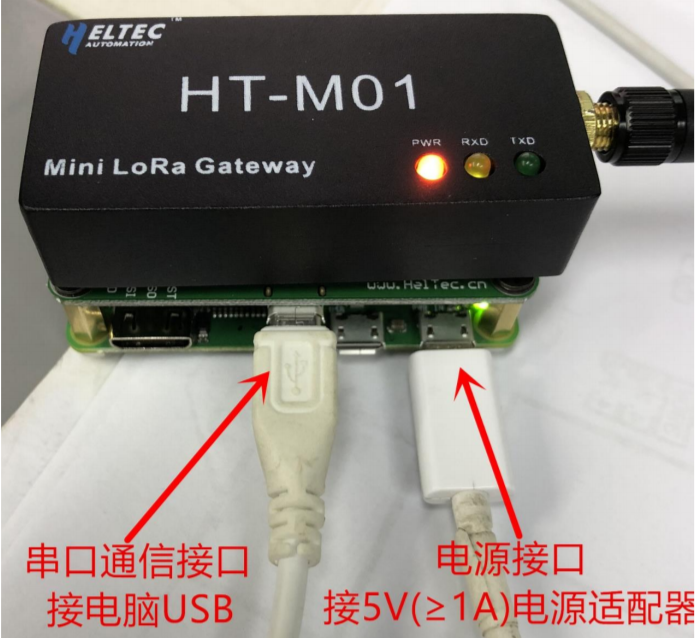
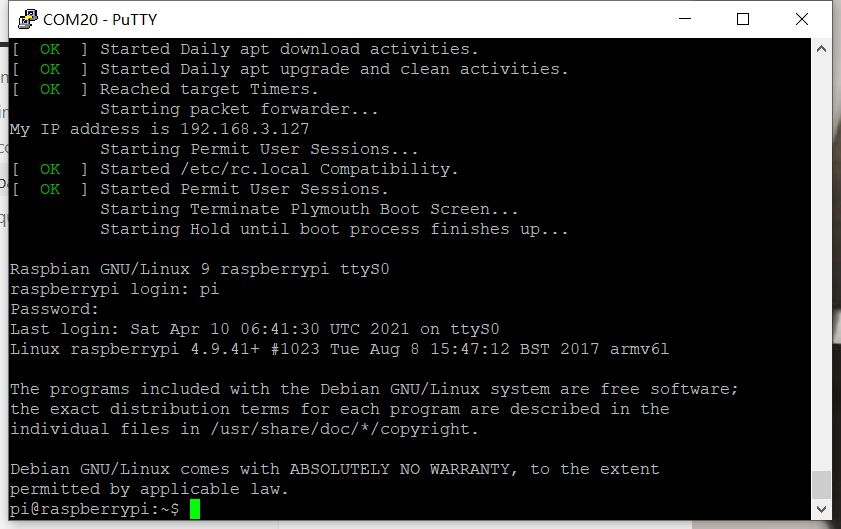
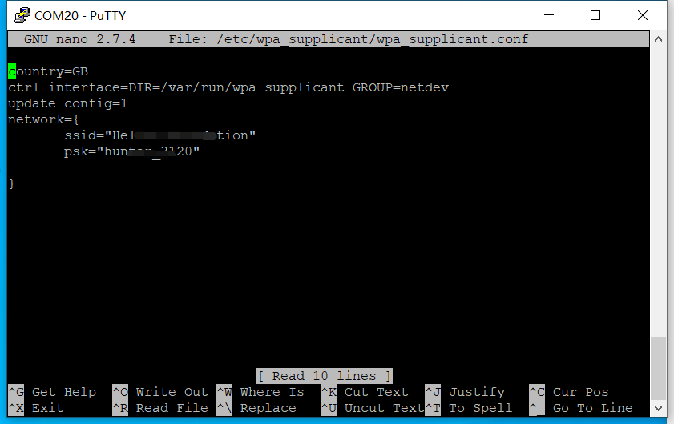
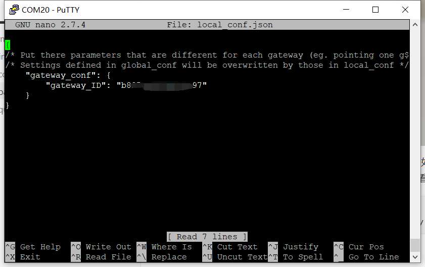
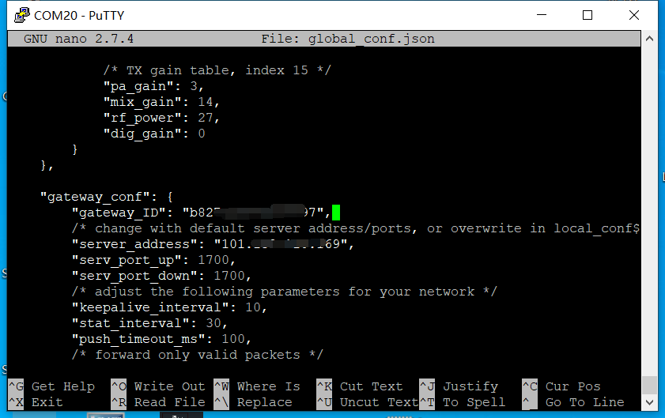
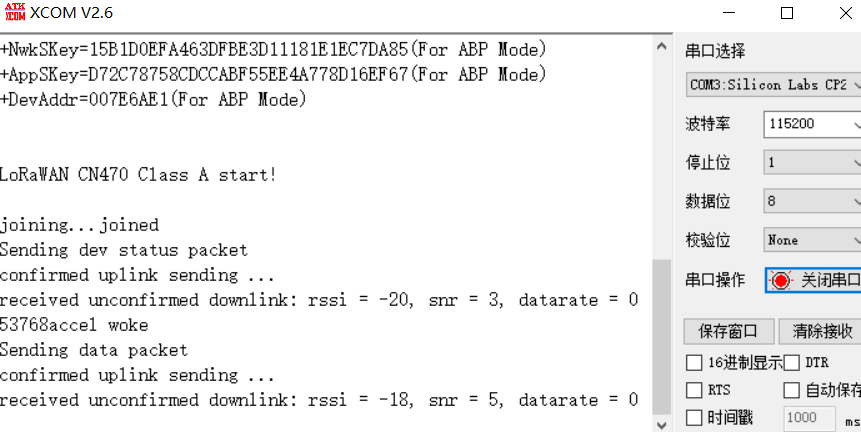
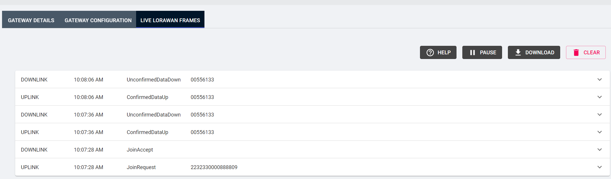

# HT-M01套餐二使用手册

## 摘要

用户购买HT-M01套餐二后，我们将会对网关和树莓派进行相应软件配置，用户拿到网关和树莓派后只需配置树莓派连上WiFi即可。如果没有连接上WiFi，则不能正常使用。默认使用[HelTec服务器](http://cloud.heltec.org/)，用户需要使用HelTec账号登录，可在官网注册。用户也可修改服务器地址以使用其他服务器。

&nbsp;

## 配置树莓派

### 配置WiFi信息

由于无法知道每位用户的WiFi信息，所以需要用户自行修改WiFi信息。

- 如下图所示将网关与树莓派连接好再通电。注意必须连接天线！否则可能会烧毁网关的射频芯片！



- 通过串口工具[putty](https://www.chiark.greenend.org.uk/~sgtatham/putty/latest.html)打开树莓派对应串口，可以看到串口会打印树莓派的启动日志信息。并通过默认用户名和密码登录(在Linux系统中，通过命令行输入密码的过程是看不到任何变化的)。

```shell
用户名：pi
密码：raspberry
```



- 在Putty中输入命令：`sudo nano /etc/wpa_supplicant/wpa_supplicant.conf`

修改WiFi的配置信息：

```shell
network={
  ssid="你的WiFi名字"
  psk="你的WIFI密码"
}
```



`ctrl + O`保存，`ctrl + X`退出。重启树莓派，如果一切正常，树莓派在重启之后将自动连接到相应的WiFi，并会在启动日志中打印IP地址。

### 配置网关信息

- 网关ID可在"/home/pi/lora/packet_forwarder/lora_pkt_fwd/local_conf.json"中查看。



- 服务器地址可在"/home/pi/lora/packet_forwarder/lora_pkt_fwd/ global_conf.json"中修改。网关ID默认优先调用"local_conf.json"中的"gateway_ID"，所以"global_conf.json"中的"gateway_ID"不起作用。



&nbsp;

## 验证通信

- 在相应的服务器中新建相应的网关和节点后就能查看上下行信息。如果使用默认的[HelTec服务器](http://cloud.heltec.org/)，需要使用HelTec账号登录，可在官网注册。
- 节点默认DevEui为2232330000888802，该DevEui作为出厂测试使用，故在服务器中已经存在，所以不能在服务器中添加该默认DevEui，如果使用该默认DevEui，则用户不用在服务器中添加DevEui，但是只能通过串口查看入网信息。



- 在服务器新建网关后，可以看到网关的上下行信息。



