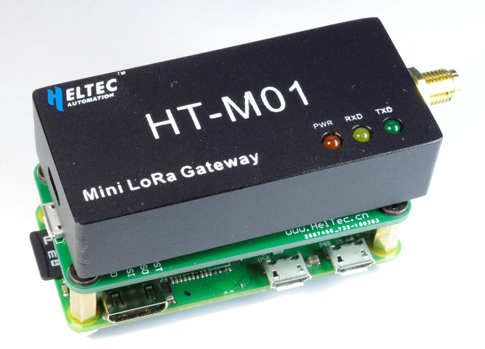
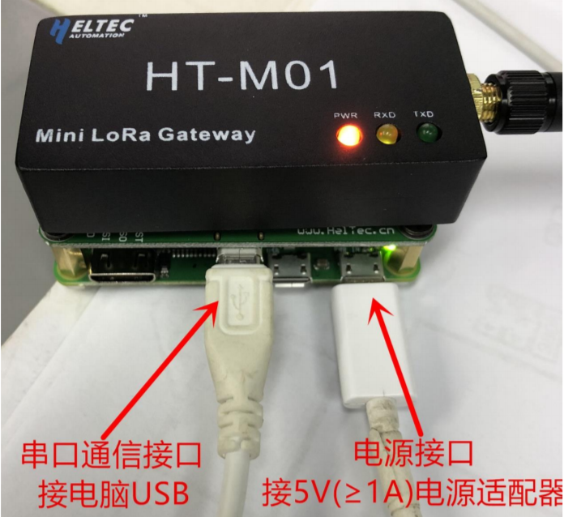
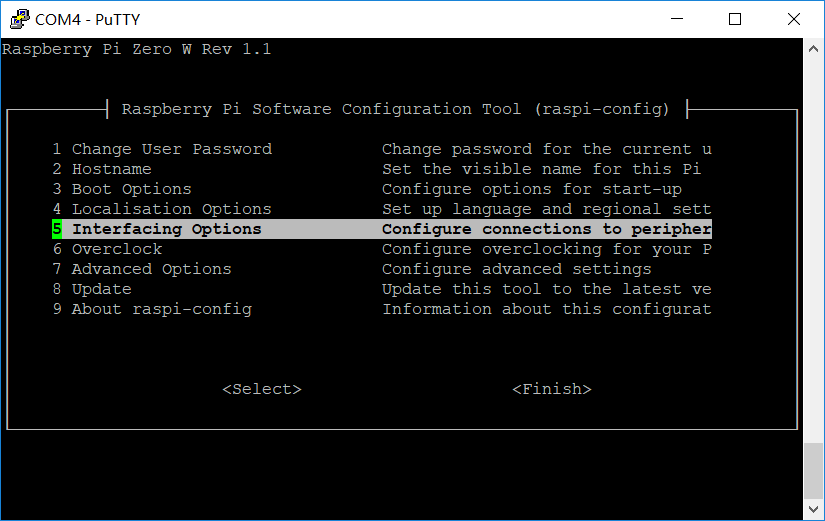
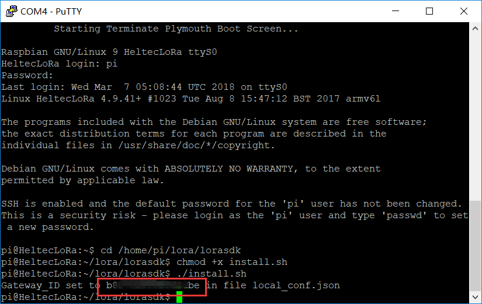
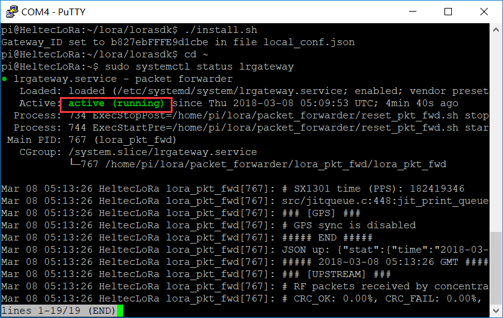
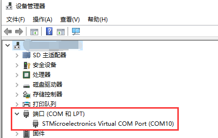
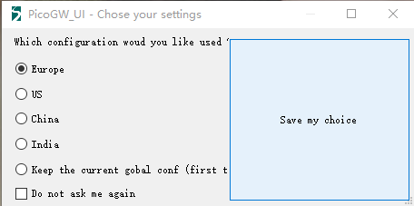
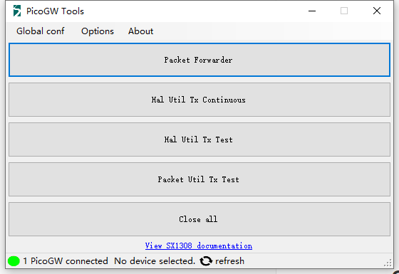
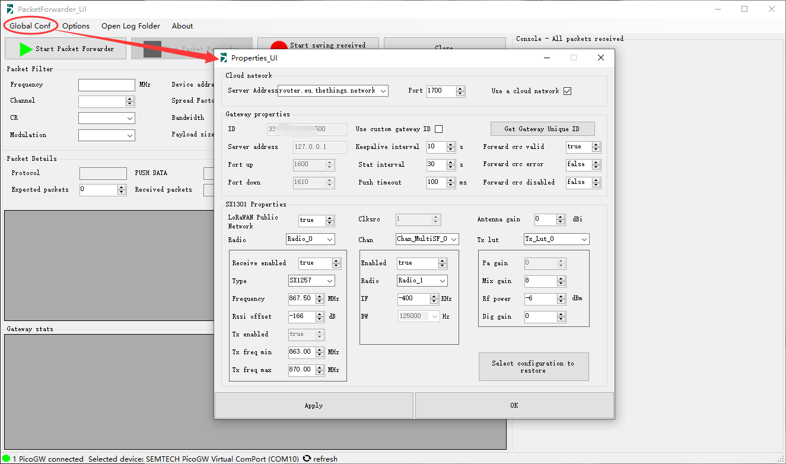

# HT-M01 Mini LoRa网关快速入门

[English](https://heltec-automation-docs.readthedocs.io/en/latest/gateway/ht-m01/quick_start.html)
## 摘要

HT-M01 LoRa 网关支持USB和SPI模式。SPI模式只能在Linux系统(树莓派)上运行，USB模式可以在Linux和Windows<sup>®</sup>上使用。一般来说，要使HT-M01运行，只需选择以下三种方法之一：

- **Linux (树莓派)**
  - [SPI 模式](#spi)
  - [USB 模式](#usb)
- **Windows<sup>®</sup>**
  - [适用于Windows<sup>®</sup>的USB模式](#windows-sup-sup-usb)

## 在Linux(树莓派)中使用HT-M01

在所有操作之前，请确保您有一个可以工作的树莓派，并且可以连接到WiFi。在这份文档中，我们使用[Raspberry Pi Zero W](https://www.raspberrypi.org/products/raspberry-pi-zero-w/).

```Tip:: 经过测试，树莓派2、3、3B也可以正常工作。

```

**[树莓派结构]()**

### SPI模式

拥有一个[PRI to HT-M01 转换器](https://heltec.org/product/m01-converter/) 会让你的操作更容易。



树莓派与转接板接线图如下图所示。



默认情况下，树莓派的SPI总线被禁用。在putty中输入以下命令以打开树莓派配置界面并启用SPI总线。

`sudo raspi-config`



选择`Interfacing Options → SPI → Yes` ，然后可能需要重启树莓派。

通过以下命令安装HT-M01相关应用程序和服务：

```shell
mkdir lora
cd lora
sudo apt-get update
sudo apt-get install git
git clone https://github.com/Lora-net/lora_gateway.git
# LoRa Gateway drivers
git clone https://github.com/Lora-net/packet_forwarder.git
# packet forwarding software
git clone https://github.com/HelTecAutomation/lorasdk.git
# This package will create a "lrgateway" service in Raspberry Pi
cd /home/pi/lora/lora_gateway
make clean all
cd /home/pi/lora/packet_forwarder
make clean all
cd /home/pi/lora/lorasdk
chmod +x install.sh 
./install.sh
#Run the script. After the script is run, it will create a service named "lrgateway". The purpose is to make the lora driver and data forwarding program run automatically at startup.
sudo cp -f /home/pi/lora/lorasdk/global_conf_CN470.json /home/pi/lora/packet_forwarder/lora_pkt_fwd/global_conf.json
#the "global_conf_CN470.json" may need change to your need.
```

其中"global_conf_CN470.json"可替换为"global_conf_EU433.json"，"global_conf_EU868.json"，"global_conf_US915.json"等，分别对应相应频段。

### USB模式

在进行以下操作之前，请使用高质量的Micro-USB数据线将HT-M01网关连接到树莓派，否则会造成很多问题！输入以下命令：

``` shell
mkdir lora
cd lora
sudo apt-get update
sudo apt-get install git
git clone https://github.com/Lora-net/picoGW_hal.git
git clone https://github.com/Lora-net/picoGW_packet_forwarder.git
git clone https://github.com/HelTecAutomation/picolorasdk.git
cd /home/pi/lora/picoGW_hal
make clean all
cd /home/pi/lora/picoGW_packet_forwarder
make clean all
cd /home/pi/lora/picolorasdk
chmod +x install.sh
./install.sh
#Run this script will create a service named "lrgateway". The purpose is to make the lora driver and data forwarding program run automatically at startup.
sudo cp -f /home/pi/lora/picolorasdk/global_conf_CN470.json /home/pi/lora/picoGW_packet_forwarder/lora_pkt_fwd/global_conf.json
#Put the configuration file on the specified path
```

其中"global_conf_CN470.json"可替换为"global_conf_EU433.json"，"global_conf_EU868.json"，"global_conf_US915.json"等，分别对应相应频段。

```Tip:: “global_conf.json”文件决定了网关的监听频率，这是节点能否成功与网关通信的关键！

```

无论是SPI模式还是USB模式，当执行`./install.sh`时，如果一切正常，将打印当前网关的唯一ID。



### 确认安装

在树莓派中运行 `sudo systemctl status lrgateway` ,如果一切正常, 服务将正在运行:



&nbsp;

## 适用于Windows<sup>®</sup>的USB模式

### USB模式

在将HT-M01连接到Windows<sup>®</sup>计算机之前，请安装[PicoGW UI](http://resource.heltec.cn/download/HT-M01/PicoGW_UI_Release_V1.0.3.4.zip) 。然后，在连接了HT-M01之后，您将在Windows<sup>®</sup>设备管理器中看到一个串行设备。



打开PicoGW_UI并选择合适的区域，然后单击`Save my choice`。默认区域没有覆盖您的位置？请参阅[本文档](https://heltec-automation.readthedocs.io/zh_CN/latest/gateway/ht-m01/add_region_on_picogw_ui.html)。



选择`Packet Forwarder`.



### 配置PicoGW参数



点击`Global Conf`打开`Properties_UI`窗口，此窗口中的参数与`C:\ Users\user name\AppData\Roaming\Semtech\PicoGW_UI`路径中的`global_conf.json`相关。我们只需要注意这三个部分，其他的保持默认。

1.  **Cloud network/Server Address** and **Port** -- 此部分仅用于TTN;
2. **Gateway properties/Server Address**, **Port up** and **Port down** -- 此部分用于自定义服务器，它可以是云服务器、私有服务器或本地服务器，例如 [ChripStack](https://www.chirpstack.io/);
3. **Get Gateway Unique ID** -- 将为您的HT-M01生成一个唯一的ID，它将在LoRa服务器中注册网关时使用。

``` Note:: 由PicoGW UI和树莓派生成的唯一ID是不同的。因为来自树莓派的唯一ID与HT-M01的STM32芯片有关。树莓派使用自己的以太网Mac地址。

```

