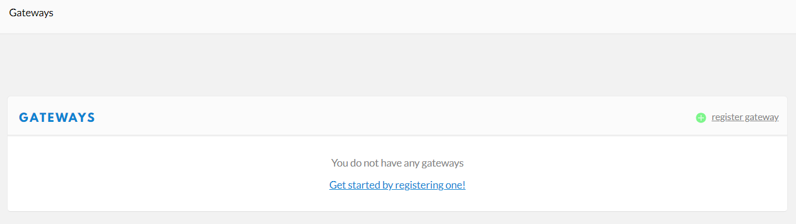

# 将HT-M01S连接到LoRa服务器
[English](https://heltec-automation-docs.readthedocs.io/en/latest/gateway/ht-m01s/connect_to_server.html)

## 摘要

本文旨在描述如何将[HT-M01S网关](https://heltec.org/project/ht-m01s/)连接到LoRa服务器，如[TTN](https://www.thethingsnetwork.org/), [ChirpStack](https://www.chirpstack.io/)，[Heltec Cloud Server](http://cloud.heltec.org/)，从而促进LoRa设备的二次开发和快速部署。

在所有操作之前，请确保HT-M01S运行良好。如果没有，请参阅[HT-M01S快速入门](https://heltec-automation.readthedocs.io/zh_CN/latest/gateway/ht-m01s/quick_start.html)文档。

&nbsp;

## 连接到TTN

### 在TTN中注册LoRa网关

在TTN中创建并激活帐户，在 [console](https://console.thethingsnetwork.org/) 页面中选择“Gateway”。



如下图所示填写HT-M01S信息并完成添加。


- **Gateway EUI** -- HT-M01S网关的唯一ID，从HT-M01S的显示屏上查看，或通过串口查看(HT-M01S启动时会通过串口打印网关ID);
- **I'm using the legacy packet forwarder** -- 必须选择;
- **Frequency Plan** -- 必须匹配HT-M01S中的LoRa频段；
- **Router** -- 必须使用TTN系统分配的默认Router.

``` Tip:: 这四点是成功连接TTN的关键。

```

### 连接TTN

在HT-M01S网关中，需要配置服务器地址、端口、频段、通道。服务器地址、端口、频段及通道在”HT-M01S Config”界面配置，请参考[HT-M01S快速入门](https://heltec-automation.readthedocs.io/zh_CN/latest/gateway/ht-m01s/quick_start.html)文档。


不同区域的路由器地址：

[https://www.thethingsnetwork.org/docs/gateways/packet-forwarder/semtech-udp.html#router-addresses](https://www.thethingsnetwork.org/docs/gateways/packet-forwarder/semtech-udp.html#router-addresses)


查看网关状态，它正在运行：


&nbsp;

## 连接到ChirpStack服务器

[ChirpStack](https://www.chirpstack.io/) 是目前最流行的LoRa服务器开源项目，广泛应用于许多领域，也是私有LoRa服务器的最佳选择。

- ChirpStack 安装指南: [https://www.chirpstack.io/overview/](https://www.chirpstack.io/overview/)
- ChirpStack 支持论坛: [https://forum.chirpstack.io/](https://forum.chirpstack.io/)

### ChirpStack网桥

**有件事需要注意！** ChirpStack需要一个名为`Gateway Bridge`的特殊服务，它将LoRa® Packet Forwarder协议转换为ChirpStack网络服务器通用数据格式(JSON和Protobuf)。

`Gateway Bridge`服务可以在树莓派或ChirpStack服务器上运行。我们建议安装在树莓派。

安装 ChirpStack Gateway Bridge: [https://www.chirpstack.io/gateway-bridge/install/debian/](https://www.chirpstack.io/gateway-bridge/install/debian/)

### 在ChirpStack中注册LoRa网关

如下图所示填写HT-M01S信息并完成添加。


- **Gateway ID** -- HT-M01S网关的唯一ID，从HT-M01S的显示屏上查看，或通过串口查看(HT-M01S启动时会通过串口打印网关ID)。

### 连接ChirpStack服务器

在HT-M01S网关中，需要配置服务器地址、端口、频段、通道。服务器地址、端口、频段及通道在”HT-M01S Config”界面配置，请参考[HT-M01S快速入门](https://heltec-automation.readthedocs.io/zh_CN/latest/gateway/ht-m01s/quick_start.html)文档。


查看网关状态，它正在运行：


&nbsp;

## 连接到HelTec服务器

### 在HelTec Cloud Server中注册LoRa网关

如下图所示填写HT-M01S信息并完成添加。


- **Gateway ID** -- HT-M01S网关的唯一ID，从HT-M01S的显示屏上查看，或通过串口查看(HT-M01S启动时会通过串口打印网关ID)。

### 连接HelTec服务器

在HT-M01S网关中，需要配置服务器地址、端口、频段、通道。服务器地址、端口、频段及通道在”HT-M01S Config”界面配置，请参考[HT-M01S快速入门](https://heltec-automation.readthedocs.io/zh_CN/latest/gateway/ht-m01s/quick_start.html)文档。


不同区域对应服务器地址如下:

`CN470` --  `cn01.cloud.heltec.cn`

`EU868` --  `eu01.cloud.heltec.org`

`US915` --  `us01.cloud.heltec.org`

`AU915` --  `au01.cloud.heltec.org`

`AS923` --  `as01.cloud.heltec.org`

查看网关状态，它正在运行：

