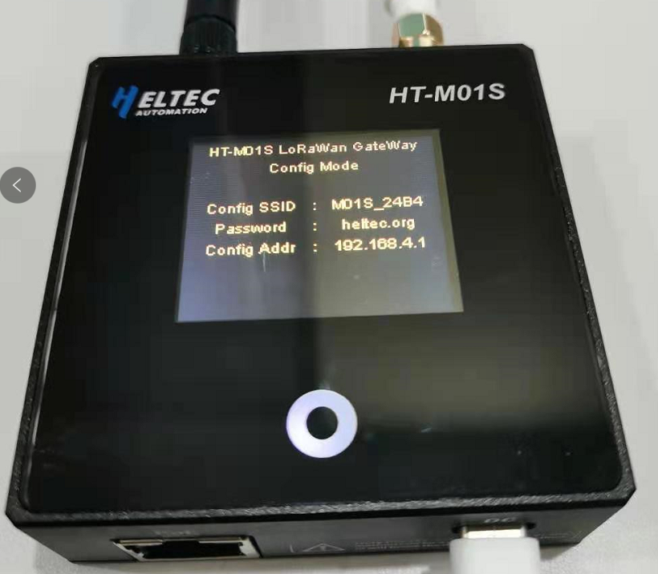
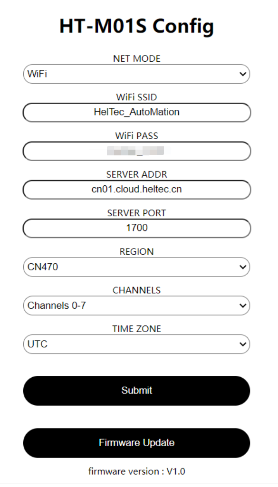
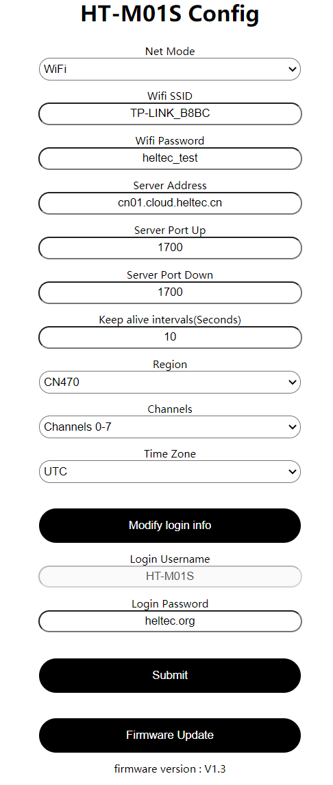
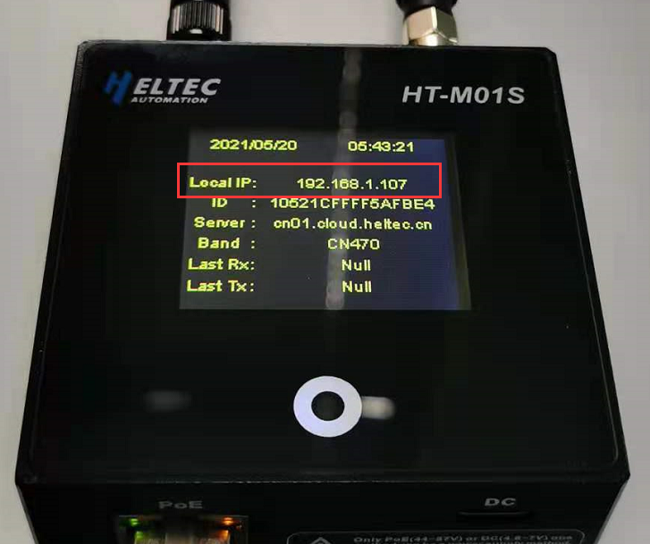
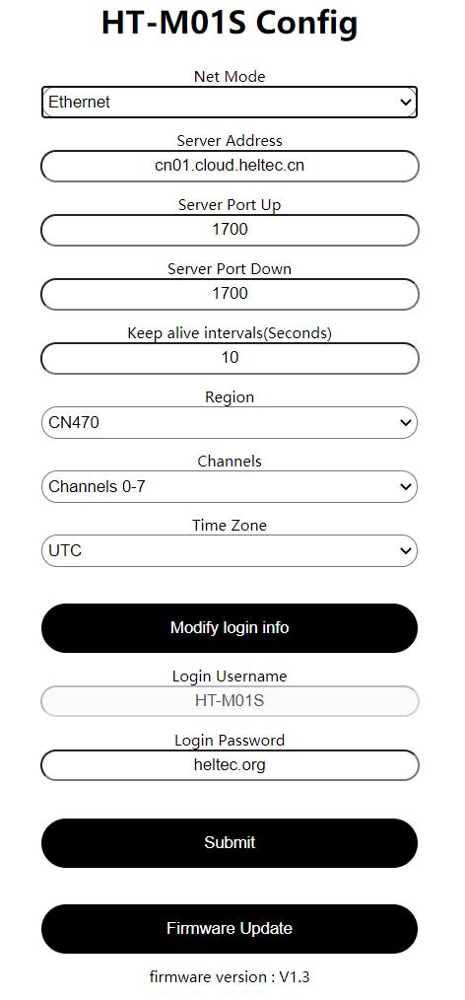
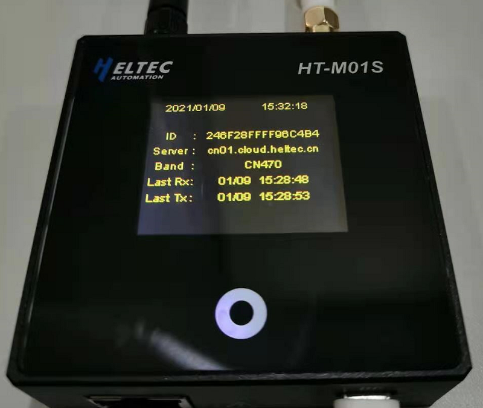
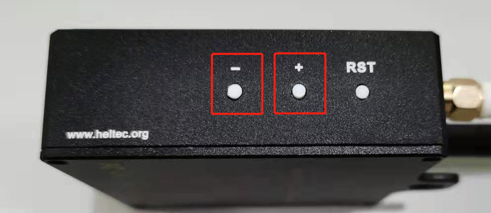
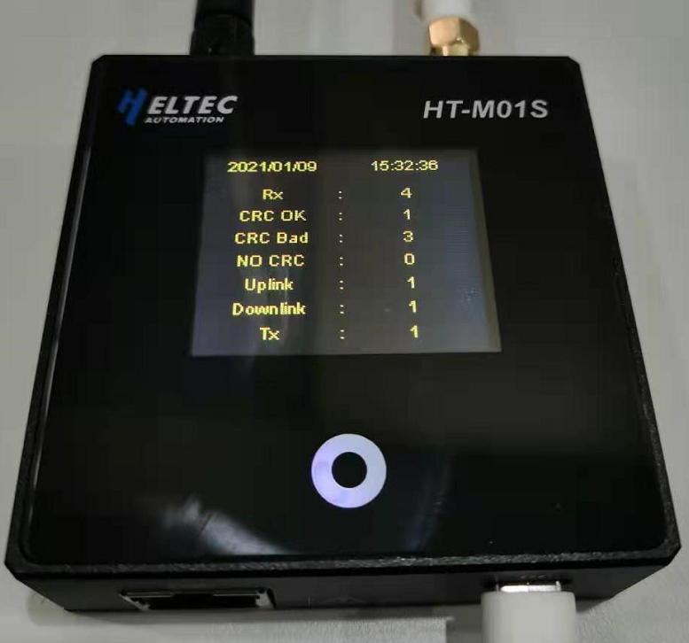

# HT-M01S室内LoRa网关快速入门

[English](https://heltec-automation-docs.readthedocs.io/en/latest/gateway/ht-m01s/quick_start.html)

## 摘要

HT-M01S定位为室内使用的低成本标准网关。LoRa部分基于SX1308+1255/7结构，我们创新地使用ESP32作为主控芯片，并将SX1308的硬件驱动程序，数据转发和消息队列等完全移植到ESP32平台上，无需另外运行Linux操作系统，使用更简单方便。它可以通过Wi-Fi或以太网连接到云服务器，可以使用Type-C_5V或PoE供电，并且在钢化玻璃面板下方还具有一个1.8英寸的TFT显示屏，用以显示网关信息。

&nbsp;

## 配置网关

```Tip:: 如果你的网关ID被占用，在修改网关ID时，为避免占用其他网关ID，请修改中间"FFFF“部分，谢谢！

```

HT-M01S网关在出厂时已经烧录好了相关程序，只需进行一些简单的操作就能使用。

### 固件版本V1.2及以下


- 通过Type-C或PoE给网关通电后，一直按住”+”按键，再按下”RST”按键，然后松开”RST”按键，待网关进入下图所示界面后松开”+”按键。

  

- 此时找到名字为”M01S_XXXX”的WiFi，并通过密码”heltec.org”连接上WiFi，然后通过浏览器进入”192.168.4.1”，进入网关配置页面。



- 在上图所示页面配置HT-M01S网关信息，如网络模式，服务器地址及端口，区域频段，网关通道，时区，配置完成后点击”Submit”。如果"NET MODE"选择"WiFi"，则需要配置相应的WiFi信息，如果"NET MODE"选择"Ethernet"，则将通过以太网直接获取网络信息。同时我们会将HT-M01S的相关固件放到该网页，点击”Firmware Update”可进行相应更新。
- 配置完成并提交后网关将重启。网关开机时将会自动连接配置好的WiFi或连接以太网，如果连接失败，将再次重启，直至连接成功。

### 固件版本V1.3及以上

#### 通过WiFi进行首次配置


- 通过Type-C或PoE给网关通电后，一直按住”+”按键，再按下”RST”按键，然后松开”RST”按键，待网关进入下图所示界面后松开”+”按键。


- 此时找到名字为”M01S_XXXX”的WiFi，连接上此WiFi，然后通过浏览器进入”192.168.4.1”，通过用户名"HT-M01S"及密码"heltec.org"登入网关配置页面。



- 在上图所示页面配置HT-M01S网关信息，如网络模式，服务器地址，上行端口，下行端口，心跳周期，区域频段，网关通道，时区，配置完成后点击”Submit”。如果"NET MODE"选择"WiFi"，则需要配置相应的WiFi信息，如果"NET MODE"选择"Ethernet"，则将通过以太网直接获取网络信息。用户可自行修改网页登录密码。同时我们会将HT-M01S的相关固件放到该网页，点击”Firmware Update”可进行相应更新。

- 配置完成并提交后网关将重启。网关开机时将会自动连接配置好的WiFi或连接以太网，如果连接失败，将再次重启，直至连接成功。

#### 通过以太网进行首次配置

- 网关通过以太网获取网络正常工作后，显示屏上将显示"Local IP"。



- 通过网关显示屏上的"Local IP"进入网页，并通过用户名 "HT-M01S"及密码"heltec.org"登入网关配置页面(登入设备需与网关在同一局域网内)。



- 在上图所示页面配置HT-M01S网关信息，如网络模式，服务器地址，上行端口，下行端口，心跳周期，区域频段，网关通道，时区，配置完成后点击”Submit”。如果"NET MODE"选择"WiFi"，则需要配置相应的WiFi信息，如果"NET MODE"选择"Ethernet"，则将通过以太网直接获取网络信息。用户可自行修改网页登录密码。同时我们会将HT-M01S的相关固件放到该网页，点击”Firmware Update”可进行相应更新。

- 配置完成并提交后网关将重启。网关开机时将会自动连接配置好的WiFi或连接以太网，如果连接失败，将再次重启，直至连接成功。

```Tip:: 网关通过WiFi或以太网接入网络正常工作后，可通过显示屏上的"Local IP“直接进入配置界面(登入设备需与网关在同一局域网内)。

```


## 查看网关信息

- 网络连接成功后，网关将进入下图所示界面。可以查看网关ID，网关配置的服务器地址，频段，最近收发时间。



- 通过按下"+"按键，可控制TFT显示屏开关，通过按下"-"按键，可切换显示屏显示内容。



- 通过按下“-”按键，可切换显示内容。查看网关收发情况。



