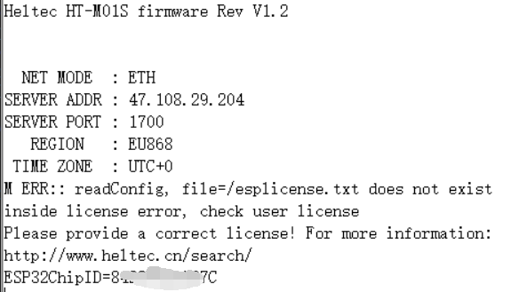

# HT-M01S固件升级
[English](https://heltec-automation-docs.readthedocs.io/en/latest/gateway/ht-m01s/update_firmware.html)

## 摘要

本文档旨在描述如何对HT-M01S进行固件升级。

```Tip:: 由于V1.2版本固件新增了HT-M01S支持频段，所以当V1.1及以下版本升级到V1.2及以上版本后，HT-M01S在网页配置界面中会出现频段显示错误的现象，但并不影响正常使用，此时频段以串口打印和屏幕显示为准。解决方法可参考下文"HT-M01S固件覆盖处理方法”。

```

```Tip:; 如果你的网关ID被占用，在修改网关ID时，为避免占用其他网关ID，请修改中间"FFFF“部分，谢谢！

```

&nbsp;

## 固件升级日志

- V1.2

  - 增加EU433频段支持。
- V1.3

  - 在以太网和 Wi-Fi 连接中添加 DHCP 支持；
  - 上下行端口可分别设置；
  - 可自行修改心跳周期。
- V1.4
  - 可自行修改网关ID。

&nbsp;

## 固件升级

下载[HT-M01S相应升级固件](https://resource.heltec.cn/download/HT-M01S/firmware)。


通过连接HT-M01S的WiFi进入HT-M01S网关配置界面(可参考[HT-M01S快速入门](https://heltec-automation.readthedocs.io/zh_CN/latest/gateway/ht-m01s/quick_start.html))，再点击"Firmwaer Update"。


点击"Select firmware"选择下载好的相应升级固件，点击"Update"进行升级。


升级完成后，将弹出相应提示并重启网关。


## HT-M01S固件覆盖处理方法

### 下载及烧录固件

下载[HT-M01S完整固件](https://resource.heltec.cn/download/HT-M01S/firmware/complete_firmware)。

打开下载好的文件，编辑"M01S_Vx_x.bat"文件。


将COM口改为HT-M01S对应的COM口。


打开HT-M01S对应的串口，按下"-"键->按下"RST"键->松开"RST"键->待串口打印"waiting for download"->松开"-"键。


双击运行"M01S_Vx_x.bat"，待运行到如下图所示界面时进行以下操作，按下"-"键->按下"RST"键->松开"RST"键->松开"-"键。待窗口自动关闭，固件烧录完成。


### 激活网关

固件烧录完成后，打开HT-M01S对应的串口，读取网关相应ESP32芯片ID。



进入[https://resource.heltec.cn/search](https://resource.heltec.cn/search)，输入ESP32芯片ID查询网关对应序列号。


打开HT-M01S对应的串口，通过串口发送命令"AT+CDKEY=xxxxxxxxxxxxxxxxxxxxxxxxxxxxxxxx"激活网关。其中"xxxxxxxxxxxxxxxxxxxxxxxxxxxxxxxx"为查询到的32位license。例如，如果license为0x12345678, 0x12345678, 0x12345678, 0x12345678，则激活命令为AT+CDKEY=12345678123456781234567812345678。


待显示屏正常显示后，表示网关激活成功。

