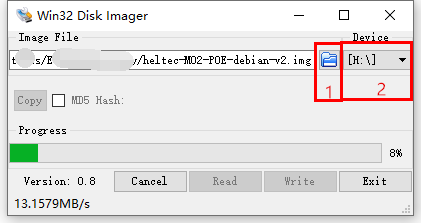
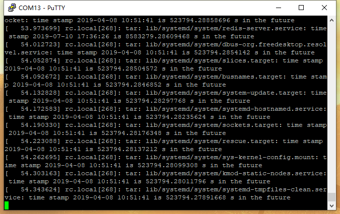

# HT-M02系统升级
[English](https://heltec-automation-docs.readthedocs.io/en/latest/gateway/ht-m02/system_upgrade.html)
## 摘要

[HT-M02](https://heltec.org/project/ht-m02/)有两种升级系统的方法。

- [通过Micro TF Card](#micro-tf-card);
- 在线升级.

## 通过Micro TF card

``` Warning:: 在升级过程中，不能切断HT-M02的电源，否则可能会对HT-M02网关造成永久性损坏。

```

### 制作系统恢复/升级卡

制作系统恢复/升级卡的过程与[制作树莓派系统卡的过程](https://projects.raspberrypi.org/en/projects/raspberry-pi-setting-up/2)完全相同。如果你有使用树莓派的经验，这部分操作将非常简单。

#### 准备

- 下载最新固件：[http://resource.heltec.cn/download/HT-M02/firmware](http://resource.heltec.cn/download/HT-M02/firmware)
  - [HT-M02 PoE最新固件](http://resource.heltec.cn/download/HT-M02/firmware/heltec-M02-POE-debian-v2.img)
  - [HT-M02 4G最新固件]()
- [Win32DiskImager](http://resource.heltec.cn/download/tools/Win32DiskImager.zip) -- 用于将固件下载到Micro TF卡的工具；
- [SD Formatter](http://resource.heltec.cn/download/tools/SD_Formatter.zip) --不是必要的，如果你需要格式化已有镜像的TF卡，你需要这个工具；
- 一个超过4GB大小的Micro TF卡和读卡器。

#### 将固件下载到Micro TF卡

选择 Micro TF card 点击 1,从磁盘选择固件文件点击 2,然后点击`Write`。



下载完成，计算机中的Micro TF卡应如下所示：


现在，系统恢复/升级卡已制作完成。

### 升级系统

#### 准备

- 关闭HT-M02网关电源，将Micro TF卡插入TF卡插槽；


- [建立串行连接](https://heltec-automation-docs.readthedocs.io/en/latest/gateway/ht-m02/quick_start_poe.html#serial), 系统升级日志将通过UART打印。

#### 升级

确保Micro TF卡已插入插槽，按“REC”键，然后打开HT-M02电源。一般来说，升级过程应该是：`插入TF卡-->一直按住"REC"键-->上电`。

在升级过程中，RX LED一直闪烁，日志将通过UART输出。



当RX停止闪烁时，系统升级完成。**关闭HT-M02电源并卸下Micro TF卡**。当HT-M02下次通电时，新系统将从eMMC运行。

- 默认登录账户: `debian`
- 默认登录密码: `temppwd`


``` Tip:: Don&#39;t forget remove the Micro TF card, or the system will running from TF card automatically in the next powe ON, and the system will be upgrade again.

```

