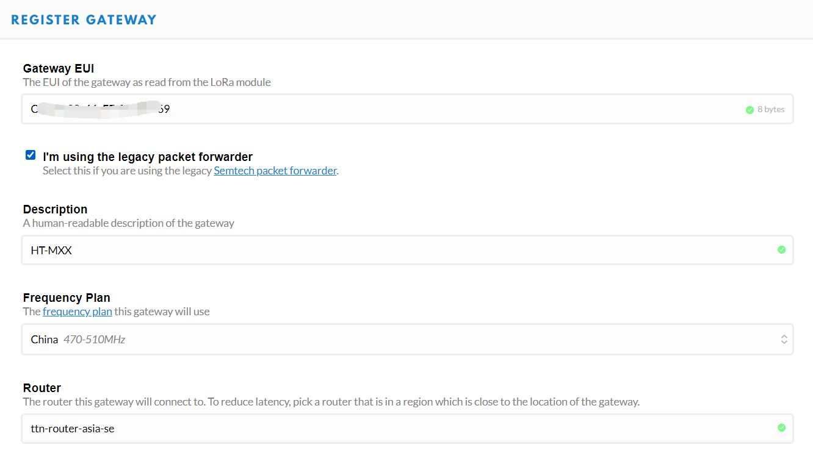
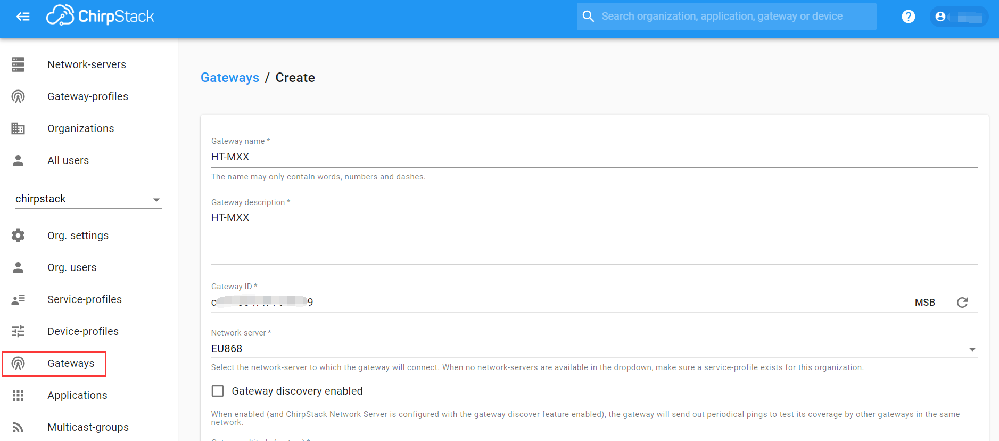
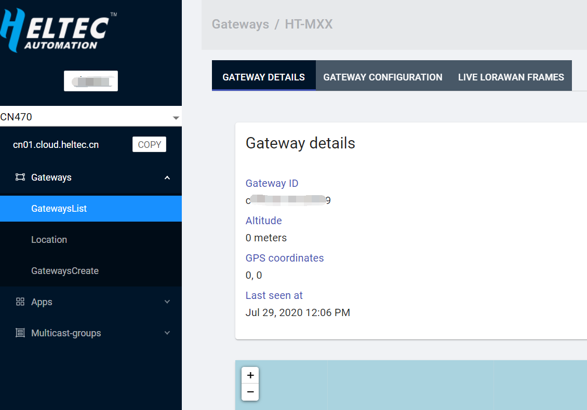

# 将HT-M02连接到LoRa服务器
[English](https://heltec-automation-docs.readthedocs.io/en/latest/gateway/ht-m02_4g/connect_to_server.html)

## 摘要

本文旨在描述如何将[HT-M02网关](https://heltec.org/project/ht-m02/)连接到LoRa服务器，如[TTN](https://www.thethingsnetwork.org/), [ChirpStack](https://www.chirpstack.io/)，从而促进LoRa设备的二次开发和快速部署。

在所有操作之前，请确保HT-M02运行良好。如果没有，请参阅[HT-M02(4G/LTE)快速入门](https://heltec-automation.readthedocs.io/zh_CN/latest/gateway/ht-m02_4g/quick_start_4g.html)文档。

&nbsp;

## 获取网关EUI

通常，网关的EUI将粘贴在网关的表面上。


也可以通过以下命令读取网关EUI：

`cat lora/packet_forwarder/lora_pkt_fwd/local_conf.json`

```Tip:: 如果由于某些原因需要更改网关EUI，可以直接修改文件，修改后的EUI将在网关重启后生效。

```

&nbsp;

## 连接到TTN

### 在TTN中注册LoRa网关

在TTN中创建并激活帐户，在 [console](https://console.thethingsnetwork.org/) 页面中选择“Gateway”。


如下图所示填写HT-M02信息并完成添加。



- **Gateway EUI** -- HT-M02网关的唯一ID;
- **I'm using the legacy packet forwarder** -- 必须选择;
- **Frequency Plan** -- 必须匹配HT-M02中的LoRa频段；
- **Router** -- 必须使用TTN系统分配的默认Router.

``` Tip:: 这四点是成功连接TTN的关键。

```

### 连接TTN

在HT-M02网关中，只需要配置服务器地址和端口。在“global_conf.json”中配置“服务器地址”和“端口”：

```shell
sudo nano lora/packet_forwarder/lora_pkt_fwd/global_conf.json
```

在此文件末尾，进行适当的更改：

```json
  “server_address”: “router.cn.thethings.network”, /*The server IP address or domain*/
  “serv_port_up”: 1700,
  “serv_port_down”: 1700,
```


`ctrl + O` 保存， `ctrl + X`退出，重启服务：

```shell
sudo systemctl restart lrgateway
```

检查系统是否正常运行：

```shell
sudo systemctl status lrgateway
```


&nbsp;

不同区域的路由器地址：

[https://www.thethingsnetwork.org/docs/gateways/packet-forwarder/semtech-udp.html#router-addresses](https://www.thethingsnetwork.org/docs/gateways/packet-forwarder/semtech-udp.html#router-addresses)


查看网关状态，它正在运行：


&nbsp;

## 连接到ChirpStack服务器

[ChirpStack](https://www.chirpstack.io/) 是目前最流行的LoRa服务器开源项目，广泛应用于许多领域，也是私有LoRa服务器的最佳选择。

- ChirpStack 安装指南: [https://www.chirpstack.io/overview/](https://www.chirpstack.io/overview/)
- ChirpStack 支持论坛: [https://forum.chirpstack.io/](https://forum.chirpstack.io/)

### ChirpStack网桥

**有件事需要注意！** ChirpStack需要一个名为`Gateway Bridge`的特殊服务，它将LoRa® Packet Forwarder协议转换为ChirpStack网络服务器通用数据格式(JSON和Protobuf)。

`Gateway Bridge`服务可以在树莓派或ChirpStack服务器上运行。我们建议安装在树莓派。

安装 ChirpStack Gateway Bridge: [https://www.chirpstack.io/gateway-bridge/install/debian/](https://www.chirpstack.io/gateway-bridge/install/debian/)

### 在ChirpStack中注册LoRa网关

如下图所示填写HT-M02信息并完成添加。



- **Gateway ID** -- HT-M02网关的唯一ID。

### 连接ChirpStack服务器

在HT-M02网关中，只需要配置服务器地址和端口。在“global_conf.json”中配置“服务器地址”和“端口”：

```shell
sudo nano lora/packet_forwarder/lora_pkt_fwd/global_conf.json
```

在此文件末尾，进行适当的更改：

```json
  “server_address”: “router.eu.thethings.network”, /*The server IP address or domain*/
  “serv_port_up”: 1700,
  “serv_port_down”: 1700,
```


`ctrl + O` 保存， `ctrl + X`退出，重启服务：

```shell
sudo systemctl restart lrgateway
```

检查系统是否正常运行：

```shell
sudo systemctl status lrgateway
```


&nbsp;

查看网关状态，它正在运行：


&nbsp;

## 连接到HelTec服务器

### 在HelTec Cloud Server中注册LoRa网关

如下图所示填写HT-M02信息并完成添加。


- **Gateway ID** -- HT-M02网关的唯一ID。

### 连接HelTec服务器

在HT-M02网关中，只需要配置服务器地址和端口。在“global_conf.json”中配置“服务器地址”和“端口”：

```shell
sudo nano lora/packet_forwarder/lora_pkt_fwd/global_conf.json
```

在此文件末尾，进行适当的更改：

```json
  “server_address”: “cn01.cloud.heltec.cn”, /*The server IP address or domain*/
  “serv_port_up”: 1700,
  “serv_port_down”: 1700,
```


`ctrl + O` 保存， `ctrl + X`退出，重启服务：

```shell
sudo systemctl restart lrgateway
```

检查系统是否正常运行：

```shell
sudo systemctl status lrgateway
```


&nbsp;

不同区域对应服务器地址如下:

`CN470` --  `cn01.cloud.heltec.cn`

`EU868` --  `eu01.cloud.heltec.org`

`US915` --  `us01.cloud.heltec.org`

`AU915` --  `au01.cloud.heltec.org`

`AS923` --  `as01.cloud.heltec.org`

查看网关状态，它正在运行：

