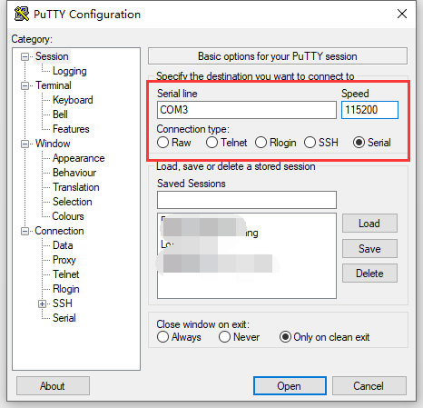
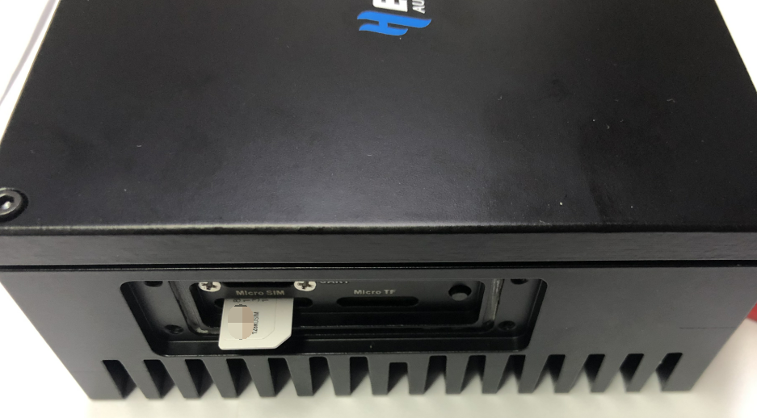

# HT-M02 Edge LoRa Gateway 4G(LTE)快速入门
[English](https://heltec-automation-docs.readthedocs.io/en/latest/gateway/ht-m02_4g/quick_start_4g.html)
## 摘要

HT-M02集成了操作系统和LoRa相关程序，可以直接用于实际应用中。HT-M02有两个版本：PoE和4G(LTE)。本文的内容是如何使用4G(LTE)版本。

``` Note:: 首次通电前，请确保天线已正确安装在适当的位置。标准天线本身不防水。如需长期在室外使用，建议用塑料薄膜适当遮挡天线部分。

```

## 配置网关

### 建立串行连接

4G（LTE）网络没有公共IP地址。因此，配置HT-M02 4G版本的唯一方法是通过串行端口。换句话说，在部署网关之前，需要通过串行端口配置网关。

由于采用防水设计，UART接口不会直接暴露在外部。建立串行连接需要卸下HT-M02侧的保护板，还需要一个UART-USB bridge(CP2102、CP2104、CH340G等)。

- HT-M02 TXD `<---->` UART-USB bridge RXD

- HT-M02 RXD `<---->` UART-USB bridge TXD

- HT-M02 GND `<---->` UART-USB bridge GND


推荐使用[Putty,](https://putty.org/) 配置如下图。 



## 首次通电

此版本仅支持220/110V交流电源。所有操作前，先插入Micro-SIM卡，卡的方向和接口如下图所示(SIM卡芯片朝下，槽口朝外)：



如果一切顺利，系统将在通电后自动运行。当系统内核成功启动时，系统指示灯亮起。整个系统初始完成后，TX LED闪烁一次，系统进入正常工作状态。整个启动过程大约需要90秒。

4G（LTE）网络将自动识别和注册。

- 默认登录账户: `debian`
- 默认登录密码: `temppwd`

``` Tp:: 许多系统日志打印在putty终端上。系统启动后，可以随时登录。

```

&nbsp;

## 相关资源

更多有关如何连接到LoRa服务器的详细信息，请参阅：

[https://heltec-automation-docs.readthedocs.io/en/latest/gateway/ht-m01/connect_to_server.html](https://heltec-automation-docs.readthedocs.io/en/latest/gateway/ht-m01/connect_to_server.html)