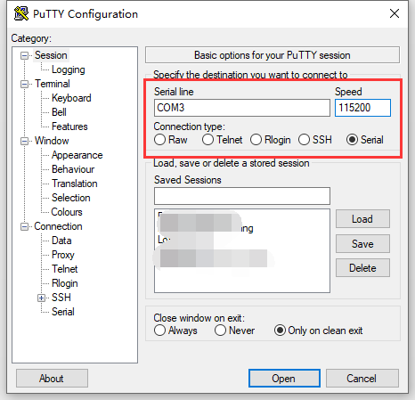

# HT-M02 Edge LoRa Gateway PoE快速入门
[English](https://heltec-automation-docs.readthedocs.io/en/latest/gateway/ht-m02_poe/quick_start_poe.html)
## 摘要

HT-M02集成了操作系统和LoRa相关程序，可以直接用于实际应用中。HT-M02有两个版本：PoE和4G(LTE)。本文的内容是如何使用PoE版本。

``` Note:: 首次通电前，请确保天线已正确安装在适当的位置。标准天线本身不防水。如需长期在室外使用，建议用塑料薄膜适当遮挡天线部分。

```

## 首次通电

此版本仅支持PoE电源模式。如图2-1所示接线。建议在将PoE适配器插入220 V/110 V AC之前，将网线连接到HT-M02上。


如果一切顺利，系统将自动运行，LED灯将开始工作。当系统内核成功启动时，SYS指示灯将亮起。进程和服务启动后，发送指示灯将闪烁一次，系统将进入正常工作状态。整个启动过程大约持续40秒。

## 配置HT-M02

当PoE向HT-M02供电时，它将同时提供以太网。在HT-M02系统中，DHCP服务默认启用。如果连接的路由器同时支持DHCP，它将自动为HT-M02分配一个IP地址。通常，您可以在路由器的DHCP客户机列表上查询HT-M02的IP地址。


### 加载HT-M02配置页

在浏览器中输入HT-M02的IP地址，打开配置页面。


- 用户名: `Heltec-M02`
- 密码: `temppwd`


### 配置页中的选项

- **Status** -- HT-M02运行状态;
- **Gateway_ID** -- 当前HT-M02的唯一ID;
- **Band** -- 区域频率, 严格遵守[LoRaWAN™ 1.0.2 Regional Parameters rB](https://resource.heltec.cn/download/LoRaWANRegionalParametersv1.0.2_final_1944_1.pdf);
- **Channels** -- 每个波段的监听频道，[LoRaWAN Regional Parameters](https://resource.heltec.cn/download/LoRaWANRegionalParametersv1.0.2_final_1944_1.pdf) 定义了每个频道的详细上下行频率，这里的“CN470”，“channels 0-7”表示HT-M02将监听“470.3mhz，470.5mhz，470.7mhz，470.9mhz，471.1兆赫，471.3兆赫，471.5兆赫，471.7兆赫'8个频道。
- **Server** --将使用哪个LoRa服务器
  - `Internal Server` -- HT-M02将数据转发至其内部的LoRa服务器；
  - `TTN` -- HT-M02将数据转发给TTN的LoRa服务器；
  - `Custom Server` -- HT-M02将数据转发到自定义服务器，如ChripStack这样的私有服务器。
- **Server Addr** -- LoRa服务器地址
  - 如果使用`Internal Server`，则服务器地址为“127.0.0.1”，无法修改；
  - 如果使用`TTN`服务器，服务器地址将自动适应[TTN的路由器地址](https://www.thethingsnetwork.org/docs/gateways/packet-forwarder/semtech-udp.html#router-addresses)，无法修改；
  - 如果使用`Custom Server`，则“服务器地址”和“上行/下行端口”应与自定义服务器匹配。

## 建立串行/SSH连接

如果需要，HT-M02可以提供串行/SSH连接。

- 默认登录账户: `debian`
- 默认登录密码: `temppwd`

### SSH

建立SSH连接需要确保客户端与HT-M02在同一个局域网中，SSH使用默认端口22。


### 串行连接

由于采用防水设计，UART接口不会直接暴露在外部。如果需要连接串行端口，需要卸下HT-M02侧的保护板，还需要一个UART-USB bridge(CP2102、CP2104、CH340G等)。

- HT-M02 TXD `<---->` UART-USB bridge RXD

- HT-M02 RXD `<---->` UART-USB bridge TXD

- HT-M02 GND `<---->` UART-USB bridge GND


推荐使用[Putty,](https://putty.org/) 配置如下图。

