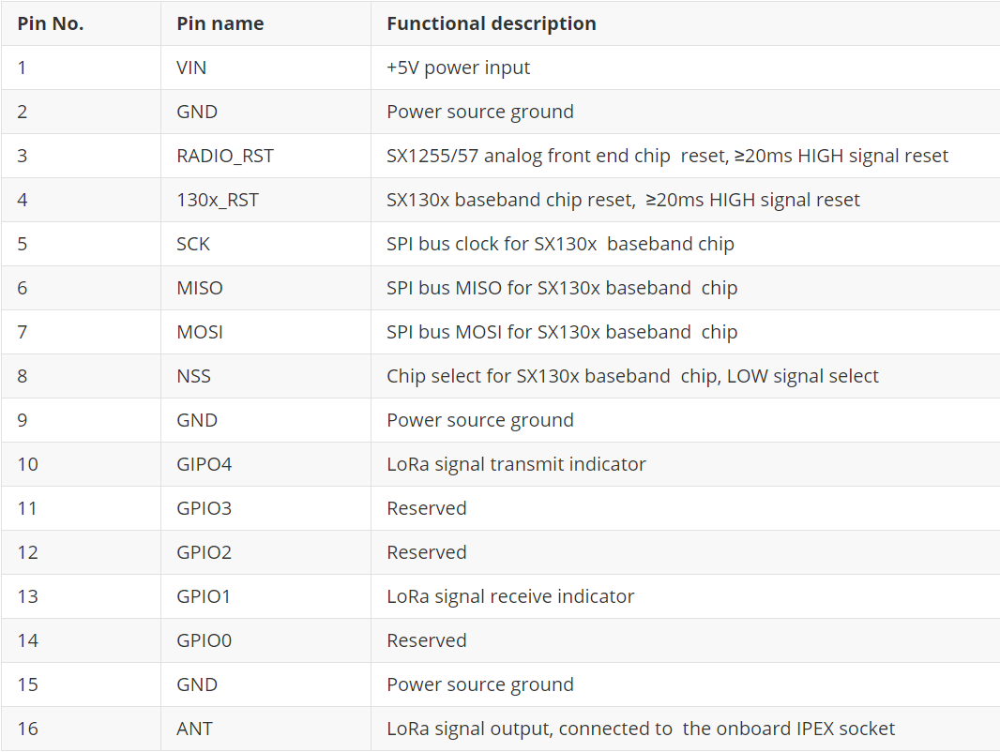
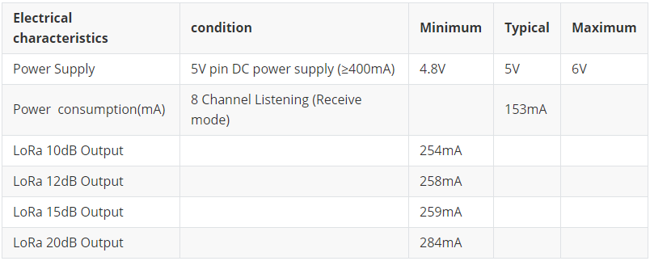

# SX130x LoRa网关模块快速入门
[English](https://heltec-automation-docs.readthedocs.io/en/latest/gateway/sx1301module/qucik_start.html)
## 摘要

SX130x LoRa网关模块包含SX1301和SX1308两种基带型号，其性能、驱动程序、接口封装、功能完全一致，区别在于工作温度区间，SX1301定位为室外型，SX1308定位为室内型。可以与支持Linux操作系统的硬件（例如树莓派）配合使用，然后作为LoRa网关。

## 技术特征

### 引脚定义



### 电气特性



## 在SPI模式下运行SX130x模块（树莓派）

默认情况下，树莓派的SPI总线是禁用的。 在putty中输入以下命令以打开树莓派配置界面并启用SPI总线。

`sudo raspi-config`


选择 `Interfacing Options → SPI → Yes` ，可能需要重新启动Raspberry Pi。

通过以下命令安装SX1301模块相关的应用程序和服务：

```shell
mkdir lora
cd lora
sudo apt-get update
sudo apt-get install git
git clone https://github.com/Lora-net/lora_gateway.git
# LoRa Gateway drivers
git clone https://github.com/Lora-net/packet_forwarder.git
# packet forwarding software
git clone https://github.com/HelTecAutomation/lorasdk.git
# This package will create a "lrgateway" service in Raspberry Pi
cd /home/pi/lora/lora_gateway
make clean all
cd /home/pi/lora/packet_forwarder
make clean all
cd /home/pi/lora/lorasdk
chmod +x install.sh 
./install.sh
#Run the script. After the script is run, it will create a service named "lrgateway". The purpose is to make the lora driver and data forwarding program run automatically at startup.
sudo cp -f /home/pi/lora/lorasdk/global_conf_EU868.json /home/pi/lora/packet_forwarder/lora_pkt_fwd/global_conf.json
#the "global_conf_EU868.json" may need change to your need.
```

```Tip:: “ global_conf.json”文件确定网关的监听频率，这是节点可以成功与网关通信的关键！

```

执行`./install.sh`时，如果一切正常，将打印当前网关的唯一ID。 在LoRa服务器上注册网关时，需要此唯一ID。


### 确认安装

在在树莓派中运行`sudo systemctl status lrgateway`，如果一切顺利，则服务正在运行：


&nbsp;

## 连接到LoRa服务器

与树莓派配合使用的SX130x模块和与树莓派配合使用的 [HT-M01](https://heltec.org/project/ht-m01/) 网关的SPI模式最相似。 连接到LoRa服务器的步骤请参考此文档：

[https://heltec-automation-docs.readthedocs.io/en/latest/gateway/ht-m01/connect_to_server.html](https://heltec-automation-docs.readthedocs.io/en/latest/gateway/ht-m01/connect_to_server.html)