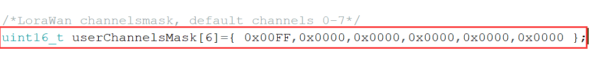

#  	连接到单通道网关（CN470）
[English](https://heltec-automation-docs.readthedocs.io/en/latest/general/sub_band_usage.html)

## 摘要

本文旨在描述如何将节点连接到单通道网关，为保证节点与单通道网关通信良好，需使节点使用的通道与单通道网关的通道相对应。本文档以CN470为例。

更多频段可参考[LoRaWAN™ 1.0.2 Regional Parameters rB](https://resource.heltec.cn/download/LoRaWANRegionalParametersv1.0.2_final_1944_1.pdf)。

```Tip:: 如果节点通道多于网关通道且将网关通道包含在内，那么只有当节点通道与网关通道匹配时才能入网，如果节点通道不包含网关通道，那么节点不能入网。

```

&nbsp;

## 通道频率


CN470从470.3MHz到489.3MHz共对应96个通道，频率每增加200kHz，通道编码增加1，即：

freq=470.3+0.2*N（N为通道编码 0-95）

让我们看看代码: (在LoRaWAN对应的`.ino`文件中)

CubeCell系列可参考"LoRaWAN",ESP32系列可参考"OTTA"。



这是为CN470定义的所有LoRaWAN 协议通道的6个阵列。在userChannelsMask[0]中，0x00FF表示使用前0-7个通道，它们是470.3MHz、470..5MHz、470.7MHz…471.7MHz。将十六进制FF转换为二进制是11111111，8个1从低位到高位分别对应前0-7个通道，即最后一个1对应通道0，第一个1对应通道7。当您修改"userChannelsMask[0]=0x0001"时，意味着通道更改为0，它是470.3MHz；当修改"userChannelsMask[0]=0x8000"时，意味着通道更改为7，它是471.7MHz。当修改"userChannelsMask[0]=0xFF00"时，意味着通道更改为8-15，它们是471.9MHz、472.1MHz、472.3MHz...473.3MHz。

&nbsp;

## 使用方法

一般来说，要将节点连接到单通道网关，我们需要使节点使用的通道与单通道网关的通道相对应，即在相应的程序中修改通道掩码。

以CubeCell系列为例：


如果将单通道网关通道频率设置为470.3MHz，在LoRaWAN程序中，需修改"userChannelsMask[0]=0x0001"。

