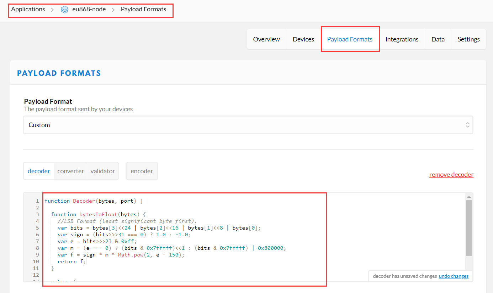

# 如何解码有效载荷数据
[English](https://heltec-automation-docs.readthedocs.io/en/latest/general/decode_payload.html)
## 为什么需要解码信息？

假设您有一个非常高精度的传感器，例如，测量数据是27.313232421875，如果通过诸如“char data[]=”27.313232421875“这样的字符串发送此数据，则有以下缺点：

- 它将花费更多字节(在本例中，它将花费15字节）；
- 将float转换为char进程会消耗大量计算资源。

众所周知，“float”数据占用内存4个字节，“unsigned int”数据占用内存2个字节。如果以字节`80 81 DA 41`传输，只需花费4个字节！完全可以避免上述缺点。但是字节格式的数据对于人们来说很难读取，这可能会给调试过程带来很多麻烦。所以我们需要将字节数据还原为浮点数。

## TTN中有效载荷数据的解码

在`Applications -> Node name -> Payload Formats -> decoder` 部分，添加以下“js”脚本：

```js
function Decoder(bytes, port) {

  function bytesToFloat(bytes) {
    //LSB Format (least significant byte first).
    var bits = bytes[3]<<24 | bytes[2]<<16 | bytes[1]<<8 | bytes[0];
    var sign = (bits>>>31 === 0) ? 1.0 : -1.0;
    var e = bits>>>23 & 0xff;
    var m = (e === 0) ? (bits & 0x7fffff)<<1 : (bits & 0x7fffff) | 0x800000;
    var f = sign * m * Math.pow(2, e - 150);
    return f;
  }  

  return {
    temp: bytesToFloat(bytes.slice(0, 4))
  };
}
```



现在，如果解码器成功运行：


&nbsp;

## ChripStack中有效载荷数据的解码

与TTN类似，在`Applications -> Node name -> APPLICATION CONFIGURATION` 部分添加相关解码脚本：


