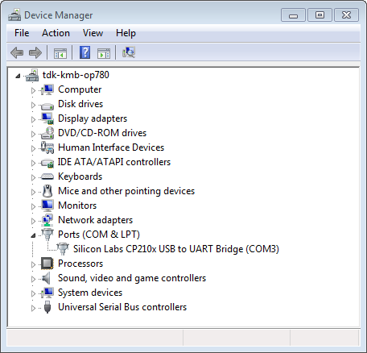

# 建立串行连接
[English](https://heltec-automation-docs.readthedocs.io/en/latest/general/establish_serial_connection.html)

**[MacOS](#for-macOS)**&nbsp;&nbsp;&nbsp;&nbsp;&nbsp;&nbsp;**[Windows](#for-windows)**

**本节提供如何在开发板和电脑之间建立串行连接的指导**

## For MacOS

### 1.安装USB驱动

**下载[SiLabs CP2104驱动](https://www.silabs.com/documents/public/software/Mac_OSX_VCP_Driver.zip)**

**下载磁盘映像“SiLabsUSBDriverDisk.dmg”后，安装它**

**然后按照屏幕截图安装这个USB驱动程序**

### 2.检查MacOS上的端口

**要检查主板（或外部转换器加密狗）串行端口的设备名称，请打开终端并运行此命令两次，首先拔下主板/加密狗，然后插入。第二次出现的端口是您需要的端口：**

**MacOS**

    ls /dev/cu.*

## For Windows

### 1.安装USB驱动

**下载 [SiLabs CP2104 驱动](https://www.silabs.com/products/development-tools/software/usb-to-uart-bridge-vcp-drivers)**

**根据您的windows版本（Windows7/8/10）选择USB驱动程序的版本**

**选择正确的版本安装程序（x64/x86），然后安装它**

### 2. 检查Windows上的端口

**检查Windows设备管理器中标识的COM端口列表。断开开发板并将其重新连接，以验证哪个端口从列表中消失，然后再次显示**

**下图显示了Heltec开发板的串行端口**

