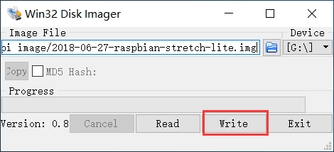
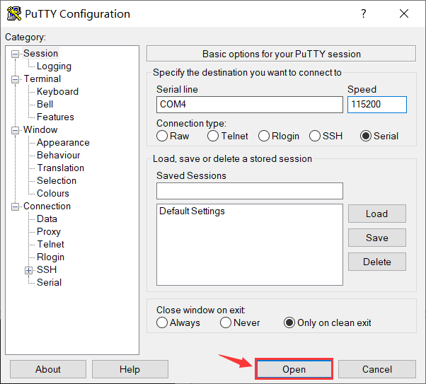
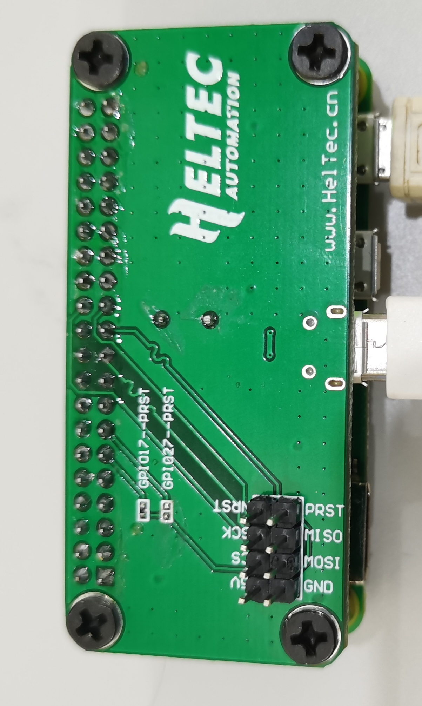
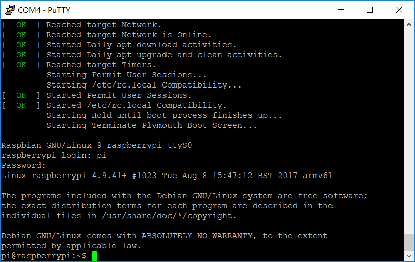
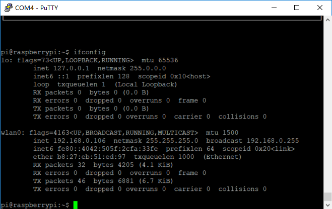
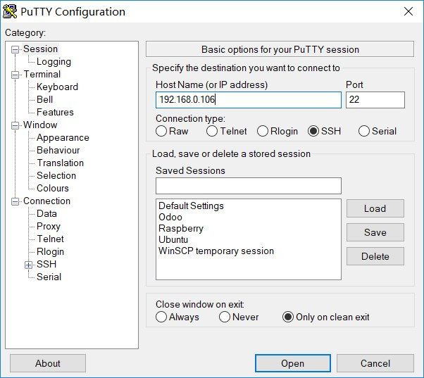

# 如何烧写树莓派的TF卡镜像、配置WiFi上网、SSH连接
[English](https://heltec-automation-docs.readthedocs.io/en/latest/general/how_to_config_raspberry_pi.html)
## 1. 准备相关工具

- [SD Formatter](http://resource.heltec.cn/download/tools/SD_Formatter.zip) *(非必须，若需要对已有树莓派镜像的TF卡进行格式化，才需要用到这个工具)*
- [Win32DiskImager](http://resource.heltec.cn/download/tools/Win32DiskImager.zip) *(镜像烧写工具)*
- [树莓派镜像文件](https://www.raspberrypi.org/downloads/raspbian) *(推荐使用“Raspbian Stretch Lite”版本，没有图形界面，更节省资源)*
- [Putty](https://www.chiark.greenend.org.uk/~sgtatham/putty/latest.html) (树莓派系统连接工具)
- 4G以上的Micro TF卡，读卡器

## 2. 烧写树莓派镜像



​	镜像烧写的速度取决于TF卡的性能。烧写完成后，可以在“我的电脑”中看到一个大约42.5MB的boot盘符，打开其中的"config.txt"文件，在末尾增加一行如下代码（开启串口打印日志）：

`enable_uart=1`

## 3. 启动树莓派

按下图所示配置Putty，端口号(COM1)应该跟设备管理器里面的串口号对应，默认波特率是115200：

]

启动树莓派之前，先将树莓派上的串口引出，通过USB转串口模块连接到电脑上（若购买了[树莓派 -- HT-M01专用转接板](https://heltec.org/product/m01-converter)，则不用额外的USB转串口模块）。



若一切正常，可以看到Putty串口中会出现树莓派启动的日志信息。

默认的用户名和密码：

用户名：`pi`

登陆密码：`raspberry` *（在Linux系统中，通过命令行输入密码的过程是看不到任何变化的）*



## 4. 连接WIFI

在Putty中输入如下命令：

`sudo nano /etc/wpa_supplicant/wpa_supplicant.conf`

在它的末尾添加WIFI的配置信息：

```shell
network={
  ssid="你的WiFi名字"
  psk="你的WIFI密码"
}
```

`ctrl + O`保存，`ctrl + X`退出。重启树莓派，如果一切正常，树莓派在重启之后将自动连接到相应的WiFi，并会在启动日志中打印IP地址。



## 5. 配置SSH实现局域网登陆

`sudo raspi-config` 打开树莓派配置菜单；

`Interfacing Options --> SSH --> YES` 激活SSH登陆选项。至此，我们就可以在局域网环境中，通过网络登陆到树莓派了：




