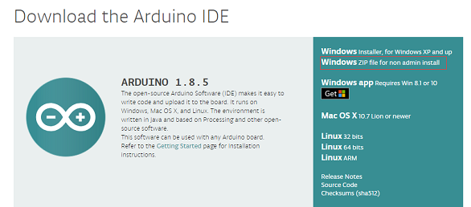
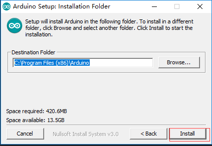
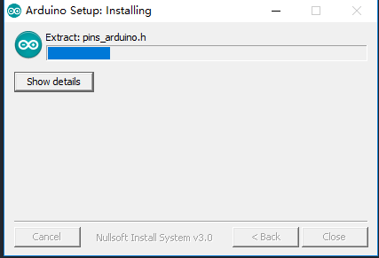

# 怎样安装Git和Arduino IDE (Windows)
[English](https://heltec-automation-docs.readthedocs.io/en/latest/general/how_to_install_git_and_arduino.html)
## 1. 安装`Git`
如果您安装了“Git”，请直接执行第2步 。否则，请下载[Git](https://Git-scm.com/download/win)并安装它。

## 2. 安装`Arduino IDE`

下载地址: [https://www.arduino.cc/en/Main/Software](https://www.arduino.cc/en/Main/Software)

双击安装"Arduino IDE“。

&nbsp;s

