# 各国的LoRaWAN频率计划和法规

[English](https://heltec-automation-docs.readthedocs.io/en/latest/general/lorawan_frequency_plans_by_country.html)

## 摘要

本文档仅是无线电法规的摘要，以及相应国家/地区应使用的适当频率计划。 这绝不是正式文件； 网关所有者仍然有义务查找，研究并遵守其本国的法规。 某些国家/地区还希望您注册网关或获取许可证。 在这种情况下，您使用的是“免费频段”，而不是“免许可频段”。 在某些国家/地区，如果您允许其他人也可以通过网关进行通信，则还必须经过网关认证（CE，FCC等）。

&nbsp;

## 国家

### A

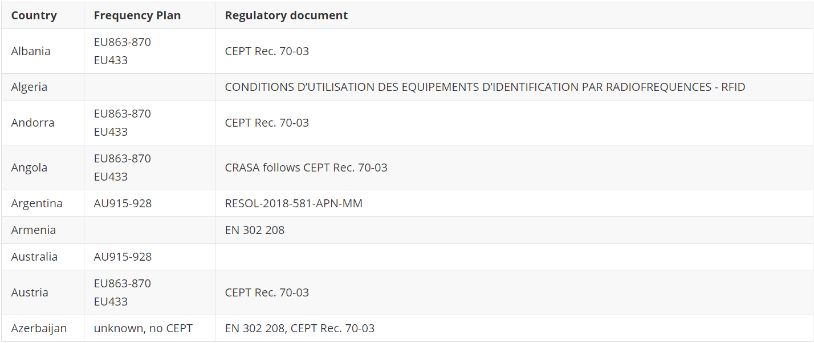

### B

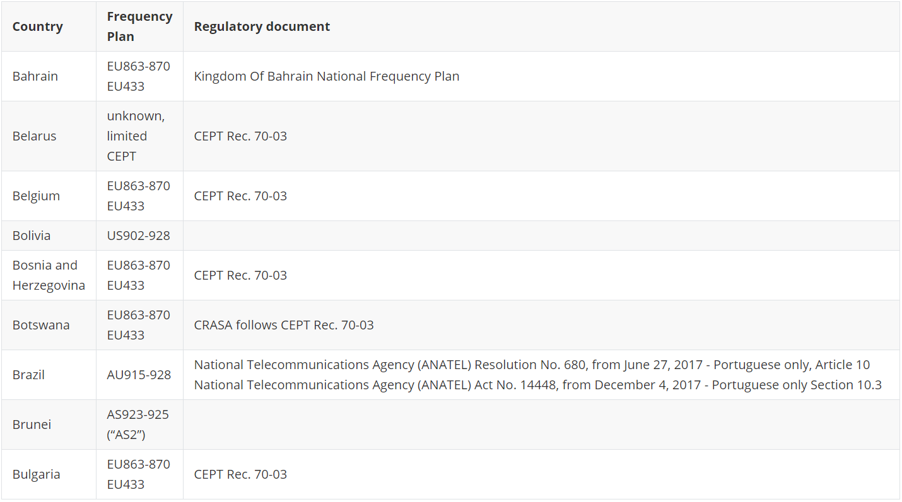

&nbsp;

### C

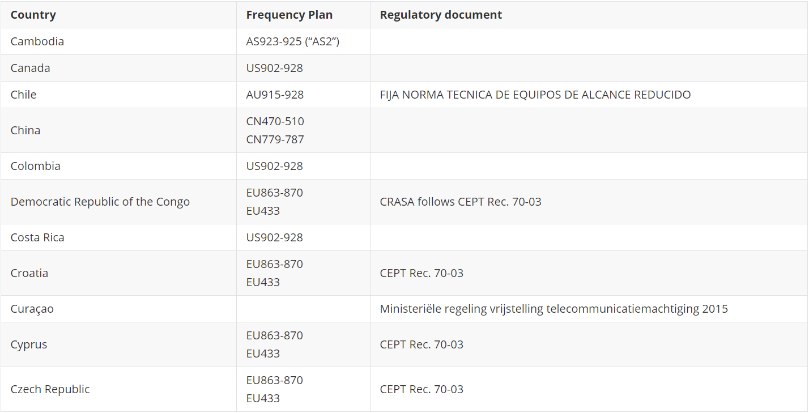

&nbsp;

### D

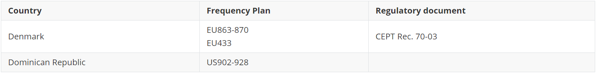

&nbsp;

### E

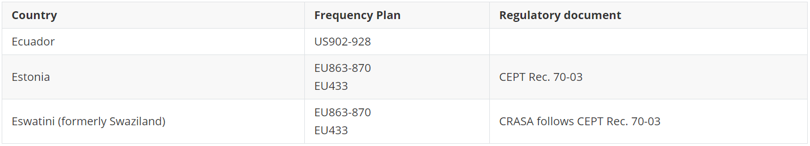

&nbsp;

### F

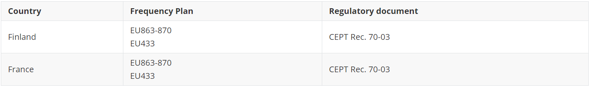

&nbsp;

### G

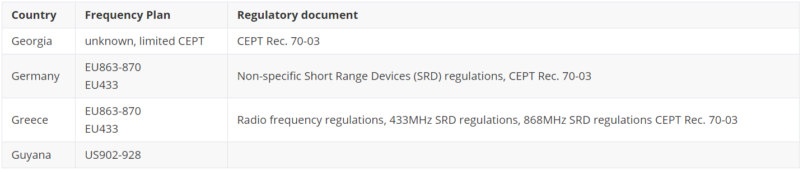

&nbsp;

### H

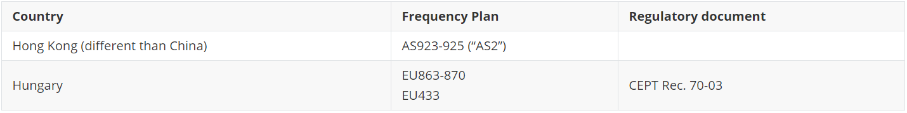

&nbsp;

### I

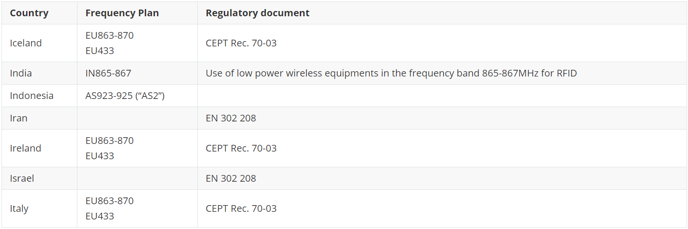

&nbsp;

### J

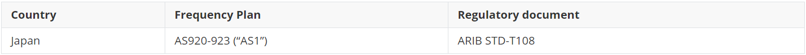

&nbsp;

### L

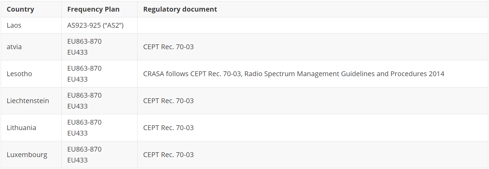

&nbsp;

### M

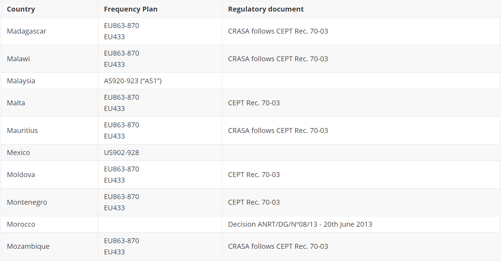

&nbsp;

### N

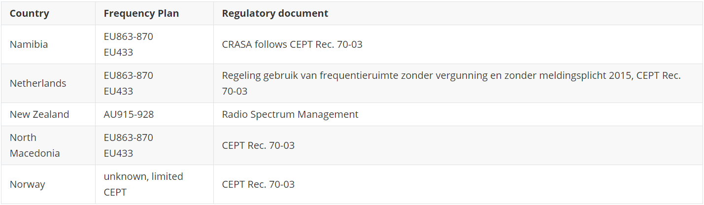

&nbsp;

### O

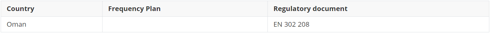

&nbsp;

### P

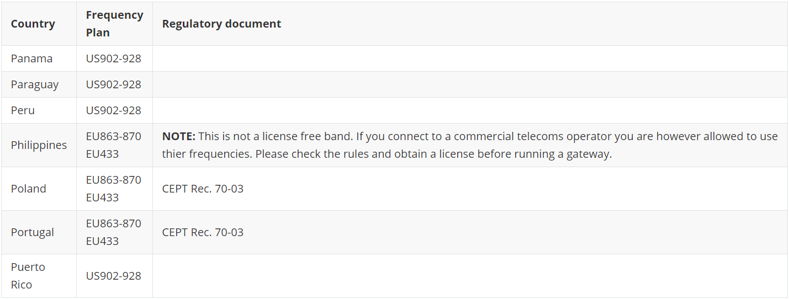

&nbsp;

### R

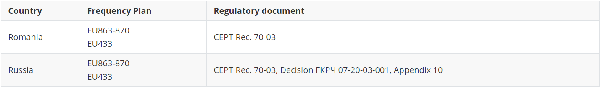

&nbsp;

### S

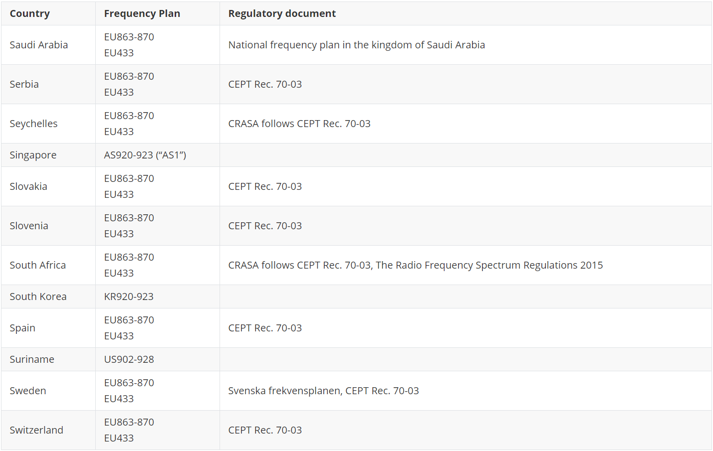

&nbsp;

### T

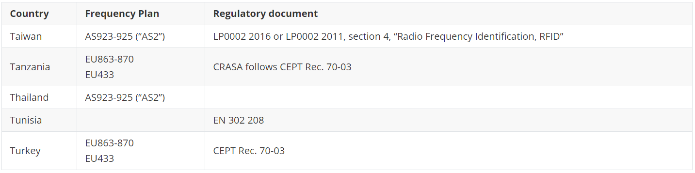

&nbsp;

### U

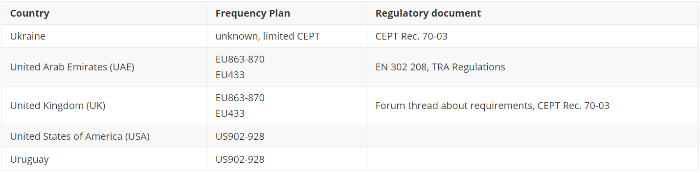

&nbsp;

### V

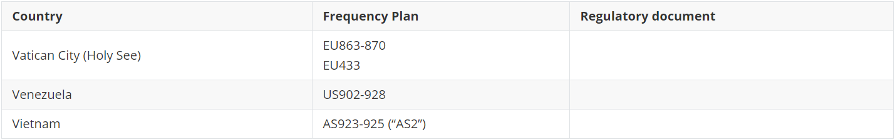

&nbsp;

### Z

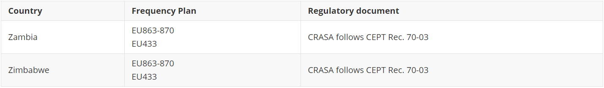

&nbsp;

## 相关资源

- [各国的频率计划](https://www.thethingsnetwork.org/docs/lorawan/frequencies-by-country.html)